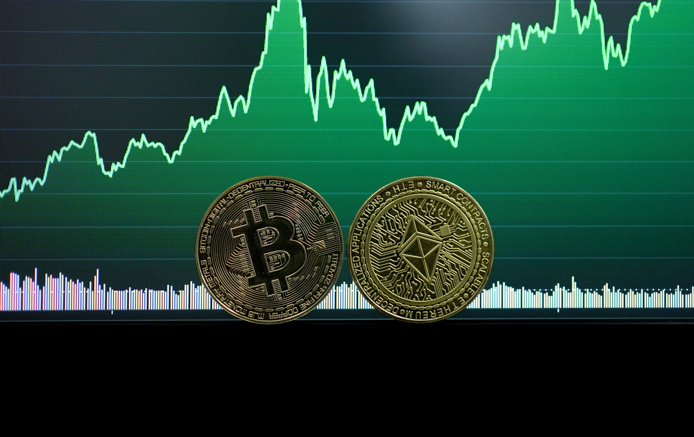
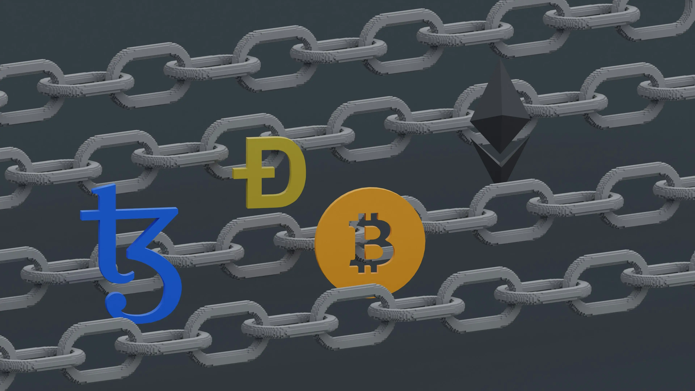
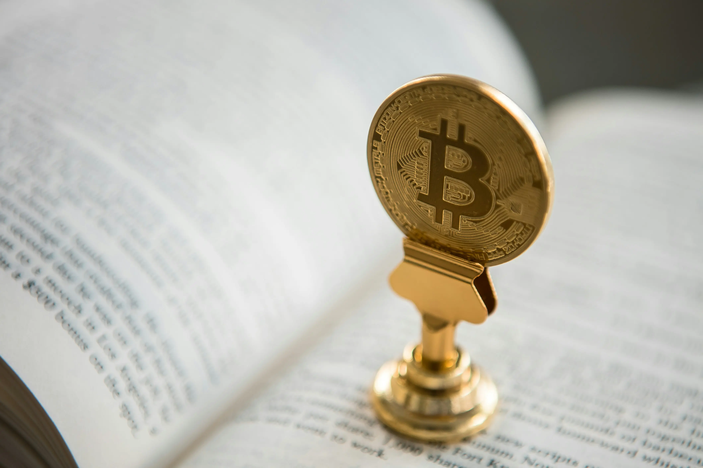

Bitcoin is the first and most well-known cryptocurrency in the world. Created by an anonymous developer under the pseudonym Satoshi Nakamoto in 2009, it introduced blockchain technology to the world and changed the way we think about money.

This decentralized system allows value to be transferred without the involvement of intermediaries such as banks or governments. Unlike traditional financial systems, Bitcoin operates on mathematics and cryptography, ensuring transparency and security of transactions.

## What is Bitcoin

**Bitcoin (BTC)** is the first decentralized cryptocurrency that functions without a single governing body. The system was created as an alternative to traditional money to enable secure, fast, and independent financial operations.

The key feature is the use of blockchain technology—a distributed ledger of transactions protected by cryptography. Each transaction is recorded in blocks that are linked in a continuous chain, ensuring transparency and protection against counterfeiting.

### Key Characteristics

Bitcoin has several unique properties that distinguish it from traditional currencies:

**Limited Supply:** Only 21 million coins will ever be created. This programmatic limit makes Bitcoin protected against inflation, unlike fiat currencies that can be printed by central banks.

**Decentralization:** No one controls the network. Unlike banking systems where one authority manages the entire infrastructure, the Bitcoin network is distributed among thousands of nodes worldwide.

**Transparency:** All transactions are recorded in a public ledger. Anyone can view the transaction history in the blockchain, ensuring system transparency.

**Security:** Cryptographic algorithms protect transactions from counterfeiting and ensure data integrity.

**Pseudonymity:** Although all transactions are public, the identity of the address owner is not directly revealed. This provides a certain level of privacy while maintaining transparency.

**Double-Spending Prevention:** The cryptographic mechanisms of the blockchain prevent the possibility of spending the same Bitcoins twice. Each transaction is verified by the network before being added to the blockchain.

## History of Bitcoin

Bitcoin emerged during a difficult period for the global financial system. In 2008, against the backdrop of the global financial crisis, an anonymous developer under the pseudonym Satoshi Nakamoto published a whitepaper on a decentralized digital currency.

The goal was to create a system free from the influence of banks and governments. The document described the concept of an electronic payment system based on cryptography that could enable direct transactions between users without intermediaries.

### Key Development Milestones

**2008 — The Idea:** Satoshi Nakamoto published the whitepaper "Bitcoin: A Peer-to-Peer Electronic Cash System". The document described the concept of a decentralized digital currency.

**2009 — Launch:** The Bitcoin network began operation with the creation of the first block (genesis block). This moment is considered the birth of the first cryptocurrency.

**2010 — First Purchase:** Programmer Laszlo Hanyecz made the first known purchase with Bitcoins (2 pizzas for 10,000 BTC). This transaction became a symbol of the birth of the crypto economy.

**2011 — Development:** The first competitors (altcoins) appeared, such as Litecoin. The market began to expand, and new projects using blockchain technology emerged.

**Growing Interest:** From 2012, Bitcoin began to be viewed as an investment instrument. Major exchanges such as Coinbase and Kraken were formed, simplifying access to cryptocurrency for ordinary users.

## How Bitcoin Works

Bitcoin operates on a blockchain—a continuous chain of blocks containing data about all transactions. Each block contains information about several transactions and is linked to the previous block through a cryptographic hash.

### Blockchain Technology

A blockchain is a sequence of blocks. Each block is connected to the previous one through a unique cryptographic hash, which guarantees data integrity.

**Block:** A group of transactions over a certain period (approximately 10 minutes for Bitcoin). Each block contains transaction information, a timestamp, and the hash of the previous block.

**Hash:** A unique cryptographic identifier of a block. The hash is created based on the block's content and the hash of the previous block, making it impossible to change data without detection.

**Decentralization:** Data is stored on thousands of computers (nodes) worldwide. Each node stores a complete copy of the blockchain, ensuring system fault tolerance.

### Transactions

A transaction is the process of transferring funds between Bitcoin network users. Each transaction must be confirmed by the network before being added to the blockchain.

**Private Key:** An electronic signature that proves ownership of funds. The private key is used to create a digital signature for the transaction and must be kept secret.

**Public Key:** An address to which Bitcoins can be sent. The public key is generated from the private key, but reverse conversion is impossible.

**Mempool:** A queue of transactions awaiting confirmation. A transaction enters the mempool until it is included in a block. Miners select transactions from the mempool to include in a new block.

### Mining

Mining is the process of confirming transactions and creating new blocks. Miners solve complex mathematical problems, competing for the right to add the next block to the chain.

**Reward:** A miner receives new BTC for adding a block. This reward includes transaction fees and new coins (until halving).

**Difficulty:** Adjusted every 2016 blocks (~2 weeks) so that the average block time is 10 minutes. If miners find blocks faster, the difficulty increases.

**Halving:** Every 210,000 blocks (~4 years), the mining reward is halved. This curbs inflation and guarantees that only 21 million coins will ever be created.

Initially, miners received 50 BTC per block, but after several halvings, the reward decreased. This mechanism controls the emission of new coins and gradually transitions the system to funding exclusively through transaction fees.

Mining requires specialized equipment (ASIC) for efficient operation. The process consumes significant amounts of electricity, making it inaccessible to ordinary users without special infrastructure.

## What Bitcoin is Used For

Bitcoin is used for various purposes, depending on the user's needs and strategy. Its versatility allows the cryptocurrency to be applied in different areas of life.

**Payment Method:** Global transfers without bank involvement with minimal fees. Bitcoin allows sending funds anywhere in the world in minutes, regardless of time of day or weekends.

This is especially important for international transfers, where traditional banks may charge high fees and require several days for processing. Bitcoin simplifies this process, making transfers fast and accessible.

**Investment Instrument:** Often called "digital gold" due to limited supply. Many investors view Bitcoin as a way to diversify their portfolio and protect against fiat currency inflation.

Bitcoin's historical volatility attracts both long-term investors and short-term traders. Some use it to accumulate capital, expecting price growth in the future.

**Capital Preservation:** Protection against fiat currency inflation. Thanks to limited supply, Bitcoin is not subject to devaluation caused by excessive money printing by central banks.

In countries with high inflation, Bitcoin becomes an alternative to local currency. People use it as a means of preserving the purchasing power of their savings.

**Financial Independence:** Full control over funds 24/7. The user does not depend on banks or governments and can manage their funds at any time.

No need to open a bank account or obtain permission for transfers. It is enough to have internet access and a wallet to manage your assets.

**Censorship Resistance:** Transactions cannot be blocked by third parties. Unlike bank transfers that can be frozen, Bitcoin transactions cannot be canceled or blocked.

This makes Bitcoin particularly attractive to people living in countries with unstable financial systems or restrictions on banking operations.

## How to Use Bitcoin

Using Bitcoin begins with creating a wallet to store the cryptocurrency. A wallet is a software or hardware device that stores private keys and allows managing funds.

### Types of Wallets

**Hardware Wallets (Ledger, Trezor):** Maximum security through offline key storage. Hardware wallets connect to a computer only to sign transactions, making them protected against hacker attacks.

**Mobile Wallets (Trust Wallet, Electrum):** Convenience for everyday operations. Mobile wallets allow quick sending and receiving of Bitcoins but require caution when storing large amounts.

**Exchange Wallets:** Storage on trading platform accounts. Exchange wallets are convenient for trading but less secure, as private keys are stored on the exchange. It is recommended to store large amounts in your own wallets.

### Buying and Selling

BTC can be purchased through cryptocurrency exchanges, online exchangers, or payment systems. Exchanges provide various purchase methods: via bank card, bank transfer, or P2P exchange.

Before purchasing, it is important to study the fees and conditions of various platforms. Some exchanges require identity verification for large amounts, while others allow anonymous operations with limitations.

Selling Bitcoin is also done through exchanges or exchangers. The process is similar to purchasing but in reverse: the user exchanges Bitcoins for fiat currency.

When working with exchanges, it is important to consider the liquidity of the trading pair and the spread between buy and sell prices. Large exchanges usually offer better trading conditions.

## Advantages and Disadvantages

Bitcoin has both advantages and disadvantages that are important to consider when working with cryptocurrency.

### Advantages

**Decentralization and Censorship Resistance:** Transactions cannot be blocked or canceled by third parties. This ensures freedom of financial operations regardless of political situation.

**Transparency:** All transactions are public and can be viewed in the blockchain. This ensures system transparency and allows tracking fund movements.

**Global Availability:** Operates without weekends, 24/7. Users can send and receive funds at any time, regardless of time zones.

**Inflation Protection:** Limited supply makes Bitcoin protected against devaluation. Unlike fiat currencies, the number of coins is programmatically limited.

**Fast Transactions:** Transfers are processed in minutes, regardless of the geographical location of the sender and receiver.

### Disadvantages

**High Volatility:** Bitcoin's price can fluctuate significantly, creating risks for investors and making it less suitable for everyday payments.

**Irreversibility of Transactions:** After confirmation, a transaction cannot be canceled. This requires caution when sending funds.

**Low Processing Speed:** The main network processes about 7 transactions per second. This limits the system's scalability for mass use.

**Storage Complexity for Beginners:** The risk of losing keys or wallet hacking requires a certain level of technical knowledge and caution.

**Energy-Intensive Mining:** The mining process requires significant electricity consumption, raising environmental concerns.

## FAQ

**What is Bitcoin in simple terms?**

Bitcoin is a digital currency that operates without bank involvement. Each transaction is recorded in a public ledger (blockchain), ensuring transparency and security.

**How does blockchain work?**

A blockchain is a chain of blocks, each containing transaction information. Blocks are cryptographically linked to each other, making it impossible to change data without detection.

**How is Bitcoin different from regular money?**

Bitcoin is decentralized (no single governing body), has limited supply (maximum 21 million coins), and operates on blockchain technology. Learn more about the differences in the article on [digital currencies](/en/library/what-is-digital-currency-in-simple-terms/).

**What is mining?**

Mining is the process of confirming transactions and creating new blocks in the blockchain. Miners solve complex mathematical problems and receive rewards in the form of new Bitcoins.

**Is Bitcoin safe?**

Bitcoin uses cryptography to protect transactions, making it secure. However, security also depends on user actions: proper storage of private keys and use of reliable wallets.

**Where can I buy Bitcoin?**

Bitcoin can be purchased through cryptocurrency exchanges, online exchangers, or payment systems. For more detailed information about working with cryptocurrency, study the [complete Bitcoin guide](/en/library/what-bitcoin-everything-you-need-know/).
