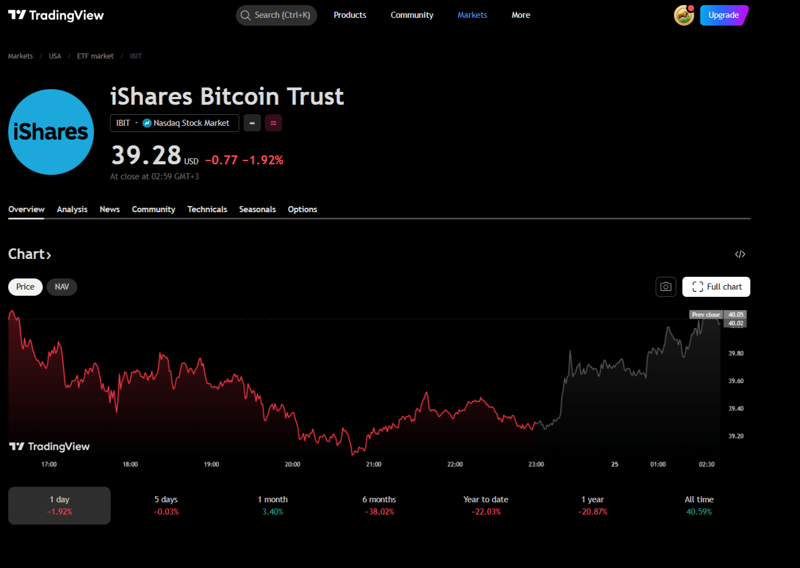

**Bitcoin ETF (exchange-traded fund)** — investment instrument for buying Bitcoin through a traditional brokerage account without needing to store cryptocurrency yourself. In 2026, investors have access to several types of Bitcoin ETFs: spot, futures, and leveraged.

**Why this matters:**

In January 2024, the SEC approved the first spot Bitcoin ETFs in the US. This opened access to Bitcoin for institutional investors and retail investors who didn't want to deal with crypto exchanges and wallets.

---

## What is ETF in Simple Terms

**ETF (Exchange Traded Fund)** — a stock exchange fund that trades like a regular stock but tracks the price of an underlying asset.

**Real-life example:**

Gold ETF. Instead of buying physical bars (storage, insurance, authenticity verification), you buy fund shares. The share price rises with gold prices. You can sell anytime through a broker.

**Bitcoin ETF works the same way:**

1. **Fund issuer** (BlackRock, Fidelity, Grayscale) creates the ETF
2. **Custodian** (Coinbase Prime, BitGo) stores real Bitcoin
3. **Investor** buys ETF shares through a brokerage account
4. **Share price** follows Bitcoin price (minus fund fee)

**Key advantage:**

Buying Bitcoin ETF doesn't require:
- Registering on a crypto exchange
- Setting up a wallet and storing seed phrases
- Worrying about private key security

---

## Bitcoin ETF History: From Rejection to Approval

### 2013-2020: First Attempts

**2013:** First Bitcoin ETF request (Winklevoss Capital) — **SEC denial**.

**Reasons for denial:**
- Manipulation on crypto exchanges
- Insufficient market oversight
- Investor risks

**2017-2020:** More than 10 rejected applications from ProShares, VanEck, Bitwise.

### 2021: Futures ETFs Approved

**October 2021:** SEC approves first **futures** Bitcoin ETF (BITO from ProShares).

**Why futures, not spot:**
- Futures trade on regulated CME exchange
- SEC sees fewer manipulation risks
- This was a compromise to start

**Result:**
- BITO attracted $1 billion in first 2 days
- But futures ETFs have a drawback: contango (losses on contract rollover)

### January 2024: Spot ETFs Approved

**January 10, 2024:** SEC approves **11 spot Bitcoin ETFs** simultaneously.

**Issuers:**
- BlackRock (iShares Bitcoin Trust — IBIT)
- Fidelity (Fidelity Wise Origin Bitcoin Fund — FBTC)
- Grayscale (GBTC conversion to ETF)
- Ark Invest, Bitwise, VanEck, Invesco, and others

**Why SEC changed position:**
- Crypto market became more mature (volume, liquidity)
- Regulated custodians appeared (Coinbase Prime)
- Court pressure (Grayscale won lawsuit against SEC)

**First-year result:**
- $30+ billion inflow into spot ETFs
- BlackRock IBIT became one of the most successful ETFs in history
- Bitcoin reached new ATH ($100,000+ in 2025)

---

## Spot vs Futures ETFs: What's the Difference

| Parameter | Spot ETF | Futures ETF |
|-----------|----------|-------------|
| **Underlying asset** | Real Bitcoin | Bitcoin futures |
| **Tracking accuracy** | High (1:1) | Medium (may lag) |
| **Fee** | 0.20-0.40% | 0.50-1.00% |
| **Contango risk** | None | Yes (rollover losses) |
| **Examples** | IBIT, FBTC, GBTC | BITO, BTF |

**Contango in simple terms:**

Futures ETFs buy contracts for future Bitcoin delivery. When a contract expires, the fund sells it and buys a new one. If the new contract is more expensive than the old one, the fund loses money on rollover.

**Example:**
- March contract: $95,000
- April contract: $97,000
- Difference: $2,000 (2.1%)

On futures rollover, the fund loses 2.1% of value. Over a year, such losses can reach 5-10%. Therefore **spot ETFs are preferable for long-term investments**.

---

## Bitcoin ETFs in 2026: Complete List

### Spot ETFs (SEC approved, January 2024)

| Ticker | Issuer | AUM ($B) | Fee |
|--------|--------|----------|-----|
| **IBIT** | BlackRock | 35+ | 0.25% |
| **FBTC** | Fidelity | 20+ | 0.25% |
| **GBTC** | Grayscale | 15+ | 0.40% |
| **ARKB** | Ark Invest | 5+ | 0.21% |
| **BITB** | Bitwise | 3+ | 0.20% |
| **HODL** | VanEck | 2+ | 0.25% |

### Futures ETFs (approved earlier)

| Ticker | Issuer | Fee | Features |
|--------|--------|-----|----------|
| **BITO** | ProShares | 0.95% | First Bitcoin ETF (October 2021) |
| **BTF** | Valkyrie | 0.95% | CME futures |
| **BTU** | Teucrium | 0.85% | Futures + options |

---

## How to Buy Bitcoin ETF: Step-by-Step Guide

### Step 1: Open Brokerage Account

**Popular brokers:**
- Interactive Brokers
- Charles Schwab
- Fidelity
- E*TRADE
- Robinhood

### Brokers Comparison for Bitcoin ETF

| Broker | Min. Deposit | Fee | ETF Access | IRA/401(k) |
|--------|--------------|-----|------------|------------|
| **Interactive Brokers** | $0 | $0 | ✅ | ✅ |
| **Fidelity** | $0 | $0 | ✅ | ✅ |
| **Charles Schwab** | $0 | $0 | ✅ | ✅ |
| **Robinhood** | $0 | $0 | ✅ | ❌ |
| **E*TRADE** | $0 | $0 | ✅ | ✅ |

**Fees:** $0 for ETF trading (all major brokers)

### Step 2: Choose ETF

**Selection criteria:**
- Fee (expense ratio) — lower is better
- AUM (fund size) — from $1 billion for liquidity
- Provider — BlackRock, Fidelity more reliable than new players

### Step 3: Buy Shares

**Process:**
1. Enter ticker (e.g., IBIT)
2. Specify number of shares
3. Choose order type (market or limit)
4. Confirm purchase

---

## Bitcoin ETF Taxes

**Note:** Tax rules vary by country. Below are examples for several jurisdictions.

### United States

**Short-term capital gains** (< 1 year):
- Tax rate: 10-37% (like ordinary income)

**Long-term capital gains** (> 1 year):
- Tax rate: 0%, 15%, or 20%

**Form:** 1099-B (broker's report on securities sales)

### CIS and Other Countries

**Personal income tax:**
- Rate: usually 13-15% (in some CIS countries)
- In some countries: broker automatically withholds tax on sale

**Note:** Tax treatment of staking rewards varies. Consult a tax professional for your jurisdiction.

### European Union

**Rates vary by country:**
- Germany: 0% (after 1 year holding)
- France: 30% (flat tax)
- Portugal: 0% (cryptocurrencies not taxed)

---

## Bitcoin ETF Risks

### 1. Counterparty Risk

**Problem:** Investor doesn't own Bitcoin directly, but trusts the custodian.

**Example:** If Coinbase (custodian) goes bankrupt, there may be problems accessing BTC.

**How to protect:**
- Choose ETFs with transparent reporting
- Check who the custodian is (Coinbase Prime, BitGo are reliable)

### 2. Fund Fees

**Problem:** Annual fee of 0.20-1.50% reduces final returns.

**Example:**
- Investment: $10,000
- Fee: 0.25% = $25/year
- Over 10 years: $250 + lost opportunity (compound interest)

**Fee comparison:**
- BlackRock IBIT: 0.25%
- Fidelity FBTC: 0.25%
- Grayscale GBTC: 0.40% (was 1.50%)
- Futures ETFs: 0.50-1.00%

### 3. Tracking Error

**Problem:** ETF may lag behind Bitcoin price.

**Reasons:**
- Fund fees
- Rebalancing delays
- For futures ETFs — contango

### 4. Regulatory Risks

**Problem:** SEC may change rules or withdraw approval.

**Example:** Grayscale GBTC traded at 40% discount before ETF conversion.

---

## Bitcoin ETF Advantages

### For Retail Investors

- **Simplicity:** Buy through regular brokerage account
- **Security:** No need to store BTC yourself
- **Taxes:** Broker reports to tax authorities
- **Retirement:** Can hold in IRA (Individual Retirement Account) and 401(k) — US retirement accounts with tax benefits

### For Institutional Investors

- **Regulation:** SEC-approved product
- **Reporting:** Transparent financial reports
- **Liquidity:** Trading during exchange hours
- **Custody:** Professional storage

---

## Bitcoin ETF vs Direct Bitcoin Ownership

| Parameter | ETF | Direct Ownership |
|-----------|-----|------------------|
| **Control** | No (trust issuer) | Full (your keys) |
| **Storage** | Custodian | Your wallet |
| **Fees** | 0.20-1.50%/year | Network fees |
| **Taxes** | Broker reports | Self-reporting |
| **Liquidity** | Exchange hours | 24/7 |
| **Use** | Investment only | Can spend, stake |

---

## 2026-2030 Forecasts: Possible Scenarios

### Institutional Adoption

**Expected trends:**
- Pension funds may start adding Bitcoin ETFs
- Insurance companies may follow BlackRock
- Bitcoin share in portfolios: 1-5% (analyst estimates)

### Price Impact: Scenarios

**Bull scenario (optimistic):**
- $50-100 billion ETF inflow
- BTC price: $150,000-200,000

**Bear scenario (pessimistic):**
- Outflow due to regulatory issues
- BTC price: $30,000-50,000

**Important:** These are analyst forecasts, not financial recommendations. Past performance does not guarantee future results.

---

## Summary

**Bitcoin ETF** — bridge between traditional finance and cryptocurrencies. In 2026, investors have access to 10+ spot ETFs with 0.20-0.40% fees.

**Main rules:**
1. Choose spot ETFs (not futures)
2. Check fees (< 0.30%)
3. Choose large issuers (BlackRock, Fidelity)
4. Understand risks (counterparty, fees, regulation)

**Who ETFs are for:**
- Retail investors without crypto exchange experience
- Retirement accounts (IRA, 401k)
- Institutional investors

**Who ETFs are NOT for:**
- Want to use Bitcoin for payments
- Don't trust traditional finance
- Want to stake or provide liquidity

---

## FAQ

**Can ETF be converted to Bitcoin?**

No. ETF shares cannot be exchanged for real Bitcoin. Only sold for dollars.

**Does Bitcoin ETF pay dividends?**

No. Bitcoin doesn't generate cash flow, so there are no dividends.

**Which Bitcoin ETF is the largest?**

BlackRock IBIT — $35+ billion under management (March 2026).

**Can I buy Bitcoin ETF in my country?**

It depends on your jurisdiction. In the US — through any broker (Interactive Brokers, Robinhood). In some countries — through foreign brokers, but currency restrictions may apply. In certain regions, ETF access is limited due to regulatory requirements.

**Do I pay tax when buying ETF?**

No. Tax is paid only on profitable sale.

**What are IRA and 401(k)?**

IRA (Individual Retirement Account) and 401(k) — US retirement accounts with tax benefits. Some brokers allow holding Bitcoin ETFs inside such accounts.

---

**Sources:**
- SEC.gov — official ETF approval documents
- BlackRock, Fidelity — issuer websites
- CoinShares — crypto product inflow reports
