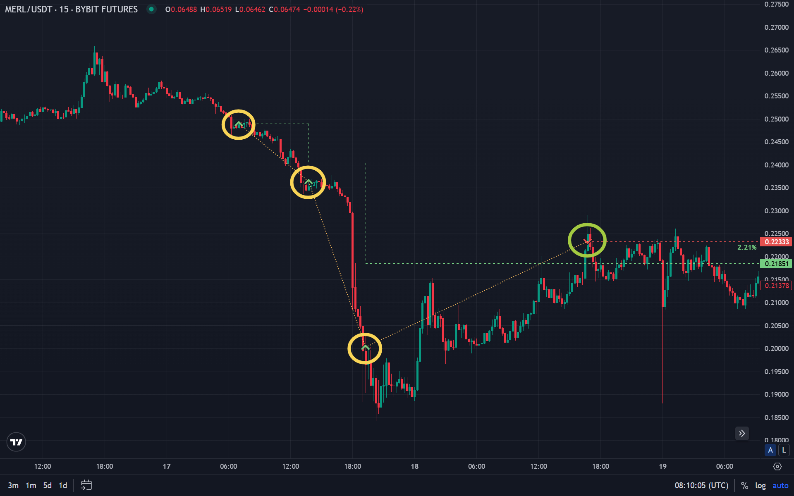

DCA (Dollar Cost Averaging) is a strategy of buying an asset for the same amount at regular intervals regardless of price. In crypto it is used both for long-term accumulation and in algorithmic trading (DCA bots).

This article covers how DCA works, how it differs from a single lump-sum purchase, pros and cons, how to apply it in practice, and when the strategy is most appropriate.

## What Is DCA (Averaging)

**DCA (Dollar Cost Averaging)** is an approach where a fixed amount is invested at equal time intervals regardless of the current price. The name means “averaging the dollar cost.”

The idea is simple: instead of trying to time one large entry, the buyer spreads capital over time. When the price is high, the same amount buys fewer units; when it is low, more. As a result, the average entry price is smoothed and less dependent on short-term market swings.

### Key DCA Parameters

- **Fixed amount** — each purchase is for the same sum (e.g. $50 per week), not the same number of coins.
- **Interval** — how often you buy: weekly, biweekly, monthly. More frequent intervals with the same amount smooth the entry more.
- **Time horizon** — the strategy is for long-term accumulation; short-term speculation is a different use case.

DCA does not require predicting market direction and reduces the stress of choosing the “perfect” entry. For more on crypto basics, see [Bitcoin basics](/en/library/bitcoin-basics/).

## How DCA Works in Practice

Example: $100 per week for 4 weeks. Asset price per week: $50, $40, $60, $50.

- Week 1: $100 / $50 = 2 units.
- Week 2: $100 / $40 = 2.5 units.
- Week 3: $100 / $60 ≈ 1.67 units.
- Week 4: $100 / $50 = 2 units.

Total spent $400, units bought 8.17. Average entry: $400 / 8.17 ≈ $48.96. The arithmetic average price over the period is $50; because more was bought when price was low ($40), the DCA entry is below that.

### Choosing Interval and Amount

- **Weekly DCA** — stronger smoothing, more trades and fees.
- **Monthly DCA** — easier to stick to, fewer fees, fewer averaging points.
- **Amount** — set from budget and horizon; regular purchases should be affordable without straining finances.

On the volatile crypto market, DCA is especially suited to long-term accumulation. For comparing entry approaches, [backtesting](/en/library/what-are-backtests/) helps evaluate strategies on history.

## Pros and Cons of DCA in Crypto

### Advantages

- **No need to time the bottom** — “when to enter” is replaced by discipline and a schedule.
- **Less emotional bias** — regular planned purchases reduce the urge to buy at euphoric highs or panic at lows.
- **Smoothing volatility** — average entry often ends up below the period’s average market price due to buying more at lower prices.
- **Saving discipline** — a fixed schedule helps build a habit of setting aside and investing.

### Disadvantages

- **In a strong uptrend** a single purchase at the start could have earned more; part of the money “arrives” later at higher prices.
- **Fees** — frequent buys mean more trades and total fees; can matter on small amounts.
- **No protection in a long bear market** — DCA only averages the entry; it does not insure against a prolonged downturn.

DCA fits well with [risk management](/en/library/risk-management-crypto-trading-bots/) in trading: avoid putting in money you cannot afford to lose or borrowed funds.

## DCA and Algo Trading

In algorithmic trading, DCA is implemented as DCA bots: a script or service sends a buy order for a set amount on a schedule. Typical settings:

- Currency or pair (e.g. USDT and asset).
- Amount per purchase.
- Interval (daily, weekly, monthly).
- Optional price limits (do not buy above/below a level).

Such a bot removes the need to log in and place each trade manually. Before going live, test logic and parameters with backtesting and on demo or small size; risk settings (share of capital for DCA, limits) should follow general [risk-management](/en/library/risk-management-crypto-trading-bots/) rules.

## When DCA Fits and When It Does Not

**DCA fits:**

- Long-term crypto accumulation (horizon of a year or more).
- When there is no goal or ability to “catch” the exact bottom.
- In sideways or volatile markets when one large lump-sum buy is too stressful or costly. For trading in a range, see [strategies for sideways markets](/en/library/sideways-trend-strategies/).

**DCA fits less:**

- Short-term speculation — entry and exit timing matter more than averaging over time.
- When there is strong conviction in a near-term rally and capital allows one entry without excessive risk (lump sum may yield more but with higher risk).

Bottom line: DCA is a tool for accumulation and reducing entry-timing stress, not a way to “profit from drawdowns” by buying forever.

## Summary

DCA in crypto is regular purchases of a fixed amount on a schedule. It smooths entry price, reduces dependence on timing, and enforces saving discipline. It does not guarantee profit and in a strong uptrend may underperform a single purchase, but it remains one of the clearest and most practical approaches for long-term accumulation and DCA bots. For more depth, see the blog’s materials on backtesting, risk management, and sideways-trend strategies.

## FAQ

**What is DCA in simple terms?**

DCA is buying an asset regularly (e.g. weekly or monthly) for the same amount regardless of price. The average entry price is smoothed and you avoid having to time one big purchase.

**Is DCA better than a lump-sum purchase?**

Neither is universally better — it depends on context. In a strong uptrend, one purchase at the start could earn more. In volatile or sideways markets, DCA often gives a more comfortable average entry and less stress.

**How often should I DCA in crypto?**

Frequency is a matter of budget and convenience: weekly gives more smoothing and more fees, monthly is simpler with fewer trades. For crypto, intervals from a week to a month are common.

**Should I backtest DCA?**

For a simple “buy $N every period,” a backtest shows average entry and historical outcome. For a DCA bot with extra rules (limits, stops), backtest and demo test help check logic and fees. More in [what are backtests](/en/library/what-are-backtests/).

**How does DCA differ from grid trading?**

DCA is time-based purchases of a fixed amount, usually one direction (accumulation). Grid is a set of buy and sell orders in a price range, profiting from swings inside the range. For grid, see [grid trading](/en/library/grid-trading-crypto/).

**Is DCA good for beginners?**

Yes. DCA does not require price forecasting or complex analysis; you set amount and interval. Avoid investing money you need or borrowing; consider fees on frequent small buys; risk-management basics apply to any strategy.
