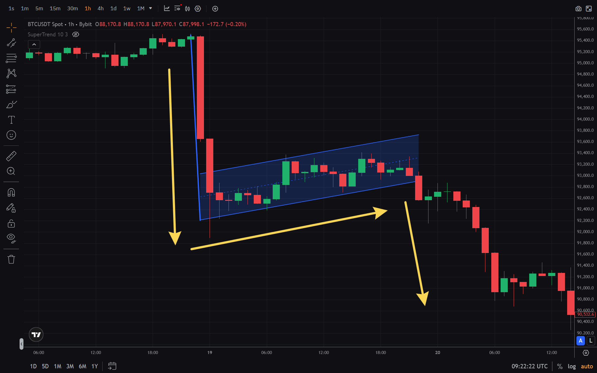

Flag and pennant patterns are classic technical analysis continuation structures. They often appear on crypto charts and help traders time entries after a short pause in a strong move.

In this guide we cover what flags and pennants are, how to identify them, how to trade them, and the most common mistakes.

## What is a flag pattern

The **flag pattern** is a continuation setup that forms after a strong impulsive price move. Visually, a flag looks like a small rectangle / parallel channel tilted against the direction of the main trend.

### Flag structure

The pattern has two parts:

1. **Flagpole** — the strong impulse move
2. **Flag** — a brief consolidation inside a parallel channel tilted against the trend

### Bull flag

A bull flag forms after an up-move. The flagpole points up, while the consolidation channel tilts down. Despite the downward tilt, the setup suggests continuation higher after a breakout above the upper boundary.

### Bear flag

A bear flag forms after a down-move. The flagpole points down, while the consolidation channel tilts up. The setup suggests continuation lower after a breakdown below the lower boundary.

## What is a pennant pattern

The **pennant pattern** is a variation of a flag with a different consolidation shape. Instead of a parallel channel, a pennant compresses into a small symmetrical triangle (converging lines).

The practical idea is to show a “pause” after an impulse: the range contracts while buyers and sellers temporarily balance. In the classic scenario, the breakout happens in the direction of the original impulse, and higher volume on the breakout strengthens the signal.

### Pennant vs flag

- **Flag**: parallel support and resistance lines
- **Pennant**: converging lines forming a triangle

Both are continuation patterns and follow the same logic.

## How to identify flags and pennants

### Identification criteria

1. **Strong impulse move** — the flagpole should be obvious and directional
2. **Consolidation** — on daily charts, flags/pennants often form over ~1–4 weeks
3. **Volume** — volume tends to contract during consolidation and expand on breakout
4. **Breakout** — price must break the pattern boundary in the trend direction

### Best timeframes

Flags and pennants work on any timeframe, but the most reliable signals are typically on:

- **H4 (4-hour)** and higher
- **D1 (daily)** — strongest signals
- **W1 (weekly)** — for longer-term positioning

On very small timeframes (M1–M15), patterns appear more often but produce more false signals.

## How to trade flags and pennants

### Entry rules

1. **Wait for the breakout** — a candle should close beyond the pattern boundary
2. **Confirm with volume** — volume should expand on the breakout
3. **Enter after confirmation** — open the position after a close beyond the boundary

### Stop-loss placement

Typical stop placement:

- **Bull flag**: below the lower boundary of the pattern
- **Bear flag**: above the upper boundary of the pattern

### Take-profit target

A classic target method:

- **Flagpole height** = distance from the start to the end of the impulse move
- **Target** = project the flagpole height from the breakout point

Example: if the flagpole is 100 points, the target is ~100 points from the breakout.

## Combining with indicators

Flags and pennants often work better when combined with other tools:

- **[RSI](/en/library/technical-analysis-rsi)** — to confirm overbought/oversold context
- **[MFI](/en/library/money-flow-index)** — to confirm breakout pressure with volume
- **[Candlestick patterns](/en/library/what-are-doji-candles)** — for extra confirmation

## Common mistakes

### 1. Entering before the breakout

Avoid entering before price breaks the pattern boundary. Early entries can get trapped if the breakout fails.

### 2. Ignoring volume

Breakouts without volume expansion are often false. Always check volume behavior.

### 3. Trading against the trend

Flags and pennants are continuation patterns, not reversal patterns. Don’t force them against the dominant trend.

### 4. Using very small timeframes

On M1–M15, patterns produce many false signals. Prefer H4 and higher.

## Using flags/pennants in algorithmic trading

These patterns can be used in bots. A bot can:

- detect the pattern structure
- wait for a breakout
- validate with volume filters
- place stop-loss and take-profit automatically

Before going live, test the logic on historical data with **[backtesting](/en/library/what-are-backtests)**.

## FAQ

**What is the difference between a flag and a pennant?**

A flag forms with parallel lines; a pennant forms with converging lines (triangle). The trading logic is similar.

**Do flags always mean continuation?**

No — false breakouts happen. Wait for a close beyond the boundary and volume confirmation.

**What timeframe is best for flags?**

H4 and D1 are usually the most reliable. Smaller timeframes produce more noise.

**Can flags be used for scalping?**

Technically yes, but the reliability drops on lower timeframes. Prefer H4+ when possible.

**How do I tell a real breakout from a false one?**

A real breakout often comes with volume expansion and a candle close beyond the boundary; a false breakout frequently snaps back inside the pattern quickly.

**Bottom line:** Flags and pennants are effective continuation tools when traded with confirmation (breakout close + volume) and proper risk control. Always test your rules via **[backtesting](/en/library/what-are-backtests)**.

