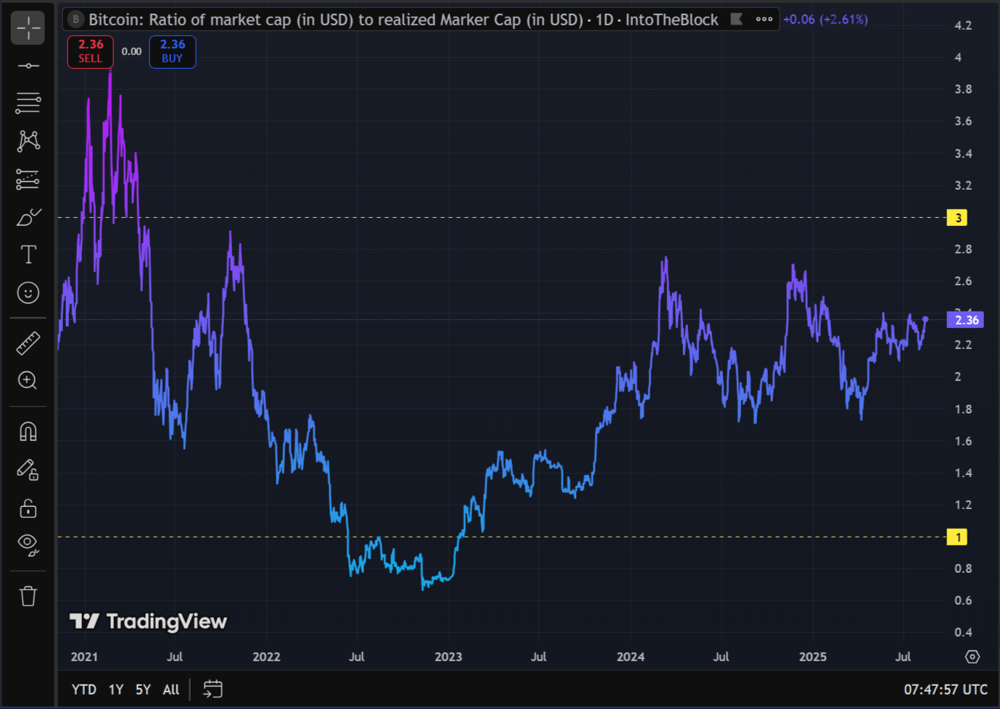
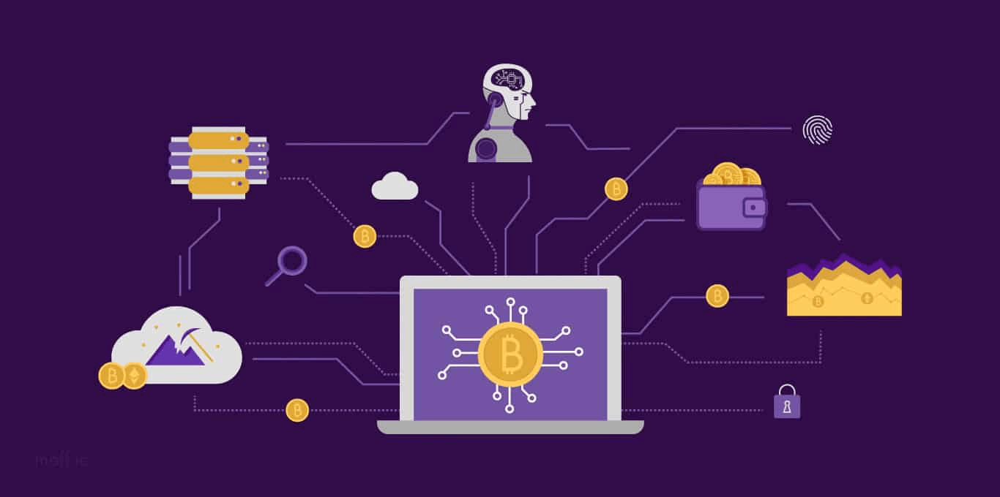
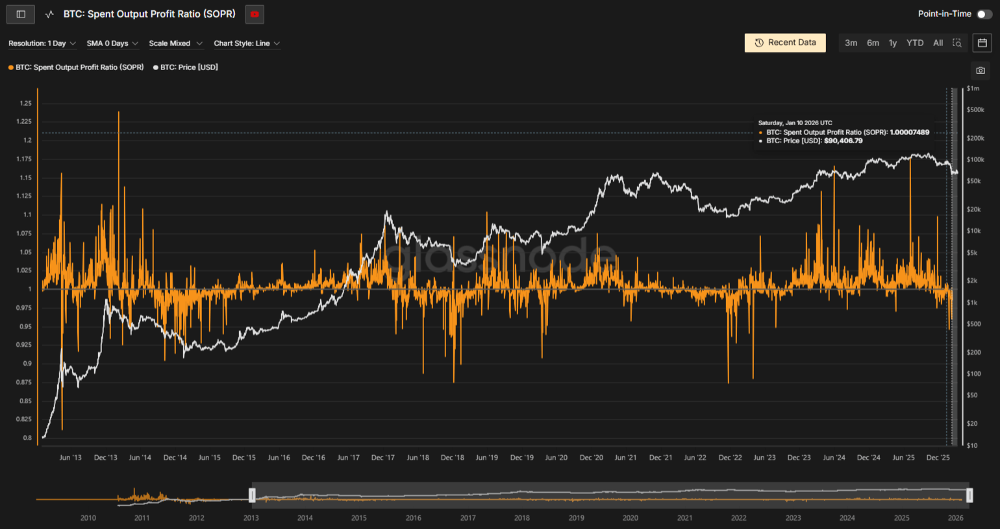

On-chain analysis is working with data from the blockchain itself: transactions, wallets, asset flows. If technical analysis shows *how* price moves, on-chain explains *why* it happens. For a trader, on-chain metrics are part of fundamental analysis: they help assess cycle context, overheated or undervalued zones, and large players’ behavior. This article covers key metrics to track and how not to overstate their role.

## Why traders use on-chain data

The blockchain is a public ledger: all transfers, balances, and coin flows are recorded there. On-chain analysis reveals large players’ footprints, accumulation zones, and signals that appear late or not at all on the chart. It does not replace technical analysis but complements it: it helps choose when to enter or exit, position size, and level of aggression. On-chain sets cycle context and participant sentiment; entry and exit points are still found from levels, indicators, and volume on the chart.

## Five on-chain metrics for fundamental context

### 1. Coin flows to and from exchanges

Large on-chain transfers often set market direction.

- **Coins flowing to exchanges** — supply "for sale" rises; correction or selling pressure is possible.
- **Coins leaving exchanges for wallets** — accumulation; participants are less willing to sell, liquidity is "locked."

Services like Glassnode or CryptoQuant show exchange balances and flows. Not every large transfer is a signal: there are internal transfers, market makers, arbitrage. Look at trend and volume, not a single transaction.

**Example:** If 50,000+ BTC left exchanges in a week, that's an accumulation signal. If 30,000+ BTC came in — possible selling pressure.

### 2. MVRV (Market Value to Realized Value)

MVRV compares market cap with the "realized" value of coins (at the price of last move). In essence — how much the market values the asset above or below average acquisition price.

- **MVRV < 1** — market price below "realized"; many hold at a loss. Often read as undervaluation or capitulation.
- **MVRV > 3–3.5** — strong overheating; many in profit, incentive to take profit rises. Correction risk is higher.

MVRV does not give a precise buy/sell point but sets context: in MVRV < 1 it's wiser to look for long setups and not overload shorts; at MVRV > 3 — be cautious adding to longs and watch for distribution on the chart.

**Historical data:**
- 2018 bottom: MVRV ≈ 0.8
- 2021 peak: MVRV ≈ 3.8
- 2022 bottom (FTX): MVRV ≈ 0.9

### 3. SOPR (Spent Output Profit Ratio)

SOPR shows whether participants are selling at a profit or loss (from the average price of "spent" outputs).

- **SOPR > 1** — profit-taking; many sellers in profit, market can cool off.
- **SOPR < 1** — loss-taking; often linked to capitulation and a possible bounce.

Like MVRV, SOPR is better used as a sentiment filter, not the only trigger. Combining with technical analysis (levels, volume, [RSI](/en/library/technical-analysis-rsi/)) gives more robust decisions.

**Variations:**
- **aSOPR (adjusted SOPR)** — excludes transactions shorter than 1 hour (noise)
- **SOPR by group** — separately for whales (>1000 BTC), sharks (100-1000 BTC), retail

### 4. Risk zones on futures (liquidations)

On futures markets, positions pile up with liquidations "hanging" below or above. Analyzing these zones helps assess the risk of sharp moves.

- **Many longs near liquidation** — a drop can trigger cascading liquidations and accelerate the fall.
- **Shorts near liquidation** — a rally can cause a short squeeze and a sharp bounce up.

Liquidation data is available on Coinglass, for example. Use it when sizing positions and setting stop losses, not as a replacement for your trading system.

**Example:** If $500M of short liquidations are stacked at $95,000, a break above $95,000 could trigger a sharp spike to $98,000-100,000 due to chain reaction of position closures.

### 5. Large holder activity

Tracking large-holder wallets and flows into new projects shows where capital is moving. Large investors accumulating an asset — possible interest signal; mass outflow into a new token — shift of focus. Such data is available from Nansen, Arkham and similar services. Interpret with care: "whales" can create false trails or act in market-making interests.

**Holder classification:**
- **Whales:** >1,000 BTC (or equivalent)
- **Sharks:** 100-1,000 BTC
- **Fish:** 10-100 BTC
- **Retail:** <10 BTC

## Services for on-chain analysis

**Glassnode:**
- Metrics: MVRV, SOPR, exchange balances, active addresses
- Pricing: free (basic), $29/mo (advanced)

**CryptoQuant:**
- Metrics: exchange reserves, flows, whales, futures
- Pricing: free (basic), $29/mo (pro)

**Nansen:**
- Metrics: whale wallets, smart money, new projects
- Pricing: from $199/mo

**Dune Analytics:**
- Metrics: custom dashboards, DeFi, NFT
- Pricing: free (basic), $199/mo (pro)

**Coinglass:**
- Metrics: liquidations, open interest, long/short ratio
- Pricing: free

.png)

For on-chain trading automation, platforms like [Veles](https://veles.finance/invite/washmallay) offer built-in metrics and bots for signal-based execution.

## Pitfalls of on-chain data

On-chain analysis is powerful but not perfect. A large transfer can be an internal move or OTC deal, not a market signal. Data can lag; aggregate metrics (MVRV, SOPR) smooth the picture. To reduce risk, combine on-chain metrics with [technical analysis](/en/library/technical-analysis-rsi/) and [volume](/en/library/money-flow-index/) — so the strategy depends less on one group of signals and is more robust to market traps.

## How to add on-chain to your process

1. **Gather data** — Glassnode, CryptoQuant, Nansen, Dune Analytics: transactions, exchange reserves, MVRV, SOPR.
2. **Look for context** — undervaluation (MVRV < 1), accumulation (outflow from exchanges), liquidation risk on futures.
3. **Tie to technical analysis** — e.g. MVRV < 1 and coins leaving exchanges → look for long setups by levels and indicators; SOPR > 1 and mass inflow to exchanges → be cautious with new longs, check for distribution.
4. **Check on history** — if you use [backtests](/en/library/what-are-backtests/), you can use on-chain conditions as a period filter (e.g. only go long when MVRV is below a threshold).

On-chain data is not a replacement for the chart and indicators but a way to make decisions more informed: who is moving the market, where liquidity is concentrated, and which phase of the cycle you're in. Together with fundamental and technical analysis, on-chain helps not just follow trends but better assess risks and opportunities.

Platforms like [Veles](https://veles.finance/invite/washmallay) offer automated on-chain trading with built-in metrics and bots for signal-based execution.

## Summary

Briefly: the key points are above; use them as a practical checklist and combine with risk management.

## FAQ

**What is MVRV in simple terms?**  
MVRV (Market Value to Realized Value) compares current market cap with the “realized” value of coins (at last-move price). MVRV < 1 — many hold at a loss, often read as undervaluation; MVRV > 3 — strong overheating, higher correction risk.

**Where to see exchange reserves and flows?**  
Services like Glassnode, CryptoQuant and similar show exchange balances and coin flows to and from exchanges. Futures liquidation data — e.g. Coinglass.

**Does on-chain replace technical analysis?**
No. On-chain complements technical analysis: it gives cycle context and participant sentiment. Entry and exit points are still found from levels, indicators, and volume on the chart.
