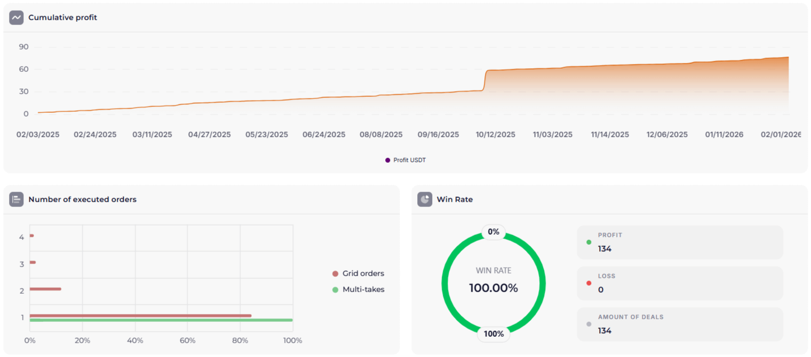
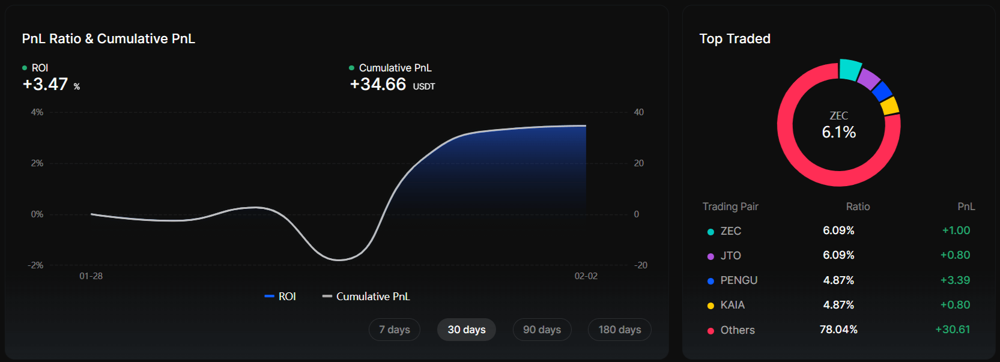

ORACLE version 1.1 is a set of strategy settings where the signal is formed by the alignment of four indicators on different [timeframes](/en/library/timeframes-trading/): from higher to lower — Bollinger Bands, ATR%, ROC, and Williams %R. You can set up and run the strategy on the algo-trading platform Veles [referral link](https://veles.finance/invite/washmallay). Below: the setup architecture, what kind of moves we target, annual backtests, and a link to the BingX copy-master test account.

**Important:** this system is currently in test mode. BingX results are for information only; before using the strategy, read about [risk management](/en/library/risk-management-crypto-trading-bots/) and the [Diversification and trading system setup](/en/library/diversification-trading-system-part-1/) series.

## Overview of settings: from higher to lower timeframes

Indicators are ordered from the highest timeframe to the lowest: H1 → M30 → M15 → M5. This sets context first (volatility and boundaries on the hourly), then momentum filters and entry on the five-minute chart.

### Bollinger Bands (H1)

[Bollinger Bands](/en/library/bollinger-bands/) are set on the **hourly timeframe (H1)** — the highest in this setup. They define volatility boundaries: a touch or break of the upper or lower band indicates an extreme deviation from the average. On H1 this filters out minor “noise” and shows when the asset has actually moved away from recent norms. Calculation and interpretation details are in the [Bollinger Bands](/en/library/bollinger-bands/) article.

### ATR% (M30)

[ATR%](/en/library/atr-and-atr-percent/) is used on the **M30 timeframe** to track volatility. When there is interest from both buyers and sellers in the asset, an ATR% value **above 1%** indicates sufficient market “activity”. This filters out overly quiet periods and focuses on moves with acceptable amplitude.

### ROC — Rate of Change (M15)

[ROC (Rate of Change)](/en/library/rate-of-change-roc/) on **M15** provides the rate of price change and movement into oversold territory. In the ORACLE 1.1 configuration a moderate impulse of **−1** is used: a downward move with that ROC value is treated as one of the filters before a possible bounce. More on ROC calculation and levels in the [ROC in cryptocurrency trading](/en/library/rate-of-change-roc/) article.

### Williams %R (M5)

[Williams %R](/en/library/williams-percent-range-r/) is on **M5** — the lowest timeframe in the strategy. Standard overbought and oversold levels for this oscillator are used. Entry into a trade or position averaging is only when there is **an exit from the oversold zone and a return toward the midpoint**. Price can fall for a long time (e.g. in a strong dump), but we only enter when Williams %R confirms — in this configuration that means crossing the lower boundary of the oversold zone and turning up. This reduces the chance of “catching a falling knife”.

## How the signal is formed

A signal is considered when all four levels agree: on H1 price is at the Bollinger band boundary, on M30 ATR% &gt; 1%, on M15 ROC shows the chosen impulse (e.g. −1 or above/below that value), on M5 Williams %R shows an exit from oversold and return to the mean. A single indicator can give false triggers; the multi-timeframe combination reduces entries into “noise”. More on combining indicators in the [trading signals](/en/library/what-are-trading-signals/) and [backtests](/en/library/what-are-backtests/) articles.

## Backtests (annual, BingX commissions)

Below are the results of annual backtests (commissions — BingX at the time of writing):

[✖️ 🪄 BINGX ZEC ORACLE 1.1](https://ru.veles.finance/share/EYBFB)

[✖️ 🪄 BINGX WOO ORACLE 1.1](https://ru.veles.finance/share/Krlla)

## BingX test results

This trading strategy has recently started testing on a BingX copy-master account. Public stats and results (profitability, total P/L, distribution by pair) are available at: [BingX Copy Trading — ORACLE 1.1](https://bingx.com/int/1tjKO4). To register on the exchange use the referral link: [BingX](https://bingxdao.com/invite/CUBDBG/) — also on the [About](/en/about/) page and in the site footer alongside Bybit, Bitget and Veles.

## Link to diversification and risk

One bot’s settings are part of the overall system. How to avoid concentrating all volume in one strategy, spread capital across assets and venues, and reduce risk load is covered in the [Diversification and trading system setup](/en/library/diversification-trading-system-part-1/) series. Connecting to an exchange via API and basic steps are in [setting up the bot on Bybit](/en/library/bybit-trading-bot-setup/); [risk management](/en/library/risk-management-crypto-trading-bots/) principles apply to ORACLE 1.1 as well.

## Summary

- ORACLE 1.1 — a set of settings on four indicators, in timeframe order: Bollinger Bands (H1), ATR% (M30), ROC (M15), Williams %R (M5). Signal when all four align.
- ATR% is used only as a volatility filter (&gt; 1%). Entry/averaging only when Williams %R confirms (exit from oversold).
- System is in test mode.

Find out more about the project, principles and ways to support it on the **[About](https://marketlab-academy.org/en/about/)** page.
