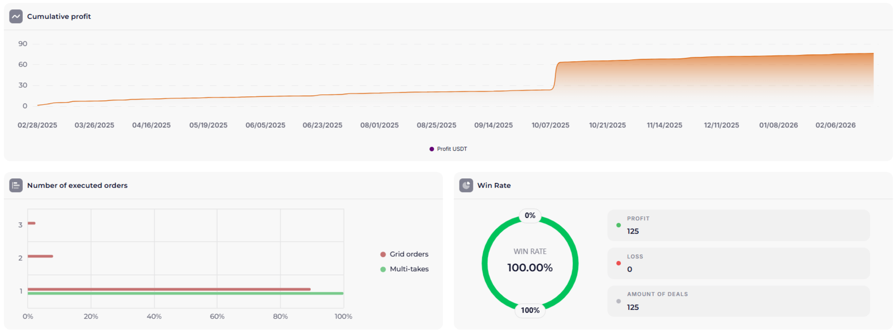
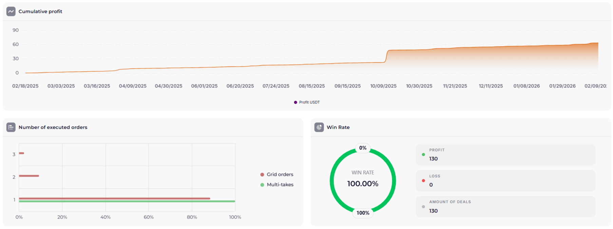

**Prisma 5.5** is a proprietary strategy from the [Veles](https://veles.finance/invite/washmallay) platform for automated trading. This article provides a full breakdown of the settings: which indicators are used for entry, how to set up the order grid, and which pairs to launch on.

**Important:** Before using any strategy, familiarize yourself with [risk management](/en/library/risk-management-crypto-trading-bots/) and the series [Diversification and Trading System Setup](/en/library/diversification-trading-system-part-1/).

## What is Prisma 5.5?

Prisma 5.5 is a high-frequency trading strategy designed for the volatile crypto market. It combines trend filters and oscillators to find optimal entry points for Long positions.

## Strategy Settings

### Main Parameters

| Parameter | Value |
|---|---|
| Direction | Long |
| Exchange | Bybit / BingX / Bitget |
| Order Grid | 4 orders |
| Overlap | 28% |
| First Order Offset | 0.2% |
| Martingale | 1.05 - 1.1 |

It should be noted that the parameters, like the settings of other Marketlab strategies, are quite flexible and can be adjusted to suit your risk management.

### Entry Indicators (Filters)

To open a position in Prisma 5.5, the following indicators are used:

1. **[CMO (Chande Momentum Oscillator)](/en/library/chande-momentum-oscillator/)**
   • Period: 14
   • Levels: ±50
   • Condition: CMO below −50 (oversold zone) before Long entry, above +50 — upward momentum (oversold zone)

2. **Bollinger Bands**
   - Period: 20, Deviation: 2
   - Condition: Price below the lower band

3. **RSI (Relative Strength Index)**
   - Period: 14
   - Level: 30
   - Condition: RSI less than 30

### Order Grid Management

The grid is configured considering current volatility:
- **Order Step:** logarithmic, starting from 0.5%
- **Martingale Coefficient:** allows for a faster return to profit during price reversals.

## Which Pairs to Launch On

It is recommended to use liquid pairs with high trading volume:
- **TOP-10:** BTC/USDT, ETH/USDT, SOL/USDT.
- **Volatile altcoins:** ARB/USDT, OP/USDT, LINK/USDT.

## Backtests Prisma 5.5

[✖️ 🌪 BINGX KAS PRISMA 5.5](https://veles.finance/share/Vsyhz)

[✖️ 🌪 BINGX UNI PRISMA 5.5](https://veles.finance/share/zslhm)

## Conclusion

Prisma 5.5 is a balanced strategy for automating spot and futures trading with a moderate level of risk. It is essential to monitor margin levels and adhere to diversification rules to ensure the stability of the trading system.

Proven platforms are available to start trading:
- **[Bybit](https://www.bybit.com/invite?ref=PWMD24)** — a leading exchange for working with [trading bots](/en/library/bybit-trading-bot-setup/).
- **[Bitget](https://www.bitget.com/referral/register?from=referral&clacCode=23EHR2VD)** — a platform with a user-friendly interface and bonuses for new users.
- **[BingX](https://bingxdao.com/invite/CUBDBG/)** — a popular choice for social trading and copy trading.

---

## Related Materials

**Basics and Strategies:** Prisma 5.5 is an advanced-level strategy. For beginners, it is recommended to start with [spot trading](/en/library/what-is-spot-trading/) and the basic [ELDER 2.0 strategy](/en/library/spot-strategy-elder-20/).

**Tools and Automation:** information is available on [how backtests work](/en/library/what-are-backtests/) and how to [set up a bot on Bybit](/en/library/bybit-trading-bot-setup/). Studying the [DCA strategy](/en/library/dca-strategy-crypto/) is also recommended.

**Experience and Risks:** it is critically important to understand [risk management when working with bots](/en/library/risk-management-crypto-trading-bots/) and to monitor [diversification](/en/library/diversification-trading-system-part-1/).
