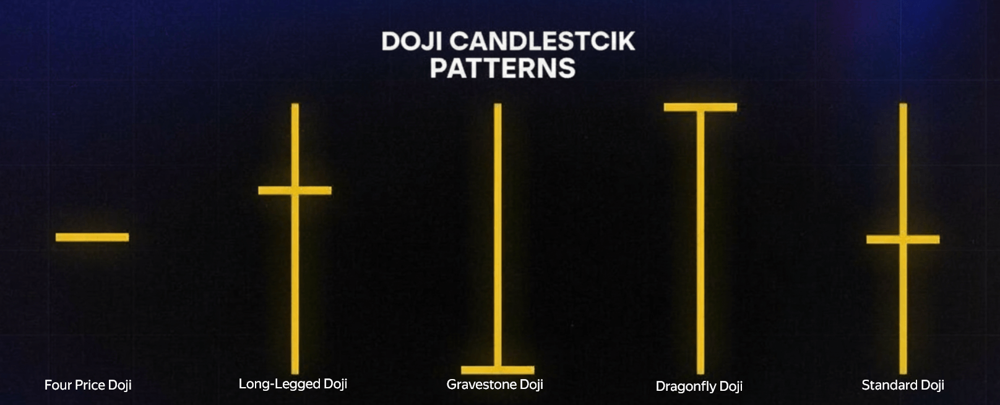

Technical analysis is the basis for decision-making for most traders. One of the most recognisable and important elements of candlestick analysis is the **doji** pattern. These candles reflect a moment of indecision in the market and often act as a precursor to a reversal or pause in the trend.

The article explains what doji are, what types exist, how to interpret them correctly, and how to use them in trading. It also covers common mistakes when analysing doji and how to combine them with [indicators](/en/library/technical-analysis-rsi) and [backtesting](/en/library/what-are-backtests) of strategies.

## What Are Doji Candles

**Doji candles** are elements of candlestick analysis that reflect a state of indecision in the market. In the classic Japanese model, a doji appears as a candle with a very small body (or none at all) and often pronounced wicks.

This shape means that over the chosen period, buyers and sellers were roughly in balance: the close matched the open or stayed very close to it. The market effectively “stalled”—neither bulls nor bears managed to set the direction.

### Origin and Meaning

The term “doji” comes from Japanese candlestick analysis. Literally it is linked to the idea of “balance” or “indecision”: the candle shows price movement within the period but without a clear outcome. That is why doji are often treated not as a standalone signal to act, but as a warning: a change in momentum or a pause before the trend continues is possible.

### Relation to Other Candlestick Patterns

Doji belong to the family of reversal and continuation patterns. They are often combined with other candlestick patterns (engulfing, pin bars), as well as with the [Money Flow Index (MFI)](/en/library/money-flow-index) and support/resistance levels. A single doji alone rarely provides enough reason to enter; context and confirmation matter.

## Main Types of Doji Candles

There are several variants of this pattern. Each carries a different shade of signal depending on the shape and position of the wicks.

### Standard Doji

Short wicks and a minimal body. Indicates consolidation and temporary balance between supply and demand. Often appears before key levels or news when participants are on the sidelines. By itself it rarely gives a clear signal; its value increases when combined with context and follow-up candles.

### Long-Legged Doji

Long wicks in both directions with a small body. A strong sign of high indecision: price moved up and down noticeably but closed near the open. This doji often forms in volatile markets and can precede a reversal. Direction is determined by the next candles and the level (support or resistance) where it formed.

### Dragonfly Doji

A long lower wick and no (or minimal) upper wick. Price sold off during the period but buyers recovered to the open by the close. Often forms at local lows and can signal weakening sellers and a possible reversal up. It is especially meaningful near support.

### Gravestone Doji

A long upper wick with no lower wick. Price rallied during the period but gave back gains to close at the open. Appears at peaks and resistance, signalling selling pressure and a possible move down. In a strong uptrend, a single gravestone may just be a pause; context and confirmation matter.

### Four-Price Doji

A rare case: open, close, high and low all coincide. The candle looks like a horizontal line with no body or wicks. Typical of illiquid instruments or extremely “frozen” markets. On liquid assets it is rare and often related to data display quirks.

## Meaning in Technical Analysis

A doji on the chart often serves as a warning of a shift in sentiment or a pause. Interpretation depends on context: trend, level, volume, and timeframe.

### At the Top of a Trend

A doji after an extended rally can mean buyers are losing control and momentum is fading. A gravestone or long-legged doji on high volume is especially telling. Wait for confirmation from the next candle or [indicator signals](/en/library/technical-analysis-rsi) before considering a short.

A strong uptrend often ends not with a sharp drop but with a “hang”: several candles with small bodies, including doji. That is a decision zone—profit-taking by some and dip-buying by others. Once the next candle closes clearly lower, especially below the doji low, the odds of a shift increase.

### At the Bottom of a Trend

A doji (especially a dragonfly) near support can suggest weakening sellers and a possible bounce. As at the top, confirmation matters: the next candle, volume, and oversold zones on RSI or MFI.

A dragonfly at support shows sellers pushed price down, but by the close buyers had recovered. If the next candle closes above the doji high, ideally on higher volume, that strengthens the case for a possible reversal up.

### In the Middle of a Move

In a strong trend, a doji often indicates a pause (consolidation) before the move continues. Do not automatically treat it as a reversal; a pullback and then continuation in the trend direction is possible.

In trending phases, doji often form “islands” before the next impulse. Watch the overall structure: if the uptrend is intact (e.g. a series of higher lows), a single doji is more likely a breather than a trend change.

## How to Trade Using Doji

To use doji effectively, follow confirmation and risk-management rules.

### Confirmation Rule

Avoid opening a trade on a single doji. Wait for the next candle to close in the direction of the expected reversal. For example, after a dragonfly at support—a close above the doji body. After a gravestone at resistance—a close below.

### Volume Analysis

A doji on high volume carries much more weight than on low volume. Rising volume as the doji forms strengthens the signal of a possible sentiment shift.

### Levels and Timeframes

The pattern is most reliable at strong historical support or resistance. On higher timeframes (daily, weekly) doji are often more meaningful than on lower ones. On 4H and daily, there tend to be fewer false signals, and the “doji + level” combo usually gives cleaner entries than on intraday charts.

### Combining with Indicators and Backtesting

Doji can be used in trading systems together with [RSI](/en/library/technical-analysis-rsi), [MFI](/en/library/money-flow-index), and other tools. For example: a dragonfly at support plus RSI in oversold territory gives a stronger long signal than a doji alone. Before going live, [backtest](/en/library/what-are-backtests) any strategy on historical data.

### Short Example

“Doji at level” strategy: on the daily chart, price approaches strong support and a dragonfly forms. Volume is above average, [RSI](/en/library/technical-analysis-rsi) is oversold. Entry—after the next candle closes above the doji high. Stop—below the doji low or below support. Such a setup is worth testing via [backtest](/en/library/what-are-backtests).

## Mistakes When Interpreting Doji

### Treating Doji as a 100% Reversal Signal

Doji indicate indecision, not a guaranteed reversal. The trend can continue, or lengthy consolidation can follow. Confirmation and context are always needed.

### Ignoring Context

Doji cannot be analysed in isolation from trend, volume, and levels. The same shape at a top vs a bottom has different implications.

### No Stop-Loss

Candlestick patterns often produce false signals, especially in volatile markets. Protecting the position with a stop-loss is mandatory.

### Trading Doji Only on Lower Timeframes

On lower timeframes there is more noise. Doji tend to be more useful on 4H, daily, and above, especially together with levels and indicators.

### Ignoring Volume

A doji on unusually low volume can be a random “stalled” candle with little meaning. A doji on a volume spike is usually more informative and more often precedes meaningful moves.

## Frequently Asked Questions

**Does a doji always mean a reversal?** No. A doji reflects balance between buyers and sellers. It can precede a reversal, a pause, or trend continuation after brief consolidation. Context and confirmation matter.

**Which doji is best for entry?** Dragonflies at support often feature in upside reversals; gravestones at resistance in downside reversals. A long-legged doji can precede a turn either way. In all cases, location, volume, and confirmation matter more than the “type” alone.

**Should doji be combined with indicators?** Yes. Confirmation with [RSI](/en/library/technical-analysis-rsi) or [MFI](/en/library/money-flow-index) overbought/oversold zones and support/resistance improves reliability.

**On which timeframes are doji more reliable?** On daily and higher (4H, weekly). On lower (M1–M15) there is more noise; a single doji less often gives a robust signal.

**Can you trade only with doji?** Theoretically yes, but in practice doji work better as one element of a system: together with trend, levels, volume, and indicators. [Backtesting](/en/library/what-are-backtests) helps check how such a combination performed in the past.

**How does doji differ from other reversal candles?** Doji emphasise indecision: open ≈ close. Patterns like engulfing or pin bars show one side already in control. Doji are often a “warning”; the others are already “action”.

---

**Bottom line:** Doji candles are a useful technical analysis tool but work best together with context, levels, volume, and indicators. Confirmation from the next candle and stop-losses are recommended. Strategies using doji should be [tested on history](/en/library/what-are-backtests) before live trading. Different doji types—dragonfly, gravestone, long-legged—convey different meaning depending on where they appear; the key to using them lies in context and confirmation, not in the candle shape alone.
