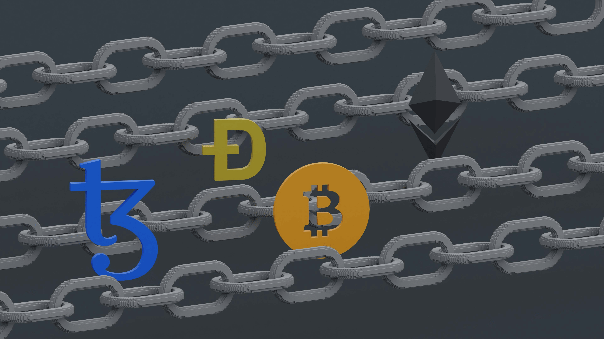

Bitcoin is the first cryptocurrency, built on blockchain. The core idea is decentralization: no single authority, which makes it independent of traditional finance.

## What is Bitcoin

**Bitcoin (BTC)** is a [digital currency](/en/library/what-is-digital-currency-in-simple-terms/) that exists only in digital form. It was created as an alternative to traditional money for secure, fast, and decentralized transactions. Its key feature is the blockchain — a cryptographically secured ledger of transactions.

## History

Main milestones:

1. **2008 — The idea:** During the global financial crisis, Satoshi Nakamoto published the whitepaper for a decentralized digital currency. The goal was a system free from bank control.
2. **2009 — Launch:** The Bitcoin network went live with the first block (genesis block).
3. **2010 — First purchase:** Programmer Laszlo Hanyecz made the first known purchase with Bitcoin (2 pizzas for 10,000 BTC).
4. **2011 — Growth:** First competitors (altcoins), such as Litecoin, appeared.
5. **Rising interest:** From 2012, Bitcoin was increasingly seen as an investment. Major exchanges like Coinbase and Kraken emerged.

## How it works

Bitcoin runs on a blockchain — a chain of blocks that record all transactions.

### 1. Blockchain — the foundation
The blockchain is a sequence of blocks. Each block is linked to the previous one by a unique cryptographic hash, which keeps the data intact.
- **Block:** A set of transactions over a period.
- **Hash:** A unique identifier for the block.
- **Decentralization:** Data is stored on thousands of nodes worldwide.

### 2. Transactions
Transfers between users.
- A private key (digital signature) is used to authorize.
- The transaction enters the mempool (queue) until it is included in a block.

### 3. Mining
The process of confirming transactions and creating new blocks. Miners solve hard mathematical problems.
- **Reward:** Miners receive new BTC for adding a block.
- **Difficulty:** Adjusted every 2,016 blocks (~2 weeks) so that block time stays around 10 minutes.

### 4. Supply cap
Total supply is capped at **21 million** coins.
- **Halving:** Every 210,000 blocks (~4 years) the mining reward is cut in half. This limits inflation. See [What Is Bitcoin Halving](/en/library/what-is-bitcoin-halving/).

## What Bitcoin is used for

1. **Payments:** Global transfers without banks, with low fees.
2. **Investment:** Often called “digital gold” because of its limited supply.
3. **Store of value:** Hedge against inflation in fiat currencies.
4. **Financial sovereignty:** Full control over your funds 24/7.

## How to use Bitcoin

### 1. Get a wallet
- **Hardware (Ledger, Trezor):** Highest security (keys stored offline).
- **Mobile (e.g. Trust Wallet):** Convenient for day-to-day use.
- **Exchange wallets:** Held on trading platforms ([Bybit](https://www.bybit.com/invite?ref=PWMD24), [Bitget](https://www.bitget.com/referral/register?from=referral&clacCode=23EHR2VD)).

### 2. Buy and sell
You can get BTC via:
- Crypto exchanges (P2P or spot).
- Online exchangers.
- Payment systems.

## Pros and cons

**Pros:**
- Decentralization and resistance to censorship.
- Transparency (all transactions are public).
- Global access, 24/7.
- Inflation-resistant supply.

**Cons:**
- High price volatility.
- Transactions cannot be reversed.
- Limited throughput (~7 transactions per second on the main chain).
- Steep learning curve (risk of losing keys).

## How to earn with Bitcoin

1. **Automated trading:** Bots can remove emotional decisions.
2. **Long-term holding (HODL):** Buy and hold.
3. **Trading:** Active trading on price swings.
4. **Mining:** Producing coins with specialized hardware (ASIC).

## Conclusion

Bitcoin is a groundbreaking technology that changed how we think about money. Despite volatility, it remains a core asset for many investors thanks to its unique design and fixed supply.

For more on the basics, see [Bitcoin Basics](/en/library/bitcoin-basics/) and [What Is Digital Currency](/en/library/what-is-digital-currency-in-simple-terms/).
