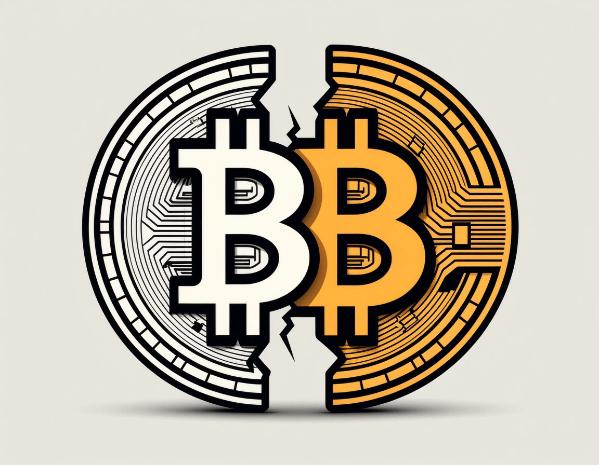

# What Is Bitcoin Halving and Why It Matters

Halving is a recurring event in the Bitcoin network, programmed by the cryptocurrency’s creator, Satoshi Nakamoto. The name comes from the English word “halving,” meaning “cutting in half.” The mechanism is simple: roughly every four years, the reward miners receive for adding a new block is cut in half.

This process is built into Bitcoin’s protocol to control supply and curb inflation. If miners always earned the same amount of coins, total BTC supply would grow too fast and could devalue the asset. Thanks to halving, new bitcoin issuance slows over time until it reaches the fixed cap of 21 million coins. For more on [how Bitcoin and the blockchain work](/en/library/bitcoin-basics/), see the dedicated article.

## What Happens at a Halving

When a halving occurs, a change in Bitcoin’s code automatically activates and reduces the block reward. For example, if before the event miners received 6.25 BTC per block, afterwards they receive only 3.125 BTC. This affects the whole ecosystem: the rate of new coins entering the market drops, and miners have to reassess profitability.

Halving is not just a technical tweak but an important economic mechanism. It creates artificial scarcity, similar to gold becoming harder to mine over time. That is why many investors and analysts watch this event closely, expecting potential BTC price upside.

For a broader view of crypto and its economics, it helps to understand [digital currencies](/en/library/what-is-digital-currency-in-simple-terms/) and [Bitcoin basics](/en/library/bitcoin-basics/).

## When Will the Next Bitcoin Halving Happen

The exact date of a halving is not fixed and depends on block production speed. On average, a new Bitcoin block is mined every 10 minutes, and a halving happens every 210,000 blocks (about every four years).

The next reward halving is expected in 2028. The precise day can be estimated using countdowns run by dedicated services (e.g. “Bitcoin halving timer” or “Bitcoin halving countdown”). Those tools show how many days remain until the halving based on current network hashrate.

## Bitcoin Halving History by Year

### First Halving (2012)

This was Bitcoin’s first halving, when the asset still attracted far less attention than today. The block reward dropped from 50 BTC to 25 BTC.

After the halving, a slow but steady uptrend began. A year later, in November 2013, BTC reached $1,100 — the first major bull run in its history. The rise was driven not only by the halving but also by growing interest in crypto and the emergence of early exchanges and wallets.

### Second Halving (2016)

By then Bitcoin was already a known asset, and halving was watched not only by miners but also by investors. The reward fell from 25 BTC to 12.5 BTC.

The subsequent rally was linked to the halving, ICO hype, and an inflow of new investors. It was followed by a sharp crash, and by the end of 2018 Bitcoin had fallen below $3,500.

### Third Halving (2020)

This halving took place during the COVID-19 pandemic, when global markets were highly volatile. The block reward dropped from 12.5 BTC to 6.25 BTC.

Despite the turmoil, BTC staged an impressive rally to $69,000. Contributing factors included:

- Institutional investors (e.g. MicroStrategy and Tesla) buying BTC in size.
- A boom in DeFi (“DeFi summer”) and NFT in crypto.
- Inflation concerns leading many to treat Bitcoin as a hedge.

After that, price corrected again but remained much higher than before the halving.

### Fourth Halving (2024)

This time miner rewards fell from 6.25 BTC to 3.125 BTC. Bitcoin went on to break its previous all-time high and reach a peak above $110,000 per coin.

History suggests that after a halving, Bitcoin eventually makes new highs. Each cycle is different, and next time new factors may matter: regulation, BTC ETFs, Lightning Network adoption, and competition from other cryptocurrencies.

## How Halving Affects Crypto Mining

For miners, halving is a serious stress test. As their BTC income is cut in half, mining profitability drops sharply. Smaller operations with older hardware are hit hardest.

After each halving, some miners leave, which temporarily reduces network hashrate. Over time, if Bitcoin’s price rises, mining becomes profitable again and miners return.

Some switch to other cryptocurrencies that also halve, such as Litecoin. Still, BTC remains the most resilient and profitable asset for many in the long run.

## Why Halving Affects Bitcoin’s Price

The main reason is supply and demand. When fewer new bitcoins are issued while demand stays the same or grows, price should, in theory, rise.

Historically, BTC has tended to rally after halvings. In 2012, it rose almost 100× in a year. In 2016–2017, about 10×. In 2020–2021, more than 3×, and after 2024, more than 2×.

It is important to remember that halving is not the only driver of price. Macro conditions, regulation, tech upgrades, and investor sentiment all play a role and add to volatility. For a deeper understanding of Bitcoin, see the [complete guide to Bitcoin](/en/library/what-bitcoin-everything-you-need-know/), which covers history, principles, and mining in detail.
