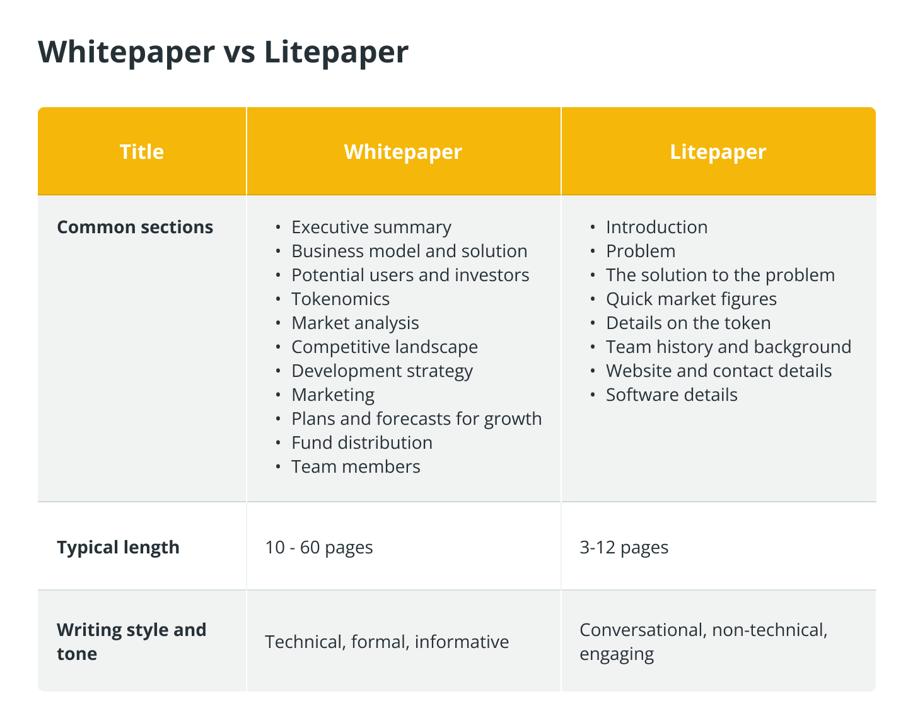
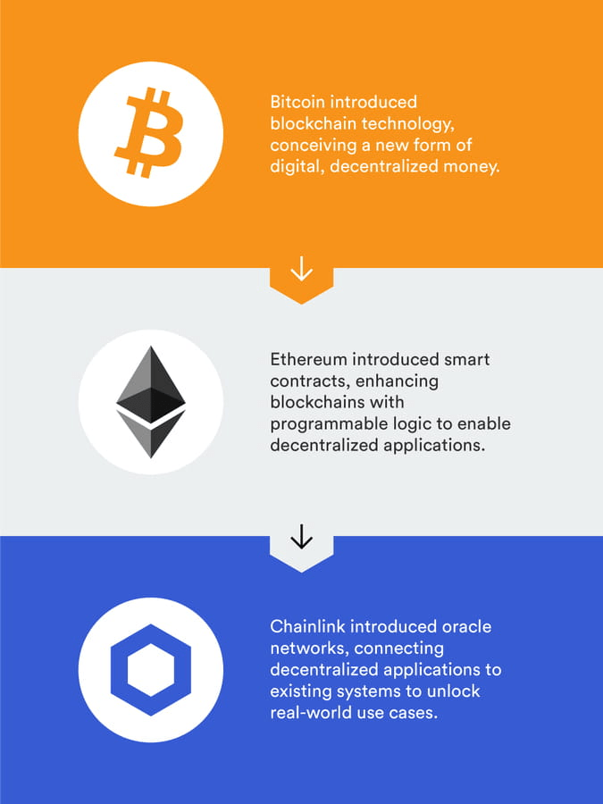

# Whitepaper in Crypto: What It Is and Why It Matters

A whitepaper is a foundational document when launching new crypto projects. It describes the technology, goals, tokenomics, and other key aspects of the project. Investors and users turn to the whitepaper to assess how promising the project is, what problems it solves, and what benefits it offers.

## What Is a Whitepaper

A whitepaper is the official document of a crypto project that outlines its technical design, goals, and outlook. It usually covers the problem the project addresses, technical details, tokenomics, and development plans. It is the first and most important document to read before investing in a cryptocurrency or blockchain startup.

**Important:** A whitepaper does not guarantee project success. It's a statement of intent, not financial reporting. Always do your own research (DYOR).

## Whitepaper vs Roadmap — What to Focus On

Although whitepapers and roadmaps are related, they serve different purposes. A whitepaper is a strategic document that sets out the project's theoretical basis; a roadmap is an action plan with development phases and timelines.

Investors should consider both: the whitepaper helps judge technical soundness and uniqueness of the idea, while the roadmap shows how realistic execution is and whether deadlines are kept.

**Key differences:**

| Parameter | Whitepaper | Roadmap |
|-----------|------------|---------|
| **Purpose** | Technology and tokenomics description | Development plan by phases |
| **Duration** | Long-term (rarely updated) | Short-term (quarter/year) |
| **Audience** | Investors, developers, partners | Community, users |
| **Content** | Problem, solution, architecture, tokenomics | Dates, releases, partnerships |

## How Whitepapers Are Used in Crypto Projects

### At Project Launch

In early stages, the whitepaper is central to building trust and attracting initial funding.

**Attracting investors and funds:**

- The main goal is to explain what problem the project solves and how.
- It is important to show competitive advantages and unique tech.
- Detailed tokenomics help investors understand token distribution and use cases.
- Institutional investors, venture funds, and retail investors analyze whitepapers before investing.

**Running ICO / IDO / IEO:**

The whitepaper is the basis for token sales:

- ICO (Initial Coin Offering) — token sale to raise funds.
- IDO (Initial DEX Offering) — token launch on decentralized exchanges.
- IEO (Initial Exchange Offering) — token launch on centralized exchanges.

### During Development and Growth

After a successful launch, the whitepaper remains a key reference for the team, community, and partners.

**Guide for developers:**

- Defines the project’s technical architecture.
- Supports smart contract development with token parameters.
- Describes the consensus mechanism (Proof-of-Work, Proof-of-Stake, etc.).
- Can be used for academic publication (e.g. Bitcoin’s origin as Satoshi Nakamoto’s paper).

**Roadmap and updates:**

- Whitepapers often include a roadmap, but the document may be updated as the project evolves.
- If the project faces new challenges, the team may revise the technical or economic design.
- For example, Ethereum was initially PoW and later moved to PoS; such changes can be reflected in an updated whitepaper.

**Regulatory compliance:**

- In some jurisdictions, a solid whitepaper helps avoid legal issues.
- The document can be used to demonstrate legitimacy to regulators.
- The whitepaper should comply with securities laws if the token has investment-like features.

### In Marketing and User Acquisition

The whitepaper also supports promotion.

**Community:**

- Helps explain why users need the token.
- Shows decentralization and governance principles.
- Describes staking, farming, voting, and other user-facing features.

**Partners and exchanges:**

- Exchanges (centralized and decentralized) use whitepapers to evaluate projects before listing.
- Companies exploring integration with a blockchain startup analyze the whitepaper to assess fit.

### During Upgrades and Scaling

As the project grows, the whitepaper may be updated or extended.

**New versions (V2.0, etc.):**

- If the technical architecture changes, a new description is needed.
- If tokenomics change (e.g. new burn mechanics), the document should be updated.
- If the project moves to another blockchain, this should be reflected in the whitepaper.

**Forks and new networks:**

- A hard fork (e.g. Ethereum → Ethereum Classic) may lead to a new whitepaper.
- Layer 2 or other scaling solutions should be documented clearly.

## Main Sections of a Whitepaper

### Introduction

A short overview that quickly engages the reader: the problem, the solution, what makes the project different, and its main goals.

### Problem Statement

A detailed description of the problem facing the industry or market, including current limitations of other projects, user pain points, and market evidence.

### Solution & Technology Overview

How the project solves the stated problem: technical description, innovations, advantages (speed, security, compatibility), and use cases.

### Technical Architecture

Consensus mechanism, blockchain structure (sidechains, Layer 2), smart contracts, cross-chain integration, and security measures.

### Tokenomics

Token type, total supply, distribution, use (staking, fees, governance), inflation/deflation mechanisms, and rewards.

Example allocation:

- 30% — early investors
- 25% — team and developers
- 20% — marketing and ecosystem
- 15% — staking rewards
- 10% — reserve

### Roadmap

Key milestones and dates: testnet, mainnet, integrations, partnerships, exchange listings.

### Team & Partners

Information about founders, key developers, and partners.

### Legal & Compliance

Jurisdiction, regulatory alignment (KYC/AML), and investment risks.

### Contact & Resources

Website, whitepaper PDF, GitHub, docs, and community links (Telegram, Discord, Twitter).

## What to Pay Attention To

**Tokenomics:** Supply, distribution, inflation/deflation, and how the token is used in the ecosystem.

**Roadmap:** Clear, realistic timelines; whether past milestones were met; how ambitious the goals are.

**References to other projects:** Can indicate proven tech adoption or lack of originality.

**Partners:** Known partners add credibility, but claims should be verified.

## Red Flags in Whitepapers

**❌ No problem description:**
- Only vague phrases ("revolution", "next Bitcoin")
- Unclear what the project does

**❌ No technical details:**
- Only marketing, no architecture or code
- Unclear how the technology works

**❌ Suspicious tokenomics:**
- 50%+ tokens to team without vesting
- No description of token function
- Infinite emission without cap

**❌ Anonymous team:**
- No names, only nicknames
- No links to previous projects

**❌ Unrealistic promises:**
- "Guaranteed 1000% returns"
- "Kill Bitcoin in 6 months"

**❌ No legal disclaimer:**
- No risk warnings
- Token presented as investment without regulation

## Quality Whitepaper Examples

**Bitcoin (2008):**
- Author: Satoshi Nakamoto
- Length: 9 pages
- Content: Double-spend problem, PoW solution, mining economics

**Ethereum (2014):**
- Authors: Vitalik Buterin and team
- Length: 36 pages
- Content: Smart contracts, EVM, gas

**Chainlink (2017):**
- Authors: Sergey Nazarov and team
- Length: 42 pages
- Content: Oracles, decentralized data, LINK tokenomics

Whitepapers of these projects have become industry standards — they are studied before investing and used as references when creating documentation. For an example of modern documentation, you can look at [Veles](https://veles.finance/invite/washmallay) — they also have technology and tokenomics descriptions.

## Summary

A whitepaper is a core document for any crypto project, for both the team and users. When reading one, focus on tokenomics, roadmap, partners, and technical execution. Even a well-written whitepaper does not guarantee success, so thorough analysis is always needed before investing. For crypto market basics, see [What Is Digital Currency](/en/library/what-is-digital-currency-in-simple-terms/), and for blockchain fundamentals, check [Bitcoin Basics](/en/library/bitcoin-basics/). The [complete guide to Bitcoin](/en/library/what-bitcoin-everything-you-need-know/) covers history, principles, and use cases in detail.

## FAQ

**Is a whitepaper required for every crypto project?**

Yes, it's a standard document for any serious project. Absence of a whitepaper is a red flag.

**What is the difference between Whitepaper and Litepaper?**

Litepaper is a simplified version for a general audience. Whitepaper is the full technical version for investors and developers.

**Where to find a project's Whitepaper?**

Usually on the project's official website in the Documents or Resources section, or as a PDF. It's often available on GitHub as well.

**Can promises in a Whitepaper be trusted?**

No, verification is necessary. Check the Roadmap — whether promises are being fulfilled on time. Also analyze the team and their experience.

**What to do if the Whitepaper is incomprehensible?**

This is normal for technical projects. Start with the introduction and summary. If too complex — the project may not be suitable, or wait for a Litepaper to be released.
