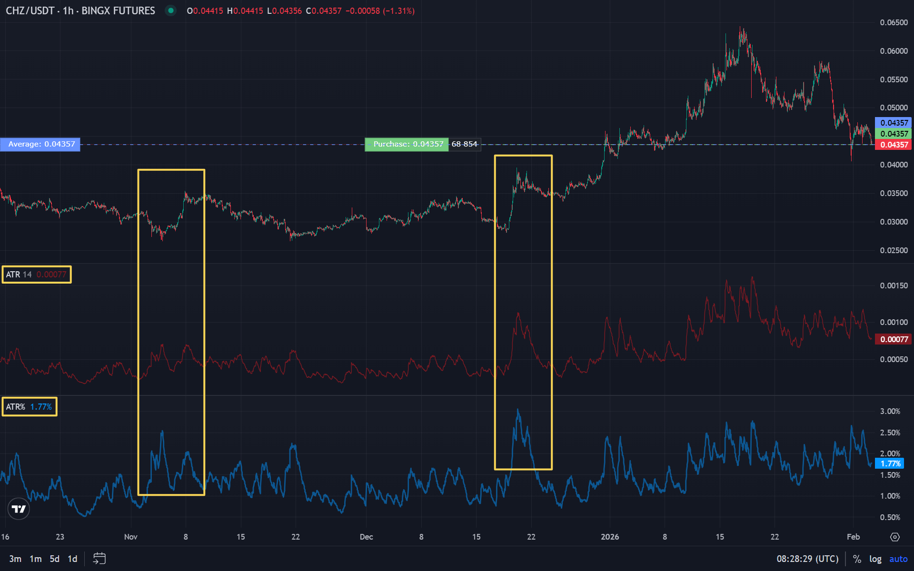

ATR (Average True Range) es un indicador de volatilidad desarrollado por Welles Wilder, autor del [RSI](/es/library/technical-analysis-rsi/). Mide el rango "verdadero" medio del precio en el periodo — cuánto se ha movido el precio de vela a vela. ATR% es el ATR expresado en porcentaje del precio actual; permite comparar la volatilidad entre activos y timeframes. En este artículo: cómo se calculan ATR y ATR%, para qué sirven en stop-loss y tamaño de posición y cómo relacionarlos con [trailing stop](/es/library/what-is-trailing-stop/) y [gestión de riesgo](/es/library/risk-management-crypto-trading-bots/).

## Qué es ATR (Average True Range)

**Average True Range (ATR)** es un indicador que mide el rango "verdadero" medio del precio en el periodo elegido. El True Range (TR) de cada vela tiene en cuenta no solo el máximo y mínimo de la vela actual sino también el hueco entre el cierre anterior y los extremos actuales. Así el ATR refleja bien la volatilidad en gaps y movimientos fuertes.

El ATR se expresa en las mismas unidades que el precio (dólares, puntos). A mayor ATR, mayor es el movimiento típico del precio en el periodo — por tanto el stop-loss suele colocarse más lejos de la entrada para no salir por ruido. Más sobre el uso de la volatilidad en [gestión de riesgo](/es/library/risk-management-crypto-trading-bots/).

## Qué es ATR%

**ATR%** es el ATR dividido por el precio actual del activo y multiplicado por 100. Fórmula: ATR% = (ATR / Precio de cierre) × 100. El resultado es la volatilidad en porcentaje del precio.

ATR% permite comparar la volatilidad entre activos y timeframes. Por ejemplo, un ATR de 1000$ en Bitcoin y 10$ en un altcoin no son comparables en valor absoluto, pero ATR% da una medida relativa: cuánto es el movimiento típico respecto al precio. Útil para diversificación y tamaño de posición.

## Cómo se calculan ATR y ATR%

**Paso 1. True Range (TR)** de cada vela es el máximo de tres valores:

- Diferencia entre máximo y mínimo de la vela actual (High − Low).
- Valor absoluto de la diferencia entre máximo de la vela actual y cierre anterior (|High − Prev Close|).
- Valor absoluto de la diferencia entre mínimo de la vela actual y cierre anterior (|Low − Prev Close|).

En la primera vela, TR suele ser High − Low.

**Paso 2. ATR** es el suavizado del true range en N periodos. Wilder usaba RMA (variante exponencial); en muchas plataformas por defecto se usa EMA o RMA con periodo 14. Es decir, ATR(14) es el TR promediado en 14 velas.

**Paso 3. ATR%** = (ATR / Precio de cierre) × 100. Se calcula con la vela actual o la última cerrada.

El periodo estándar del ATR es 14, como en [RSI](/es/library/technical-analysis-rsi/). En [distintos timeframes](/es/library/timeframes-trading/) el mismo periodo 14 tiene distinta "profundidad": en M5 es aproximadamente una hora de movimiento, en D1 unas dos semanas.

## Uso: stop-loss y tamaño de posición

El ATR se usa mucho para colocar el stop-loss de forma razonada. La idea: el stop debe tener en cuenta el movimiento "ruidoso" habitual del activo, o las posiciones se cerrarán a menudo por stop sin un verdadero cambio de tendencia. Opciones típicas:

- **Stop-loss a 1,5–2 × ATR** de la entrada. Si sube la volatilidad, el ATR sube y el stop se aleja solo; si baja, se acerca.
- **Trailing stop:** el stop se mueve con el precio manteniendo una distancia, p. ej. 2 ATR. Más en el artículo de [trailing stop](/es/library/what-is-trailing-stop/).

El tamaño de la posición también puede ligarse al ATR: a mayor ATR (o ATR%), menor tamaño de posición para el mismo riesgo en dinero. Así la [gestión de riesgo](/es/library/risk-management-crypto-trading-bots/) se adapta a la volatilidad actual.

## ATR y el mercado cripto

Las criptomonedas suelen ser muy volátiles; el ATR en pares cripto puede cambiar mucho en el tiempo. En [timeframes](/es/library/timeframes-trading/) bajos el ATR da muchas señales sobre el "recorrido" del movimiento — útil para scalping y trading intradía. En gráficos diarios el ATR ayuda a valorar el rango diario típico y a colocar stops y take-profits para swing.

Un stop fijo en puntos o dólares en un activo puede quedar demasiado estrecho (salidas frecuentes por stop) o demasiado amplio (pérdidas grandes). ATR y ATR% permiten adaptar el stop y el tamaño de posición al comportamiento actual del mercado.

## Combinación con otros indicadores

El ATR no indica dirección, solo la magnitud de las oscilaciones. Se combina con herramientas de tendencia e impulso:

- **Tendencia + ATR:** la tendencia se define por medias móviles o estructura del gráfico; el ATR se usa para colocar el stop-loss y valorar el "recorrido normal" de corrección.
- **RSI/Williams %R + ATR:** los osciladores dan señales de entrada; el ATR indica a qué distancia poner el stop. Más sobre osciladores en [RSI](/es/library/technical-analysis-rsi/) y [Williams %R](/es/library/williams-percent-range-r/).

## Resumen

- ATR es el rango verdadero medio del precio en el periodo; muestra la volatilidad en unidades de precio. ATR% es el ATR en % del precio, útil para comparar activos.
- True Range = max(High−Low, |High−PrevClose|, |Low−PrevClose|); ATR es el suavizado del TR (suele ser periodo 14).
- El ATR se usa para colocar el stop-loss (p. ej. 1,5–2 × ATR) y el trailing stop, y para adaptar el tamaño de posición a la volatilidad.
- En cripto, el ATR ayuda a ajustar stops y riesgo a un mercado cambiante.
