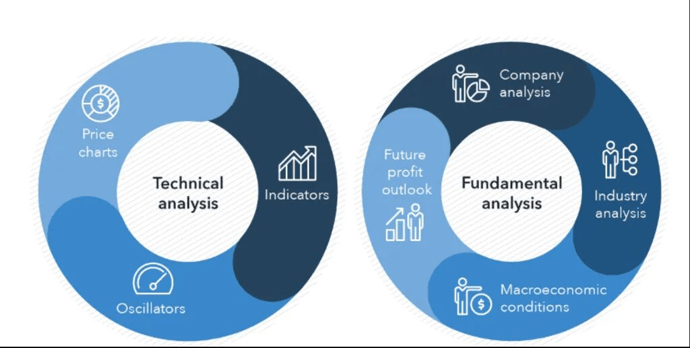
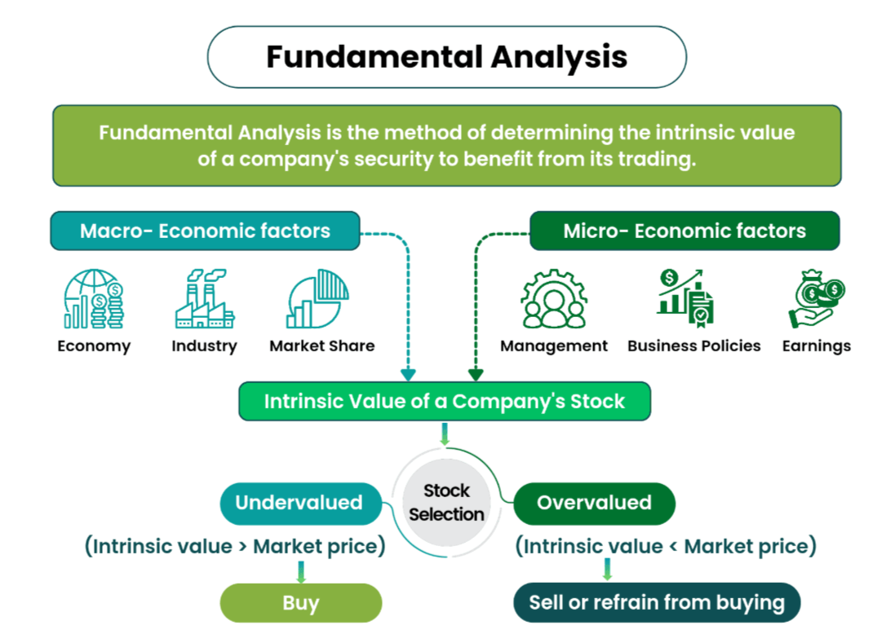

El análisis fundamental ayuda a ver si un activo merece atención y si el mercado está sobrecalentado. En cripto no hay informes IFRS, pero sí métricas on-chain, tokenómica y macro. En este artículo: cómo el FA en cripto difiere de lo clásico y cómo combinarlo con el análisis técnico.

## Por qué el fundamental importa para el trader

La mayoría de traders empiezan con velas, niveles e indicadores. Lo fundamental parece “largo y complicado”, así que a menudo se deja para después. Sin ello, la decisión de entrar o no se apoya sobre todo en el gráfico: hay tendencia — entramos, no hay — esperamos. Pero el mismo gráfico puede ser el inicio de un movimiento fuerte o una trampa antes de un desplome. El análisis fundamental no da el punto de entrada exacto, pero ayuda a filtrar ruido y entender el contexto: ¿estamos más cerca de sobrecalentamiento o de una zona donde el activo ha rebotado en el pasado?

Tiene sentido usar el FA como filtro: primero “¿merece la pena mirar este activo?”, luego el análisis técnico para el punto de entrada. Para una revisión en 15 minutos, ver el [checklist de análisis fundamental](/es/library/fundamental-analysis-checklist/).

## Qué es el análisis fundamental en lo clásico

En finanzas tradicionales, el análisis fundamental es la valoración del activo por su valor “intrínseco”, no solo por el precio en el gráfico.

**Para acciones** se mira el negocio: ingresos, beneficio, deuda, múltiplos (p. ej. P/E — precio por acción entre beneficio por acción), dividendos, cuota de mercado. La pregunta: “¿Cuánto gana la empresa y el precio de la acción refleja eso?”

**Para divisas** — la economía del país o zona: tipos de banco central, inflación, balanza comercial, desempleo. La pregunta: “¿La moneda es fuerte desde el punto de vista económico?”

En ambos casos el FA responde “qué comprar o mantener” y “¿pagamos de más?”, no “dónde colocar la orden”. El punto de entrada lo da el análisis técnico.

## Cómo difiere el fundamental en cripto

En cripto no hay reporting tipo IFRS ni banco central. No hay un “balance” único del proyecto en sentido clásico. Por eso el conjunto de datos es otro.

**Qué hay en su lugar:**

- **Tecnología y arquitectura de red** — cómo funciona el blockchain, velocidad, comisiones, seguridad.
- **Métricas on-chain** — datos de la propia cadena: MVRV, NVT, reservas en exchanges, flujos de monedas. Muestran cómo se comportan los participantes “dentro” de la red. Más en el artículo sobre [métricas on-chain en el análisis fundamental](/es/library/onchain-metrics-fundamental-analysis/).
- **Tokenómica** — emisión, límite de oferta, vesting, calendario de unlocks. La pregunta: ¿una salida masiva de monedas al mercado hundirá el precio?
- **Equipo, comunidad, regulación** — quién está detrás del proyecto, si hay producto y comunidad reales, cómo cambia el marco regulatorio.

En resumen: en acciones el fundamental es “negocio y dinero”, en cripto es “red, incentivos y datos del blockchain”. El objetivo es el mismo — ver si el activo está sobrecalentado y si tiene base para interés a largo plazo.

## Análisis fundamental y técnico: cómo se complementan

El FA y el AT responden preguntas distintas. Tiene sentido usarlos en secuencia.

**El fundamental responde:** “¿Este activo merece atención?”, “¿Estamos más cerca de sobrecalentamiento o de infravaloración/capitulación?”, “¿Hay riesgos estructurales (tokenómica, regulación)?”

**El análisis técnico responde:** “¿Dónde entrar y salir en los próximos días o semanas?”, “¿Qué niveles e indicadores confirman el escenario?”

Ejemplo práctico: on-chain y tokenómica muestran que el activo no está sobrecalentado y que grandes wallets acumulan. Entonces en el gráfico buscamos setups largos — niveles, [indicadores](/es/library/technical-analysis-rsi/), volumen. Al revés: si el FA apunta a sobrecalentamiento o unlocks masivos, es más sensato no añadir al largo y buscar puntos de toma de beneficios o cortos.

## Marco: tres pasos para el trader

Puedes dividir la revisión fundamental en tres bloques. No hace falta profundizar en todos a la vez — empieza por uno y amplía.

### Paso 1. Macro y narrativa

Tipos de banco central, regulación cripto, "historias" del mercado (halving, ETF, sanciones, etc.). Es el contexto en el que se mueve todo el mercado y las monedas.

**Qué vigilar:**
- Tipo de la Fed (tipos de interés en EE.UU.)
- Inflación (CPI, PCE)
- Noticias regulatorias (SEC, leyes cripto)
- Narrativas (halving, ETF, DeFi, NFT, AI)

### Paso 2. Calidad del activo

Monedas top con liquidez e historia frente a tokens poco conocidos; tecnología, tokenómica, equipo y producto. El objetivo es filtrar lo que no merece ni mirar el gráfico.

**Checklist:**
- Top 100 por capitalización (CoinMarketCap, CoinGecko)
- Producto funcional (web, documentación, GitHub)
- Comunidad activa (Twitter, Discord, Telegram)
- Tokenómica transparente (whitepaper, unlock schedule)

### Paso 3. Contexto on-chain del ciclo

MVRV, reservas en exchanges, actividad de la red. Ayuda a ver en qué fase del ciclo estamos: acumulación, crecimiento, distribución o capitulación.

**Métricas clave:**
- MVRV < 1 — zona de infravaloración
- Salida de exchanges — acumulación
- SOPR < 1 — capitulación
- Actividad de ballenas — interés creciente

Para el detalle de métricas on-chain, ver el [artículo dedicado](/es/library/onchain-metrics-fundamental-analysis/); para un repaso rápido del token, el [checklist de 15 minutos](/es/library/fundamental-analysis-checklist/).

## Limitaciones del análisis fundamental

El FA es una herramienta potente pero no perfecta.

**Limitaciones:**
- No da puntos exactos de entrada y salida
- Requiere tiempo para aprender (30-60 minutos por activo)
- Los datos pueden estar incompletos o desactualizados
- En cripto, la alta volatilidad anula el fundamental en plazos cortos

**Cómo reducir riesgos:**
- Combinar FA con AT y gestión de riesgos
- Usar checklists para acelerar el análisis
- Mantenerse actualizado (tokenómica, regulación)
- No depender de una sola fuente de datos

## Resumen

El análisis fundamental no sustituye al técnico; lo complementa: ayuda a elegir activos y a entender el contexto del ciclo. Un trader que usa FA y AT distingue mejor el "bombeo por bombeo" de una tendencia con fundamento y depende menos solo del gráfico.

**Conclusiones clave:**
- FA responde "qué comprar", AT responde "cuándo entrar"
- En cripto, usa métricas on-chain, tokenómica, equipo
- Marco: macro → calidad del activo → contexto on-chain
- Combina FA con AT y gestión de riesgos

Para más sobre tokenómica, ver [Qué es Tokenómica](/es/library/what-is-tokenomics/).

## FAQ

**¿Qué es el análisis fundamental en pocas palabras?**

Valorar el activo por datos "intrínsecos": en acciones — negocio y beneficio, en divisas — economía, en cripto — tecnología, tokenómica y datos del blockchain. La pregunta: "¿Este activo vale su dinero y el mercado está sobrecalentado?"

**¿En qué se diferencia el FA en cripto del FA en acciones?**

En cripto no hay informes IFRS. En su lugar se usan métricas on-chain (MVRV, reservas en exchanges, flujos de monedas), tokenómica (emisión, unlocks), valoración de tecnología y equipo. El objetivo es el mismo — entender valor y riesgos.

**¿Cómo combinar análisis fundamental y técnico?**

Primero FA: "¿merece la pena mirar este activo, está sobrecalentado?". Luego AT: "dónde entrar y salir" por niveles e indicadores. El FA da contexto y filtro, el AT el punto de entrada y salida.

**¿Para qué sirven las métricas on-chain al trader?**

Muestran el comportamiento de los participantes en la red (acumulación, ventas, reservas en exchanges) y la fase del ciclo. Complementan el gráfico: el gráfico dice "cómo" se mueve el precio, on-chain "por qué" y "qué tan sostenible es".

**¿Cuánto tiempo lleva el análisis fundamental?**

Evaluación inicial: 15-30 minutos (checklist). Análisis profundo: 1-2 horas (tokenómica, equipo, competidores, on-chain). Para activos habituales, actualizar datos una vez por semana o antes de eventos importantes es suficiente.

**¿Qué servicios usar para análisis fundamental?**

- On-chain: Glassnode, CryptoQuant, Nansen
- Tokenómica: Token Unlocks, Token Terminal
- Agregadores: CoinMarketCap, CoinGecko
- Noticias: Twitter, Discord, Telegram de proyectos

**¿Se puede operar solo por fundamentales?**

No. El FA no da puntos exactos de entrada. Incluso con fundamentales fuertes, un activo puede caer semanas o meses. Usa AT para entrada y stop losses para proteger el capital.
