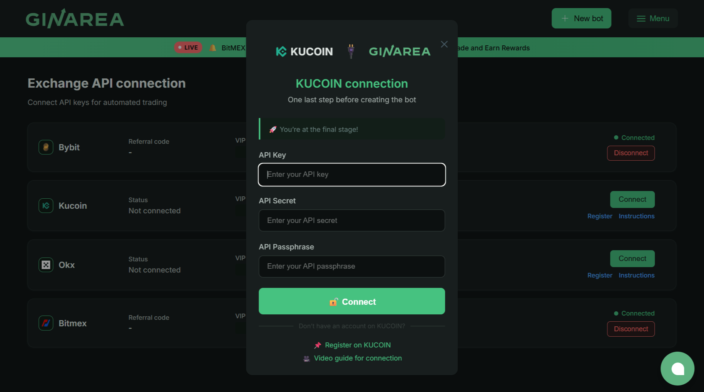
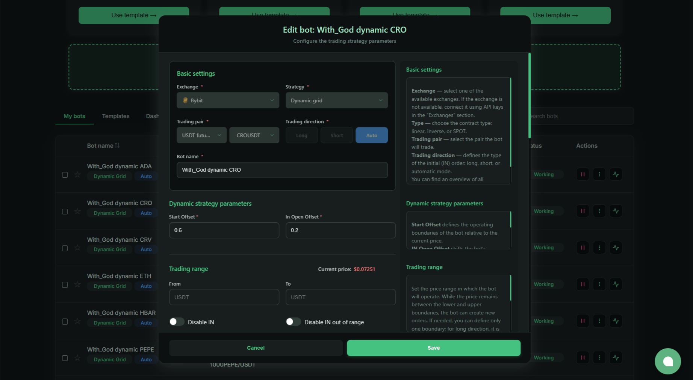

**Ginarea** — plataforma para crear bots de trading usando un constructor visual. Permite automatizar trading sin programar, usando tipos de bots listos e indicadores.

**Para quién:** Traders que quieren automatizar trading pero no saben programar.

---

## Qué es Ginarea

**Ginarea (Grow Investments Area)** es una plataforma de bots gratuitos para trading automatizado en exchanges centralizados. A diferencia de bots listos (como Veles), aquí eliges tipo de bot y configuras parámetros para tu estrategia.

**Idea principal:** Proporcionar herramientas de automatización simples y efectivas sin programación compleja.

### Funciones Clave

1. **Constructor visual** — configuración de bots vía interfaz clara
2. **Tipos de bots** — Default, Auto Grid, Dynamic, Indicator Grid, DCA
3. **Analítica** — estadísticas de trading, análisis de resultados
4. **Multi-exchange** — OKX, Bybit, BitMEX
5. **Auto Grid** — ajuste automático de rejilla en movimiento de precio
6. **Gratis** — plataforma con tier gratuito (programa de afiliados para desarrollo)

### Exchanges Soportados

| Exchange | Tipo | Estado |
|----------|------|--------|
| **OKX** | Crypto (spot + futuros) | ✅ Soporte completo |
| **Bybit** | Crypto (spot + futuros) | ✅ Soporte completo |
| **BitMEX** | Crypto (futuros) | ✅ Soporte completo |

**Importante:** Ginarea se especializa en futuros (crypto), el trading spot es limitado. Se requiere cuenta de trading unificada (Bybit) o cuenta de trading (OKX).

### Requisitos Mínimos

- **Spot:** Desde 200 USDT para lanzar bot
- **Futuros:** Desde 200 USDT en cuenta de trading unificada
- **Contratos inversos:** Desde 200 USDT

---

## Cómo Funciona Ginarea

### Flujo de Trabajo

1. **Registro:** Crear cuenta en Ginarea
2. **Conexión del exchange:** Añadir claves API (¡solo trading, sin retiro!)
3. **Elegir tipo de bot:** Default, Auto Grid, Dynamic, Indicator Grid, DCA
4. **Configuración:** Llenar parámetros del bot (exchange, par, configuración)
5. **Inicio:** El bot comienza a operar 24/7
6. **Monitoreo:** Seguir vía interfaz web

### Constructor Visual

**Ginarea usa interfaz visual para configuración de bots:**

1. **Elegir tipo de bot:** Default, Auto Grid, Dynamic, Indicator Grid, DCA
2. **Llenar campos:** Exchange, estrategia, par de trading, tipo, dirección, nombre del bot
3. **Configurar indicadores:** EMA, RSI, MA, SMMA, ATR, ATR%, Supertrend
4. **Gestión de riesgos:** Stop-loss, take-profit, tamaño de posición

**Ejemplo de configuración Indicator Grid:**
- Elegir indicadores (ej. RSI + EMA)
- Configurar parámetros (período RSI, período EMA)
- Especificar condiciones de entrada (RSI < 30 + Precio > EMA)
- Establecer gestión de riesgos

### Tipos de Bots Ginarea

**Ginarea soporta varios tipos de bots:**

#### 1. Default (Estándar)

**Principio:** Estrategia unidireccional (solo long o solo short).

**Configuración:**
- Dirección: Long o Short
- Indicadores para entrada
- Stop-loss / Take-profit

**Para quién:** Principiantes, trading de tendencia simple.

#### 2. Auto Grid (Autorejilla)

**Principio:** Abre posiciones long y short simultáneamente dentro de rango especificado.

**Configuración:**
- Rango de precio (mín/máx)
- Número de rejillas
- Tamaño de posición por rejilla

**Característica:** Disponible solo para Futuros USDT.

**Para quién:** Mercado lateral (flat), alta volatilidad.

#### 3. Dynamic

**Principio:** Usa límites flotantes que se ajustan al precio.

**Configuración:**
- Rango base
- Coeficiente de ajuste
- Dirección: Long, Short, Auto

**Para quién:** Mercado de tendencia con correcciones.

#### 4. Indicator Grid

**Principio:** Rejilla de órdenes con filtros de indicadores.

**Indicadores:**
- EMA (Exponential Moving Average)
- RSI (Relative Strength Index)
- MA (Moving Average)
- SMMA (Smoothed Moving Average)
- ATR (Average True Range)
- ATR% (ATR en porcentaje)
- Supertrend

**Para quién:** Traders experimentados que quieren combinar rejilla con indicadores.

#### 5. DCA

**Principio:** Promediado de posición en movimiento de precio en contra.

**Configuración:**
- Cantidad base de compra
- Paso de promediado (% o fijo)
- Multiplicador (aumentar compra)
- Take-profit

**Para quién:** Inversiones a largo plazo, acumulación de posición.

---

## Comisiones

**Ginarea es completamente gratis.** La plataforma gana en rebate de comisión del exchange (IB rebate) — esta es práctica estándar.

**Gastos:**
1. **Comisiones del exchange:** 0.02-0.1% por operación (depende del exchange y volumen)
2. **Slippage:** Diferencia entre precio esperado y ejecución real

---

## Pros y Contras Ginarea

### Pros

| Ventaja | Descripción |
|---------|-------------|
| **Constructor visual** | Creación de estrategias sin código, claro |
| **Flexibilidad** | Puedes implementar ideas complejas (condiciones, filtros) |
| **Analítica** | Estadísticas de trading, análisis de resultados |
| **Multi-exchange** | OKX, Bybit, BitMEX en una plataforma |
| **Comunidad** | Publicación de estrategias, educación |

### Contras

| Desventaja | Descripción |
|------------|-------------|
| **Complejidad** | Principiantes necesitan tiempo para aprender constructor |
| **Indicadores limitados** | No hay indicadores personalizados (solo integrados) |
| **Sin app móvil** | Solo interfaz web |
| **Sin backtests** | No puedes probar estrategia en datos históricos |
| **Sin paper trading** | No hay prueba en cuenta demo |

---

## Para Quién Ginarea

### ✅ Adecuado si:

- Quieres crear propias estrategias (no bots listos)
- Entiendes indicadores técnicos
- Depósito: $500-5,000
- Operas en futuros (crypto con apalancamiento)
- Listo para aprender (constructor requiere tiempo para dominar)

### ❌ No adecuado si:

- Necesitas soluciones listas (mejor Veles, Gainium)
- No entiendes indicadores técnicos
- Depósito < $200 (comisiones comerán ganancia)
- Quieres operar en spot (crypto sin apalancamiento)

---

## Alternativas Ginarea

| Plataforma | Pros | Contras | Para quién |
|------------|------|---------|------------|
| **Veles** | Bots listos, más simple | Sin constructor, menos flexibilidad | Principiantes |
| **Gainium** | Gratis hasta 2 bots | Estrategias simples, sin backtests | Prueba |
| **3Commas** | Muchas funciones, app móvil | Caro, backtests complejos | Experimentados |
| **TradingView + Pine Script** | Lenguaje potente, backtests | Necesita código (Pine Script) | Desarrolladores |
| **Python + Backtrader** | Libertad total | Necesita código, configuración | Programadores |

---

## FAQ

**¿Es seguro confiar las claves API a Ginarea?**

Sí, si las claves son solo para trading (sin retiro). Ginarea no puede retirar fondos.

**¿Cuánto dinero necesito para empezar?**

Mínimo: $200-500 (para futuros con 3-5x apalancamiento).  
Óptimo: $1,000-3,000 para trading cómodo.

**¿Ginarea funciona en Rusia?**

Sí, Ginarea está disponible en Rusia. Los exchanges (Bybit, Binance) funcionan con restricciones.

**¿Necesito pagar impuestos?**

Sí, la ganancia de trading está gravada (13% para residentes de Rusia). Ginarea proporciona exporte para contabilidad.

**¿Puedo usar estrategias listas?**

Sí, el marketplace de Ginarea tiene cientos de estrategias listas (pagas y gratis).

---

## Probar Ginarea

**[Registrarse en Ginarea](https://ginarea.com)** y empezar a automatizar trading.

*Plataforma completamente gratis — el servicio gana en rebate de comisión del exchange.*

---

**Fuentes:**
- Ginarea — documentación oficial
- Comunidad Ginarea (Telegram, foro)
