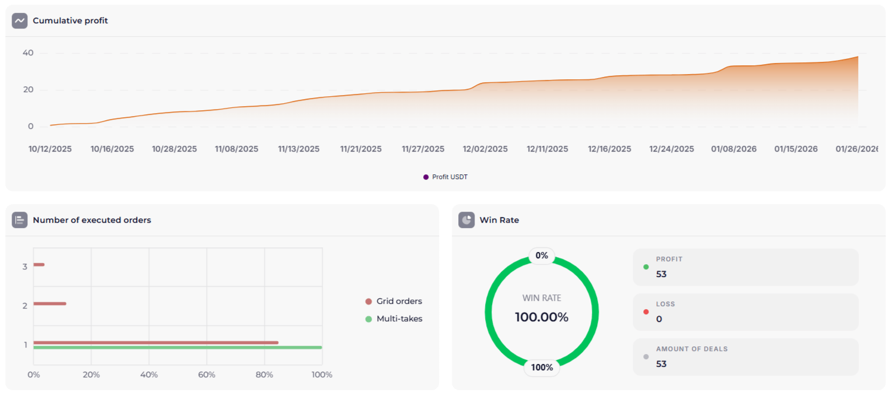
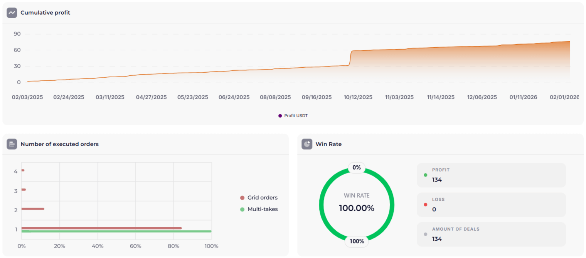
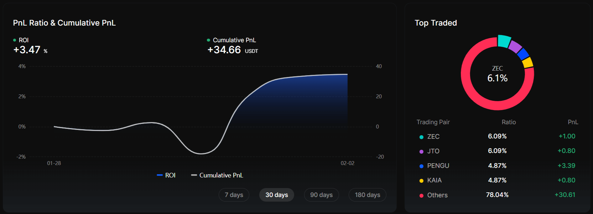

ORACLE versión 1.1 es un conjunto de ajustes de estrategia en el que la señal se forma por la coincidencia de cuatro indicadores en distintos [timeframes](/es/library/timeframes-trading/): de mayor a menor — bandas de Bollinger, ATR%, ROC y Williams %R. Puedes configurar y ejecutar la estrategia en la plataforma de algotrading Veles [enlace de referido](https://veles.finance/invite/washmallay). A continuación: arquitectura de la configuración, qué movimientos buscamos, backtests anuales y enlace a la cuenta de prueba de copia en [BingX](https://bingxdao.com/invite/CUBDBG/).

**Importante:** este sistema está actualmente en modo de pruebas. Los resultados en BingX son solo informativos; antes de usar la estrategia, consulta [gestión de riesgos](/es/library/risk-management-crypto-trading-bots/) y la serie [Diversificación y configuración del sistema de trading](/es/library/diversification-trading-system-part-1/).

## Resumen de la configuración: de timeframes mayores a menores

Los indicadores están ordenados del timeframe mayor al menor: H1 → M30 → M15 → M5. Así se fija primero el contexto (volatilidad y límites en la hora), luego los filtros de momentum y la entrada en el gráfico de cinco minutos.

### Bandas de Bollinger (H1)

Las [bandas de Bollinger](/es/library/bollinger-bands/) están en el **timeframe horario (H1)** — el mayor de esta configuración. Marcan los límites de volatilidad: el toque o ruptura de la banda superior o inferior indica una desviación extrema de la media. En H1 esto filtra el “ruido” menor y muestra cuándo el activo se ha alejado de la norma reciente. Detalles de cálculo e interpretación en el artículo de [bandas de Bollinger](/es/library/bollinger-bands/).

### ATR% (M30)

El [ATR%](/es/library/atr-and-atr-percent/) se usa en el **timeframe M30** para seguir la volatilidad. Cuando hay interés de compradores y vendedores en el activo, un valor de ATR% **por encima del 1%** indica una “vida” suficiente del mercado. Así se filtran momentos demasiado tranquilos y se enfoca en movimientos con amplitud aceptable.

### ROC — Rate of Change (M15)

El [ROC (Rate of Change)](/es/library/rate-of-change-roc/) en **M15** aporta la velocidad de cambio del precio y el movimiento hacia zona de sobreventa. En la configuración ORACLE 1.1 se usa un impulso moderado de **−1**: un movimiento a la baja con ese valor de ROC se considera uno de los filtros antes de un posible rebote. Más sobre el cálculo y niveles del ROC en el artículo [ROC en el trading de criptomonedas](/es/library/rate-of-change-roc/).

### Williams %R (M5)

El [Williams %R](/es/library/williams-percent-range-r/) está en **M5** — el timeframe más bajo de la estrategia. Se usan los niveles estándar de sobrecompra y sobreventa de este oscilador. La entrada en operación o el promedio de posición solo se hace cuando hay **salida de la zona de sobreventa y vuelta hacia el valor medio**. El precio puede bajar mucho tiempo (p. ej. en una fuerte caída), pero solo entramos cuando Williams %R lo confirma — en esta configuración es el cruce del límite inferior de la zona de sobreventa y el giro al alza. Así se reduce la probabilidad de entrar “al cuchillo”.

## Cómo se forma la señal

Se considera señal cuando coinciden los cuatro niveles: en H1 el precio en el límite de las bandas de Bollinger, en M30 ATR% &gt; 1%, en M15 el ROC muestra el impulso elegido (p. ej. −1 o por encima/debajo de ese valor), en M5 Williams %R muestra salida de sobreventa y vuelta a la media. Un solo indicador puede dar señales falsas; la combinación por timeframes reduce entradas en “ruido”. Más sobre combinación de indicadores en [señales de trading](/es/library/what-are-trading-signals/) y [backtests](/es/library/what-are-backtests/).

## Backtests (anuales, comisiones BingX)

Resultados de backtests anuales (comisiones — BingX a fecha de redacción):

[✖️ 🪄 BINGX ZEC ORACLE 1.1](https://ru.veles.finance/share/EYBFB)

[✖️ 🪄 BINGX WOO ORACLE 1.1](https://ru.veles.finance/share/Krlla)

## Resultados de la prueba en BingX

Esta estrategia de trading ha empezado recientemente a probarse en una cuenta de copia de BingX. Estadísticas y resultados públicos (rentabilidad, P/L total, distribución por par) en: [BingX Copy Trading — ORACLE 1.1](https://bingx.com/int/1tjKO4). Para registrarte en el exchange, enlace de referido: [BingX](https://bingxdao.com/invite/CUBDBG/) — también en la página [Sobre el proyecto](/es/about/) y en el pie del sitio junto a Bybit, Bitget y Veles.

## Relación con diversificación y riesgo

La configuración de un bot es parte del sistema global. Cómo no concentrar todo el volumen en una estrategia, repartir capital entre activos y plataformas y reducir la carga de riesgo está en la serie [Diversificación y configuración del sistema de trading](/es/library/diversification-trading-system-part-1/). Conexión al exchange por API y pasos básicos en [configuración del bot en Bybit](/es/library/bybit-trading-bot-setup/); los principios de [gestión de riesgos](/es/library/risk-management-crypto-trading-bots/) se aplican también a ORACLE 1.1.

## Resumen

- ORACLE 1.1 — conjunto de ajustes con cuatro indicadores, por orden de timeframe: Bollinger Bands (H1), ATR% (M30), ROC (M15), Williams %R (M5). Señal cuando los cuatro coinciden.
- ATR% se usa solo como filtro de volatilidad (&gt; 1%). Entrada/promedio solo con confirmación de Williams %R (salida de sobreventa).
- El sistema est√° en modo de pruebas.

M√°s sobre el proyecto, principios y formas de apoyo en la p√°gina **[Sobre el proyecto](https://marketlab-academy.org/es/about/)**.

## FAQ

**?Por que exactamente 4 indicadores y 4 timeframes?**
Cada indicador cumple su funcion: BB ó limites, ATR% ó volatilidad, ROC ó impulso, Williams %R ó reversion. El filtrado multitimeframe reduce el ruido.

**?Que pares funcionan mejor?**
Volatilidad media: ZEC, WOO, RARE. Evita demasiado quietos (USDT-stablecoins) y extremadamente volatiles.

**?Necesito ajustar ajustes para diferentes pares?**
Los ajustes base son universales, pero puedes afinar ATR% y ROC para la volatilidad especifica del par.

**?Con que frecuencia revisar resultados?**
Diariamente en las primeras semanas, luego semanalmente. Observa drawdown y cantidad de operaciones.

**?Puedo usar en otros exchanges?**
Si, la logica de la estrategia es universal. Pero necesita adaptacion para comisiones y ajustes de API.

Descubre mas sobre el proyecto, principios y formas de apoyarlo en la pagina **[Acerca de](https://marketlab-academy.org/es/about/)**.
