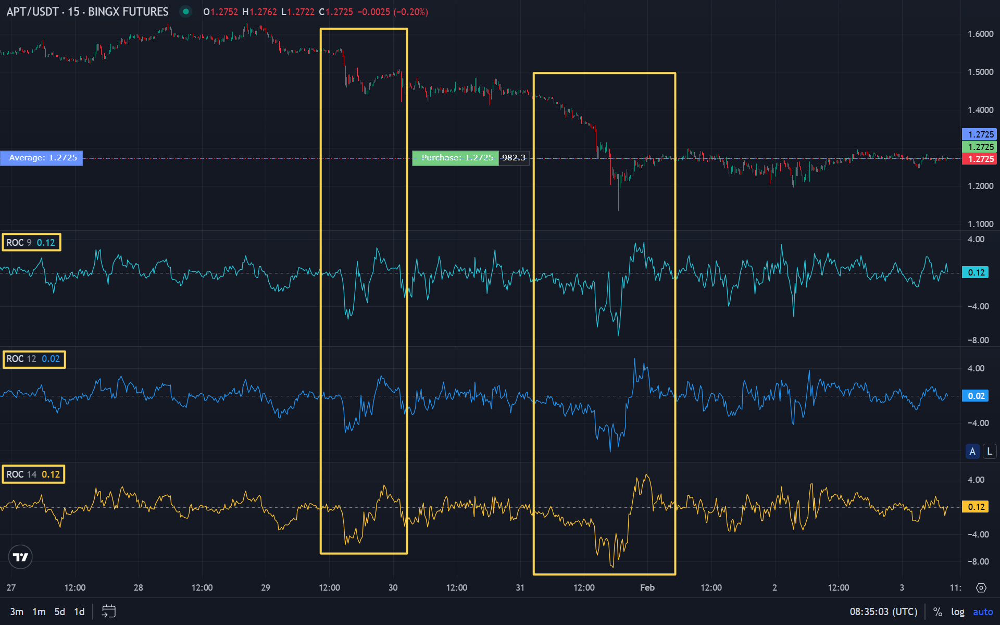

ROC (Rate of Change) es un oscilador de momentum: muestra en qué porcentaje ha cambiado el precio en el periodo elegido. La línea cero y las desviaciones por encima y por debajo dan una idea de la aceleración o desaceleración y de posibles reversiones. En este artículo: cómo se calcula el ROC, cómo leer niveles y divergencias y cómo combinarlo con [RSI](/es/library/technical-analysis-rsi/) y [Williams %R](/es/library/williams-percent-range-r/) en la misma familia de osciladores.

## Qué es ROC (Rate of Change)

**ROC (Rate of Change)** es un indicador que mide el cambio porcentual del precio en N periodos. Responde a: ¿en qué porcentaje está el precio actual por encima o por debajo del precio de hace N velas? El ROC se construye alrededor de la línea cero: valores positivos corresponden a subida del precio en el periodo, negativos a bajada.

ROC pertenece a los osciladores de momentum. No tiene un rango fijo, a diferencia de [RSI](/es/library/technical-analysis-rsi/) (0–100) o [Williams %R](/es/library/williams-percent-range-r/) (0…−100). Cuanto más fuerte sea el movimiento del precio en N periodos, mayor es el valor absoluto del ROC. Ayuda a valorar la fuerza y velocidad del movimiento y a detectar divergencias — desacoples entre precio y ROC que suelen preceder a una reversión.

## Cómo se calcula el ROC

Fórmula del ROC:

**ROC = ((Cierre actual ‚àí Cierre hace N periodos) / Cierre hace N periodos) √ó 100**

Es decir, el ROC muestra el cambio porcentual del precio de cierre en las √∫ltimas N velas. Por ejemplo, con N = 12 y una subida del precio del 5% en esos 12 periodos, el ROC ser√° aproximadamente +5. Con una bajada del 3%, el ROC ser√° aproximadamente ‚àí3.

El periodo N lo elige el trader. Suele usarse 9, 12 o 14 (como en RSI). Un periodo corto hace el indicador más sensible y con más señales; uno largo más suave. La elección depende del [timeframe](/es/library/timeframes-trading/) y del estilo de trading. Conviene probar la configuración en [backtests](/es/library/what-are-backtests/).

## Interpretación: niveles y divergencias

**Línea cero:** ROC por encima de cero — el precio subió en el periodo; por debajo — bajó. El cruce de cero de abajo a arriba puede interpretarse como refuerzo del momentum alcista; de arriba a abajo como bajista. Como en otros osciladores, el cruce de cero solo suele dar muchas señales falsas, por lo que conviene usarlo junto con tendencia u otros indicadores.

**Valores extremos:** un ROC positivo muy alto indica fuerte subida en N periodos — posible sobrecompra o agotamiento. Un ROC muy bajo (muy negativo) indica fuerte bajada — posible sobreventa. Los niveles concretos (p. ej. +5 y −5) dependen del activo y del timeframe; se ajustan con histórico o backtests.

**Divergencia:** cuando el precio hace un nuevo máximo y el ROC hace un máximo más bajo (divergencia bajista), puede indicar debilitamiento del momentum alcista y posible giro a la baja. Cuando el precio hace un nuevo mínimo y el ROC hace un mínimo más alto (divergencia alcista), el momentum bajista puede estar debilitándose. Las divergencias del ROC, como las [divergencias del RSI](/es/library/technical-analysis-rsi/), conviene confirmarlas con niveles o volumen.

## ROC combinado con otros osciladores

ROC, RSI y Williams %R son herramientas de momentum/osciladores pero calculadas de forma distinta. Se pueden usar juntos para filtrar:

- **ROC + RSI:** RSI muestra sobrecompra/sobreventa en un rango fijo; ROC la velocidad de cambio del precio. La coincidencia (p. ej. RSI &gt; 70 y ROC en zona extrema) puede reforzar la señal de corrección.
- **ROC + Williams %R:** ambos reaccionan a la posición del precio respecto al rango reciente; la combinación ayuda a filtrar salidas falsas de zonas de sobrecompra/sobreventa.
- **ROC + volumen:** el [Índice de Flujo de Dinero (MFI)](/es/library/money-flow-index/) tiene en cuenta el volumen; ROC solo el precio. ROC da la "velocidad" del precio, MFI el respaldo del volumen.

No conviene poner demasiados osciladores en el gráfico: 2–3 suelen bastar. Más sobre combinaciones en [señales de trading](/es/library/what-are-trading-signals/).

## Uso en criptotrading

El mercado cripto es volátil, por lo que el ROC en pares cripto suele dar valores absolutos grandes. En [timeframes](/es/library/timeframes-trading/) bajos el ROC es muy sensible — muchas señales y ruido; en superiores (H4, D1) las señales son más escasas pero a menudo más significativas. Las divergencias del ROC en cripto se ven bien en movimientos fuertes; conviene comprobarlas junto con [falsas rupturas](/es/library/false-breakouts-trading/) y niveles.

Antes de usar en trading real una estrategia con ROC, se recomienda probarla en histórico. Cómo hacerlo está en [qué son los backtests](/es/library/what-are-backtests/).

## Resumen

- ROC (Rate of Change) es el cambio porcentual del precio en N periodos. Oscilador de momentum con línea cero; valores positivos — subida en el periodo, negativos — bajada.
- Fórmula: ((Precio actual − Precio hace N periodos) / Precio hace N periodos) × 100. Periodo típico 9, 12 o 14.
- El cruce de cero y los valores extremos dan señales; las divergencias ROC–precio pueden anticipar reversión.
- ROC combina bien con RSI, Williams %R y MFI; en cripto la configuración y niveles conviene ajustarlos por timeframe y backtests.

## FAQ

**?Que periodo ROC elegir?**

Estandar ó 12 o 14. Para scalping en TFs bajos ó 5ñ9. Para swing ó 20ñ28.

**ROC o RSI ó ?cual es mejor?**

RSI esta limitado a 0ñ100, ROC no tiene limites (muestra porcentaje). ROC es mas rapido, RSI mas suave. Usar juntos.

**?Como usar las divergencias del ROC?**

Divergencia alcista ó precio hace nuevo minimo, ROC mas alto. Bajista ó nuevo maximo, ROC mas bajo. Es senal de reversion.

**?Por que el ROC da senales falsas en cripto?**

Alta volatilidad. Usar con indicadores de tendencia y probar en backtests.

**?Se puede usar ROC sin otros indicadores?**

Es posible, pero no recomendado. ROC muestra momentum, no direccion. Combinar con tendencia.
