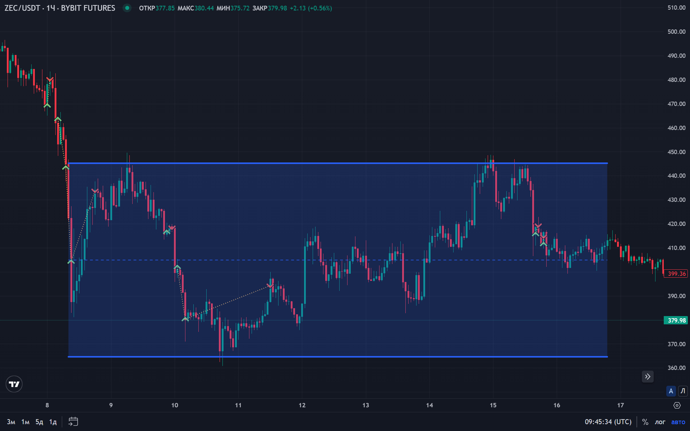
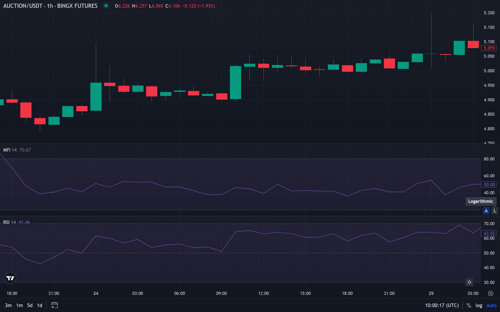
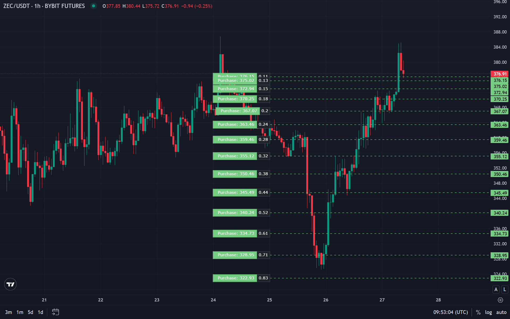

Un mercado lateral (rango) es un periodo en el que el precio se mueve dentro de un canal horizontal sin una dirección clara. Gran parte del tiempo el mercado está en rangos, por lo que saber operarlos es una habilidad clave.

## Qué es un mercado lateral

Un **mercado lateral (range)** es una fase de consolidación donde el precio oscila entre niveles horizontales de soporte y resistencia, sin tendencia definida.

### Características comunes

- rebotes repetidos entre dos niveles
- ausencia de nuevos máximos/mínimos direccionales
- volumen generalmente más bajo
- a menudo precede a un movimiento impulsivo fuerte

## Cómo identificar un rango

### Señales visuales

1. niveles horizontales claros
2. máximos/mínimos que no se expanden
3. oscilación “equilibrada” arriba/abajo

### Indicadores útiles

- **[RSI](/es/library/technical-analysis-rsi)** — en rangos suele moverse alrededor del centro (aprox. 40–60)
- **[MFI](/es/library/money-flow-index)** — ayuda a ver si hay entrada/salida real de capital
- medias móviles — el precio suele “cortar” las MAs sin separación tendencial

## Estrategias para operar rangos

### Estrategia 1: Range trading

**Idea:** comprar cerca del soporte y vender cerca de la resistencia.

**Reglas:**

1. definir límites del rango
2. comprar en reacciones del soporte
3. vender en reacciones de la resistencia
4. stop por fuera del rango
5. objetivo hacia el lado opuesto

### Estrategia 2: Grid trading

**Idea:** colocar una “rejilla” de órdenes dentro del rango.

**Reglas:**

1. definir el rango
2. colocar órdenes de compra con un paso fijo (p.ej. cada 1%)
3. colocar órdenes de venta con el mismo paso
4. capturar beneficio en cada ciclo

### Estrategia 3: Señales con osciladores

**Idea:** usar osciladores para entradas de reversión a la media dentro del rango.

**Reglas:**

1. usar **[RSI](/es/library/technical-analysis-rsi)** o **[MFI](/es/library/money-flow-index)**
2. comprar cuando RSI < 30 y el precio está cerca del soporte
3. vender cuando RSI > 70 y el precio está cerca de la resistencia
4. stop por fuera del rango

### Estrategia 4: Falsos rompimientos

**Idea:** usar fake-outs más allá de los límites del rango para entrar de vuelta al rango.

Lee más en **[Falsos rompimientos en trading](/es/library/false-breakouts-trading)**.

## Gestión de riesgo en rangos

Reglas básicas:

1. stop-loss obligatorio
2. limitar el riesgo por operación/idea (p.ej. 1–2% o según tu enfoque; ver [gestión de riesgo](/es/library/risk-management-crypto-trading-bots/))
3. tamaño de posición acorde al ancho del rango
4. diversificar (no concentrar todo en un solo rango)

## Cuándo termina el rango

Señales típicas:

1. ruptura con volumen
2. “aceptación” fuera del rango (cierres sostenidos)
3. nuevos máximos/mínimos direccionales
4. cambio de estructura a tendencia

## FAQ

**¿Cuánto puede durar un rango?**

Desde días hasta meses, dependiendo del marco temporal.

**¿Qué indicadores funcionan mejor en rangos?**

Osciladores como **[RSI](/es/library/technical-analysis-rsi)**, **[MFI](/es/library/money-flow-index)** y **[Williams %R](/es/library/williams-percent-range-r)** suelen ser más útiles que indicadores tendenciales.

**Conclusión:** los rangos se pueden operar con lógica clara (range/grid), control de riesgo y validación con **[backtesting](/es/library/what-are-backtests)**.

## Materiales relacionados

**Fundamentos y estrategias:** Después de dominar los conceptos básicos, asegúrese de estudiar nuestra estrategia principal [ELDER 2.0](/es/library/spot-strategy-elder-20/), diseñada específicamente para el mercado spot. Además, comprenda [la diferencia entre spot, margen y futuros](/es/library/spot-trading-vs-futures-margin/).

**Herramientas y automatización:** Para aumentar la eficiencia, utilice indicadores técnicos como el [Oscilador Estocástico](/es/library/stochastic-oscillator/) y las [Bandas de Bollinger](/es/library/bollinger-bands/). Una guía paso a paso sobre [cómo configurar un bot de trading en Bybit](/es/library/bybit-trading-bot-setup/) le ayudará a automatizar los procesos.

**Experiencia y riesgos:** Aprenda [cómo empezar a operar con un depósito pequeño](/es/library/how-to-start-trading-small-deposit/) y asegúrese de estudiar los fundamentos de la [gestión de riesgos](/es/library/risk-management-crypto-trading-bots/) y consulte nuestro [diario de depósito real](/es/library/surviving-drawdown-diary/).

Si le interesa esta estrategia y desea seguir el desarrollo de nuestro proyecto, visite la página [Sobre nosotros](/es/about/) — allí hablamos de nuestra misión y de cómo puede apoyar la startup.