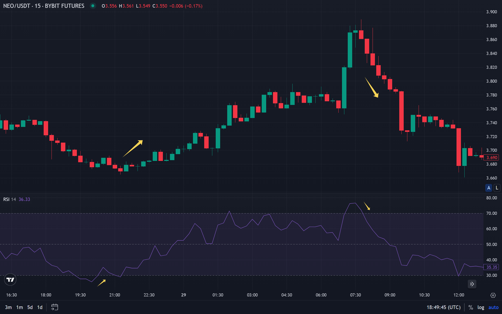

El indicador RSI (Relative Strength Index) es uno de los osciladores más populares en el análisis técnico. Mide la velocidad y el cambio de los movimientos de precios, ayudando a los traders a determinar momentos de entrada y salida del mercado.

El indicador oscila en un rango de 0 a 100 y se utiliza tradicionalmente para identificar condiciones de sobrecompra o sobreventa de un activo. RSI se considera una herramienta clásica de análisis técnico que se aplica en varios mercados, incluyendo criptomonedas.

## Qué es RSI (Relative Strength Index)

**RSI (Relative Strength Index)** es un oscilador técnico desarrollado por Welles Wilder en 1978. El indicador mide la fuerza relativa de los movimientos de precio alcistas y bajistas durante un período determinado.

La idea principal de RSI es comparar el aumento promedio del precio con la disminución promedio del precio durante el período seleccionado. El resultado se expresa como un número de 0 a 100, lo que permite interpretar fácilmente las condiciones del mercado.

RSI pertenece a la categoría de indicadores de momentum. Muestra la fuerza y velocidad de los movimientos de precio, ayudando a determinar cuándo un activo puede estar sobrecomprado o sobrevendido. Esto lo hace particularmente útil para encontrar puntos de reversión de tendencia.

### Historia

El indicador RSI fue introducido por Welles Wilder en su libro "New Concepts in Technical Trading Systems", publicado en 1978. Wilder desarrolló varios indicadores técnicos conocidos, incluyendo Average True Range (ATR) y Average Directional Index (ADX).

Inicialmente, RSI estaba destinado para analizar mercados de materias primas, pero con el tiempo comenzó a aplicarse en todos los tipos de mercados financieros. Gracias a su simplicidad de interpretación y efectividad, el indicador ganó popularidad entre traders en todo el mundo.

Hoy, RSI es parte del conjunto estándar de herramientas de la mayoría de las plataformas de trading y es ampliamente utilizado tanto por principiantes como por traders profesionales.

### Características Clave

RSI tiene varias propiedades importantes que lo convierten en una herramienta universal:

**Rango de Valores:** El indicador siempre está en un rango de 0 a 100, simplificando la interpretación de resultados.

**Niveles Estándar:** Tradicionalmente, los niveles 70 y 30 se consideran zonas de sobrecompra y sobreventa, respectivamente. Sin embargo, estos valores pueden variar dependiendo de la volatilidad del mercado.

**Período de Cálculo:** Se usa un período de 14 velas por defecto, pero los traders pueden cambiar este parámetro para adaptarse a diferentes marcos temporales.

**Indicador de Momentum:** RSI reacciona a los cambios en el momentum del precio, permitiendo identificar reversiones potenciales antes de que se vuelvan obvias en el gráfico de precios.

## Cómo se Calcula RSI

El cálculo de RSI se basa en comparar los valores promedio de aumentos y disminuciones de precio durante el período seleccionado. La fórmula incluye varios pasos:

**Paso 1:** Se calcula el valor promedio del aumento de precio (Average Gain) durante el período.

**Paso 2:** Se calcula el valor promedio de la disminución de precio (Average Loss) durante el período.

**Paso 3:** Se calcula la fuerza relativa (RS) como la relación del aumento promedio a la disminución promedio.

**Paso 4:** RSI se calcula usando la fórmula: RSI = 100 - (100 / (1 + RS)).

El período de cálculo estándar es de 14 velas, pero los traders pueden usar otros valores. Períodos cortos (por ejemplo, 9) hacen el indicador más sensible, mientras que períodos largos (por ejemplo, 21) lo hacen más suave.

Es importante entender que RSI se calcula solo basándose en los precios de cierre de las velas. Los volúmenes de trading no se consideran, a diferencia del [Índice de Flujo de Dinero (MFI)](/es/library/money-flow-index/), que incluye volúmenes en sus cálculos.

## Cómo Interpretar los Valores de RSI

La interpretación de RSI se basa en analizar los valores numéricos del indicador y su dinámica. Zonas y señales principales:

**Zona de Sobrecompra (70-100):** Los valores por encima de 70 tradicionalmente indican que un activo puede estar sobrecomprado. Esto significa que el aumento de precio fue demasiado rápido y es posible una corrección a la baja.

Sin embargo, en tendencias alcistas fuertes, RSI puede permanecer por encima de 70 durante períodos prolongados. En tales casos, cruzar el nivel 70 de arriba hacia abajo puede ser una señal más confiable que simplemente estar en la zona de sobrecompra.

**Zona de Sobreventa (0-30):** Los valores por debajo de 30 indican condiciones de sobreventa de un activo. La caída del precio fue demasiado intensa y es posible un rebote al alza.

Similar a la zona de sobrecompra, en tendencias bajistas fuertes, RSI puede permanecer por debajo de 30 durante períodos prolongados. Salir de la zona de sobreventa (cruzar el nivel 30 de abajo hacia arriba) a menudo sirve como una señal más confiable.

**Zona Neutral (30-70):** Los valores entre 30 y 70 se consideran normales. RSI estando en esta zona no proporciona señales claras sobre las condiciones del mercado.

La línea central (50) juega un papel especial. RSI cruzando el nivel 50 de abajo hacia arriba puede indicar un fortalecimiento del momentum alcista, mientras que cruzar de arriba hacia abajo indica un fortalecimiento del momentum bajista.

## Divergencias RSI

La divergencia es una de las señales más fuertes de RSI. Ocurre cuando la dirección del movimiento del precio no coincide con la dirección del movimiento del indicador.

**Divergencia Alcista:** El precio forma un nuevo mínimo, mientras que RSI muestra un mínimo más alto. Esto indica un debilitamiento del momentum bajista y una posible reversión al alza.

La divergencia alcista se considera una señal de compra, especialmente si se forma en la zona de sobreventa. Cuanto mayor sea el intervalo de tiempo entre los mínimos del precio, más fuerte será la señal.

**Divergencia Bajista:** El precio forma un nuevo máximo, mientras que RSI muestra un máximo más bajo. Esto indica un debilitamiento del momentum alcista y una posible reversión a la baja.

La divergencia bajista se considera una señal de venta, especialmente si se forma en la zona de sobrecompra. Al igual que la divergencia alcista, la divergencia bajista se vuelve más fuerte con el aumento del intervalo de tiempo entre máximos.

Las divergencias RSI son particularmente efectivas en el mercado de criptomonedas, donde la volatilidad permite ver claramente tales patrones. Sin embargo, es importante confirmar las señales de divergencia con otros indicadores, niveles de soporte/resistencia o [patrones de velas](/es/library/what-are-doji-candles/), como doji o patrones de engullimiento.

## Uso de RSI en Trading de Criptomonedas

El mercado de criptomonedas se caracteriza por alta volatilidad y características específicas, requiriendo adaptación de indicadores clásicos. RSI se aplica exitosamente en el mercado de criptomonedas, pero con algunas características.

**Volatilidad de Criptomonedas:** La alta volatilidad puede llevar a señales falsas frecuentes de RSI. En el trading de cripto, a menudo se usa un período más sensible (9 en lugar de 14) o se cambian los niveles de sobrecompra/sobreventa (por ejemplo, 80/20 en lugar de 70/30).

**Diferentes Marcos Temporales:** En marcos temporales cortos (minutos, horas), RSI puede generar muchas señales, pero su confiabilidad es menor. En gráficos diarios y semanales, las señales RSI son más significativas pero ocurren con menos frecuencia.

**Mercados con Tendencia y Laterales:** En tendencias laterales, RSI muestra efectivamente condiciones de sobrecompra y sobreventa. En tendencias fuertes, el indicador puede permanecer en zonas extremas durante períodos prolongados, requiriendo filtrado adicional de señales.

**Confirmación de Señales:** En el mercado de criptomonedas, es especialmente importante confirmar las señales RSI con otros indicadores. Por ejemplo, combinar RSI con el [Índice de Flujo de Dinero (MFI)](/es/library/money-flow-index/) puede aumentar la confiabilidad de las señales de trading, ya que MFI tiene en cuenta los volúmenes de trading.

## Cómo Usar RSI en Estrategias de Trading

RSI puede aplicarse en varias estrategias de trading, desde scalping hasta inversiones a largo plazo. Antes de aplicar una estrategia con RSI, se recomienda realizar [backtesting](/es/library/what-are-backtests/) para evaluar la efectividad en datos históricos. Enfoques principales:

**Estrategia de Rebote de Niveles:** Entrar en una posición cuando RSI alcanza zonas extremas (por debajo de 30 o por encima de 70) con expectativa de retorno a valores promedio. El stop-loss se establece más allá del extremo opuesto.

Esta estrategia funciona bien en tendencias laterales pero puede ser peligrosa en movimientos de tendencia fuertes. Es importante considerar la dirección general del mercado antes de usar esta estrategia.

**Estrategia de Divergencias:** Entrar en una posición cuando se forma una divergencia entre el precio y RSI. La divergencia alcista es una señal de compra, la divergencia bajista es una señal de venta.

La estrategia de divergencias requiere habilidades en análisis visual de gráficos y confirmación con otras herramientas de análisis técnico. No todas las divergencias llevan a reversiones, por lo que es importante usar filtros.

**Estrategia de Cruce del Nivel 50:** Entrar en una posición cuando RSI cruza el nivel 50 en la dirección de la tendencia. Cruce de abajo hacia arriba en un mercado en alza es una señal de compra, cruce de arriba hacia abajo en un mercado en caída es una señal de venta.

Esta estrategia es particularmente efectiva para confirmar la fuerza de la tendencia. Combinada con indicadores de tendencia, puede proporcionar señales de calidad.

**Estrategia Multi-Marco Temporal:** Usar RSI en diferentes marcos temporales para confirmar señales. Por ejemplo, si RSI en un gráfico diario muestra condiciones de sobreventa, y en un gráfico horario se está formando una divergencia alcista, esto fortalece la señal de compra.

El análisis multi-marco temporal aumenta la confiabilidad de las decisiones de trading y ayuda a evitar señales falsas características de marcos temporales cortos.

## Ventajas y Desventajas de RSI

Como cualquier indicador técnico, RSI tiene sus fortalezas y debilidades.

### Ventajas

**Interpretación Simple:** Un rango de valores de 0 a 100 y niveles claros de sobrecompra/sobreventa hacen que RSI sea comprensible incluso para traders principiantes.

**Versatilidad:** RSI funciona en todos los tipos de mercados y marcos temporales, desde criptomonedas hasta instrumentos financieros tradicionales.

**Detección Temprana de Reversiones:** Las divergencias RSI a menudo aparecen antes de que las reversiones se vuelvan obvias en el gráfico de precios.

**Amplia Disponibilidad:** El indicador está presente en todas las plataformas de trading populares y no requiere configuración adicional.

Un indicador similar es [Williams Percent Range](/es/library/williams-percent-range-r/), que también mide el momentum del precio y puede usarse en combinación con RSI para aumentar la confiabilidad de las señales.

### Desventajas

**Señales Falsas:** En mercados con tendencia, RSI puede permanecer en zonas extremas durante períodos prolongados, generando señales falsas de reversión.

**Sin Consideración de Volúmenes:** RSI se calcula solo basándose en el precio y no tiene en cuenta los volúmenes de trading, a diferencia del [Índice de Flujo de Dinero (MFI)](/es/library/money-flow-index/).

**Retraso:** Como la mayoría de los osciladores, RSI puede retrasarse con las señales en mercados que cambian rápidamente.

**Filtrado Requerido:** Para aumentar la confiabilidad, se requiere combinar RSI con otros indicadores o métodos de análisis.

## FAQ

**¿Qué es RSI en términos simples?**

RSI es un indicador que muestra qué tan rápido y fuertemente se mueve el precio de un activo. Los valores por encima de 70 indican posible sobrecompra, mientras que los valores por debajo de 30 indican sobreventa.

**¿Qué valor de RSI se considera óptimo?**

No hay valores óptimos. RSI se interpreta dependiendo de las condiciones del mercado. En tendencias laterales, las zonas 30 y 70 pueden servir como puntos de entrada; en mercados con tendencia, la dinámica de los cambios de RSI es más importante.

**¿RSI es mejor que MFI?**

No mejor ni peor: son herramientas diferentes. RSI analiza solo el precio, mientras que [MFI tiene en cuenta los volúmenes de trading](/es/library/money-flow-index/). Ambos indicadores pueden complementarse entre sí en análisis integral. Un oscilador similar es también [Williams Percent Range](/es/library/williams-percent-range-r/), que opera en un rango invertido.

**¿Con qué frecuencia RSI da señales falsas?**

La frecuencia de señales falsas depende de las condiciones del mercado y la configuración del indicador. En tendencias laterales, RSI es más confiable; en tendencias fuertes, puede generar muchas señales falsas. Combinar con otros indicadores reduce el número de activaciones falsas.

**¿En qué marco temporal es mejor usar RSI?**

RSI funciona en todos los marcos temporales. Para trading a corto plazo, se usan períodos cortos (9); para trading a largo plazo, se usan períodos estándar (14) o más largos (21). Es importante considerar que en marcos temporales cortos hay más señales, pero su confiabilidad es menor.

**¿Qué es la divergencia RSI?**

La divergencia es una discrepancia entre la dirección del movimiento del precio y RSI. La divergencia alcista (el precio cae, RSI sube) puede indicar una reversión al alza; la divergencia bajista (el precio sube, RSI cae) puede indicar una reversión a la baja.

**¿Se puede usar RSI solo?**

Técnicamente sí, pero en la práctica RSI es más confiable en combinación con otras herramientas de análisis técnico. Confirmar señales con niveles de soporte/resistencia u otros indicadores aumenta la probabilidad de operaciones exitosas.
