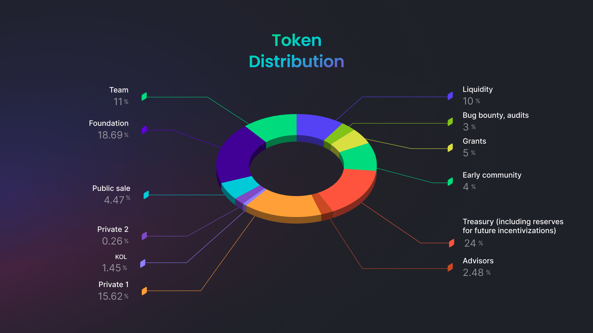
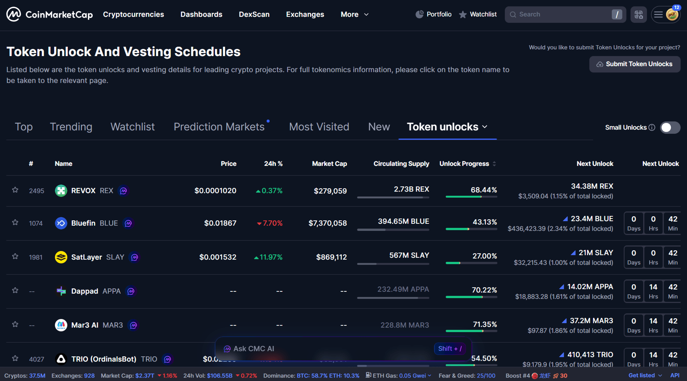

La **tokenómica** es el conjunto de reglas que define la economía de un proyecto cripto: cuántos tokens existen, cómo se distribuyen, cómo se usan y qué factores afectan su precio. Entenderla ayuda a evaluar sostenibilidad y riesgos.

## Por qué importa

Un token puede servir para acceso al producto, gobernanza, recompensas por staking o pago de comisiones. La tokenómica conecta estas piezas y responde: **quién recibe tokens, cuándo y bajo qué condiciones**.

Componentes clave:

- **Oferta / emisiones:** supply máximo (o no), cómo se emite (de golpe, gradual, mining, staking, etc.).
- **Distribución:** porcentaje para equipo, inversores, comunidad y fondos — y cuándo esos tokens pueden entrar al mercado.
- **Utilidad:** para qué se usa el token (fees, staking, gobernanza, descuentos). La utilidad impulsa demanda real.

## Métricas principales

**Market cap:** precio × supply circulante.

**FDV:** precio × supply máximo (si se emite todo). Ayuda a estimar valoración totalmente diluida.

**Circulating supply:** tokens disponibles en el mercado (no siempre igual al máximo).

**Total supply:** todos los tokens que existen ahora (incluyendo bloqueados).

**Max supply:** máximo número de tokens que existirán. Bitcoin: 21 millones; Ethereum: ilimitado.

**Unlock schedule:** calendario de desbloqueos de equipo/inversores/ecosistema; unlocks grandes pueden crear presión vendedora.

**Inflation rate:** porcentaje anual de aumento de oferta. Inflación alta diluye la participación de holders.

## Tipos de tokens por propósito

**Utility tokens:** Dan acceso a producto o servicio. Ejemplos: FIL para almacenamiento en Filecoin, ETH para gas de Ethereum.

**Governance tokens:** Dan derecho a voto en gobernanza del protocolo. Ejemplos: UNI para votar en Uniswap, MKR en MakerDAO.

**Security tokens:** Representan propiedad en activo o proyecto. Sujetos a regulación de valores. Ejemplo: acciones tokenizadas.

**Stablecoins:** Vinculadas a activo estable (USD, oro). Ejemplos: USDT, USDC, DAI.

**NFTs (tokens no fungibles):** Tokens únicos que representan propiedad de activos digitales o físicos.

## Qué revisar al analizar tokenomics

**1. Asignación a equipo e inversores:**
- Óptimo: 10-20% con vesting de 2-4 años
- Riesgo: 30%+ sin vesting (pueden vender anytime)

**2. Unlock schedule:**
- Comprobar fechas de unlocks grandes
- Evitar proyectos con 50%+ tokens en una mano

**3. Mecanismos de quema (burn):**
- Quemas regulares reducen oferta
- Ejemplo: BNB quema 20% de beneficios trimestralmente

**4. Utilidad real del token:**
- ¿El token sirve para el producto o solo especulación?
- ¿Hay incentivos para mantener (staking, descuentos)?

**5. Comparación con competidores:**
- FDV relativo a market cap
- ratio circulating/max supply

**6. Inflación y emisiones:**
- ¿Cuántos tokens nuevos se crean anualmente?
- ¿Cómo afecta al precio a largo plazo?

## Banderas rojas en tokenomics

**❌ Gran asignación al equipo sin vesting:** 30%+ a fundadores que pueden vender anytime.

**❌ Emisiones ocultas:** No está claro cuántos tokens más se crearán.

**❌ Sin utilidad real:** Token solo para especulación, no uso en producto.

**❌ Inflación excesiva:** 50%+ anual diluye holders.

**❌ Distribución opaca:** Sin información sobre quién posee los tokens.

## Ejemplos de tokenomics

**Bitcoin (BTC):**
- Max Supply: 21 millones
- Circulating: ~19.5 millones (93%)
- Inflación: 1.7% anual (tras halving 2024)
- Distribución: descentralizada (mining)

**Ethereum (ETH):**
- Max Supply: ilimitado
- Circulating: ~120 millones
- Inflación: ~0.5% (tras transición a PoS y quemas)
- Distribución: mining (histórico), staking (actual)

**BNB:**
- Max Supply: 200 millones
- Circulating: ~153 millones
- Mecanismo: quema trimestral del 20% de beneficios
- Utilidad: fees, staking, participación en launchpad

## Resumen

La tokenómica muestra cómo está estructurada la economía de un proyecto cripto. Es importante observar emisión, distribución y utilidad real del token. Desbloqueos abruptos y gran asignación al equipo son señales de alerta.

Una buena tokenómica incentiva participación a largo plazo, es transparente y tiene mecanismos claros de influencia en precio. Antes de invertir, estudia whitepaper, unlock schedule y compara con competidores.

Para más sobre análisis de documentación, ver [Qué es Whitepaper](/es/library/what-is-whitepaper/).

## FAQ

**¿Qué es FDV y por qué importa?**

FDV (Fully Diluted Valuation) es precio × supply máximo. Si FDV supera mucho la capitalización actual, muchos tokens nuevos pueden salir al mercado, diluyendo tu participación.

**¿Cómo encontrar el calendario de desbloqueos de tokens?**

Busca "unlock schedule" en la web del proyecto, en documentación (Tokenomics, Token Distribution), o en trackers como Token Unlocks. Presta atención a fechas y volúmenes.

**¿Es buena una gran asignación de tokens al equipo?**

Es un riesgo. Si el equipo tiene 30%+ sin vesting (desbloqueo gradual), pueden vender en cualquier momento. Lo óptimo es 10–20% con vesting largo (2–4 años).

**¿Qué es quema de tokens (burn)?**

Mecanismo donde parte de la oferta de tokens se elimina permanentemente de circulación. Esto reduce oferta y potencialmente aumenta precio. Pero es importante comprobar si se quema suficiente porcentaje.

**¿La tokenómica es suficiente para evaluar un proyecto?**

No, es solo una parte. Mira también producto, equipo, competidores, riesgos regulatorios. Buena tokenómica no salva mal proyecto.

**¿En qué se diferencian utility y governance tokens?**

Utility tokens dan acceso al producto (fees, staking). Governance tokens dan derecho a voto en decisiones del protocolo (propuestas, votaciones). Algunos tokens combinan ambas funciones.

**¿Qué es vesting?**

Vesting es desbloqueo gradual de tokens. Por ejemplo, el equipo recibe 20% de tokens pero obtiene 25% por año durante 4 años. Esto incentiva al equipo a trabajar en el proyecto a largo plazo.

