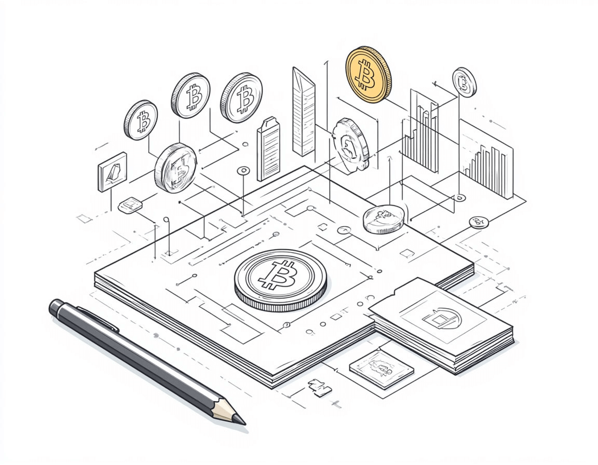

# Whitepaper en cripto: qué es y para qué sirve

El whitepaper es el documento fundacional al lanzar nuevos proyectos cripto. Describe la tecnología, los objetivos, la tokenómica y otros aspectos clave. Inversores y usuarios lo usan para valorar si el proyecto es prometedor, qué problemas resuelve y qué beneficios ofrece.

## Qué es un whitepaper

Un whitepaper es el documento oficial de un proyecto cripto que expone su diseño técnico, objetivos y perspectivas. Suele incluir el problema que aborda, detalles técnicos, tokenómica y planes de desarrollo. Es el primer y más importante documento que conviene leer antes de invertir en una criptomoneda o startup blockchain.

## Whitepaper frente a roadmap: qué revisar

Aunque están relacionados, whitepaper y roadmap no son lo mismo. El whitepaper es un documento estratégico que define las bases del proyecto; el roadmap es un plan de acción con fases y plazos.

Los inversores deben tener en cuenta ambos: el whitepaper ayuda a valorar la solidez técnica y la originalidad; el roadmap, la viabilidad de la ejecución y el cumplimiento de plazos.

## Cómo se usa el whitepaper en proyectos cripto

### En el lanzamiento

En las fases iniciales, el whitepaper es clave para generar confianza y atraer financiación.

**Atracción de inversores y fondos:**

- Explicar qué problema resuelve el proyecto y cómo.
- Mostrar ventajas competitivas y tecnología propia.
- La tokenómica detallada ayuda a entender la distribución y usos del token.
- Institucionales, fondos de capital riesgo e inversores minoristas analizan whitepapers antes de invertir.

**ICO / IDO / IEO:**

El whitepaper es la base de las ventas de tokens:

- ICO (Initial Coin Offering): venta de tokens para captar fondos.
- IDO (Initial DEX Offering): lanzamiento en exchanges descentralizados.
- IEO (Initial Exchange Offering): lanzamiento en exchanges centralizados.

### En el desarrollo y el crecimiento

Tras un buen arranque, el whitepaper sigue siendo referencia para equipo, comunidad y socios.

**Guía para desarrolladores:**

- Define la arquitectura técnica.
- Ayuda a desarrollar contratos inteligentes con los parámetros del token.
- Describe el mecanismo de consenso (Proof-of-Work, Proof-of-Stake, etc.).
- Puede usarse para publicaciones académicas (p. ej. el origen de Bitcoin como trabajo de Satoshi Nakamoto).

**Roadmap y actualizaciones:**

- Muchos whitepapers incluyen roadmap, pero el documento puede actualizarse.
- Si el proyecto cambia de retos, el equipo puede revisar diseño técnico o económico.
- Por ejemplo, Ethereum pasó de PoW a PoS; cambios así pueden reflejarse en un whitepaper actualizado.

**Cumplimiento normativo:**

- En algunas jurisdicciones, un whitepaper sólido ayuda a evitar problemas legales.
- El documento puede servir para demostrar legitimidad ante reguladores.
- Debe ajustarse a la normativa de valores si el token tiene rasgos de inversión.

### En marketing y captación de usuarios

El whitepaper también apoya la promoción.

**Comunidad:**

- Explica para qué sirve el token.
- Muestra descentralización y gobierno.
- Describe staking, farming, votación y otras funciones.

**Socios y exchanges:**

- Los exchanges (centralizados y descentralizados) usan whitepapers para evaluar proyectos antes de listar.
- Empresas que exploran integraciones con startups blockchain analizan el whitepaper.

### En actualizaciones y escalado

Con el crecimiento del proyecto, el whitepaper puede actualizarse o ampliarse.

**Nuevas versiones (V2.0, etc.):**

- Si cambia la arquitectura, hace falta una nueva descripción.
- Si cambia la tokenómica (p. ej. quemas), el documento debe actualizarse.
- Si el proyecto migra a otra blockchain, debe reflejarse en el whitepaper.

**Forks y nuevas redes:**

- Un hard fork (p. ej. Ethereum → Ethereum Classic) puede dar lugar a un nuevo whitepaper.
- Las soluciones de capa 2 u otras de escalado deben documentarse bien.

## Secciones habituales de un whitepaper

**Introducción:** visión general del problema, la solución, qué diferencia al proyecto y sus objetivos.

**Descripción del problema:** limitaciones actuales, pain points de usuarios y evidencia de mercado.

**Solución y tecnología:** cómo se aborda el problema, innovaciones, ventajas (velocidad, seguridad, compatibilidad) y casos de uso.

**Arquitectura técnica:** consenso, estructura de la blockchain (sidechains, capa 2), contratos inteligentes, integración entre cadenas y seguridad.

**Tokenómica:** tipo de token, supply, distribución, usos (staking, comisiones, gobierno), inflación/deflación y recompensas.

**Roadmap:** hitos y fechas (testnet, mainnet, integraciones, listings).

**Equipo y socios:** fundadores, desarrolladores clave y partners.

**Legal y cumplimiento:** jurisdicción, KYC/AML y riesgos de inversión.

**Contacto y recursos:** web, PDF del whitepaper, GitHub, redes y comunidad.

## A qué prestar atención

**Tokenómica:** supply, distribución, inflación/deflación y uso del token en el ecosistema.

**Roadmap:** plazos claros y realistas, cumplimiento de hitos previos y ambición de los objetivos.

**Referencias a otros proyectos:** pueden indicar adopción de tecnología contrastada o falta de originalidad.

**Socios:** socios conocidos suman credibilidad, pero hay que verificar las afirmaciones.

## Conclusión

El whitepaper es un documento central para cualquier proyecto cripto, tanto para el equipo como para los usuarios. Al leerlo, conviene fijarse en tokenómica, roadmap, socios y ejecución técnica. Ni siquiera un whitepaper muy bien escrito garantiza el éxito, así que siempre conviene un análisis riguroso antes de invertir.

---

## Materiales relacionados

- [Qué es la moneda digital](/es/library/what-is-digital-currency-in-simple-terms/) — bases del mercado cripto
- [Fundamentos de Bitcoin](/es/library/bitcoin-basics/) — blockchain y primeras criptomonedas
- [Bitcoin: guía completa](/es/library/what-bitcoin-everything-you-need-know/) — historia, principios, casos de uso
