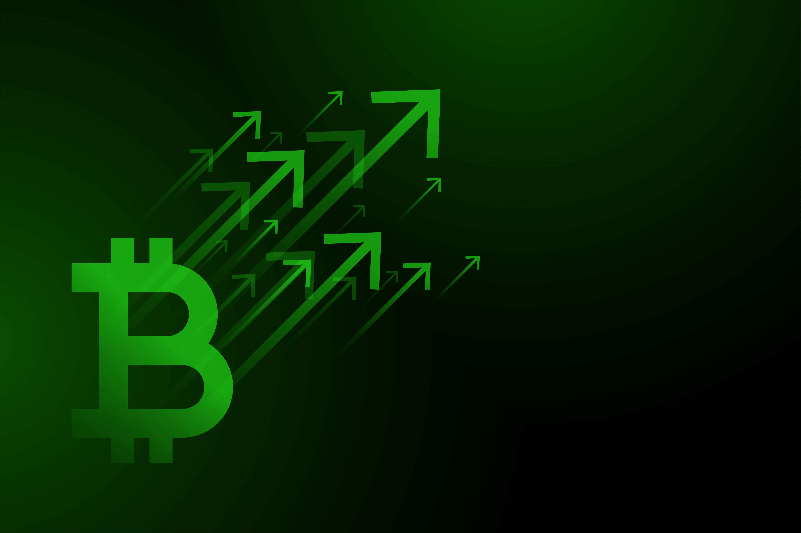
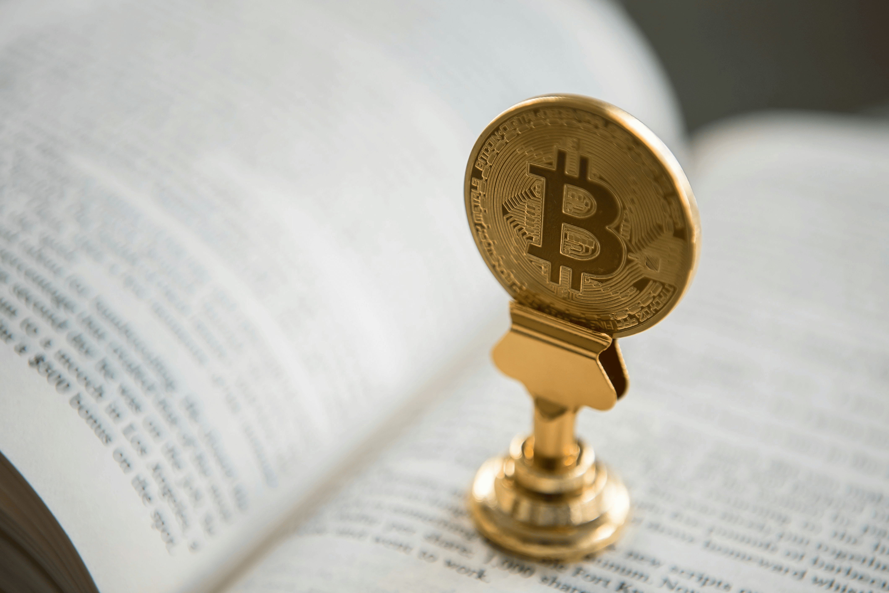

Биткоин — это первая и самая известная криптовалюта в мире. Созданный анонимным разработчиком под псевдонимом Сатоши Накамото в 2009 году, он представил миру технологию блокчейн и изменил представление о деньгах.

Эта децентрализованная система позволяет передавать ценность без участия посредников, таких как банки или правительства. В отличие от традиционных финансовых систем, Биткоин работает на основе математики и криптографии, обеспечивая прозрачность и безопасность транзакций.

## Что такое Биткоин

**Биткоин (Bitcoin, BTC)** — это первая децентрализованная криптовалюта, которая функционирует без единого управляющего органа. Система была создана как альтернатива традиционным деньгам для обеспечения безопасных, быстрых и независимых финансовых операций.

Ключевая особенность заключается в использовании технологии блокчейн — распределенного реестра транзакций, защищенного криптографией. Каждая транзакция записывается в блоки, которые связываются в непрерывную цепь, обеспечивая прозрачность и защиту от подделок.

### Ключевые характеристики

Биткоин обладает несколькими уникальными свойствами, которые отличают его от традиционных валют:

**Ограниченная эмиссия:** Всего будет создан только 21 миллион монет. Это программное ограничение делает Биткоин защищенным от инфляции, в отличие от фиатных валют, которые могут печататься центральными банками.

**Децентрализация:** Никто не контролирует сеть. В отличие от банковских систем, где один орган управляет всей инфраструктурой, сеть Биткоина распределена между тысячами узлов по всему миру.

**Прозрачность:** Все транзакции записываются в открытый реестр. Любой может просмотреть историю транзакций в блокчейне, что обеспечивает прозрачность системы.

**Безопасность:** Криптографические алгоритмы защищают транзакции от подделки и обеспечивают целостность данных.

**Псевдоанонимность:** Хотя все транзакции публичны, личность владельца адреса не раскрывается напрямую. Это обеспечивает определенный уровень приватности при сохранении прозрачности.

**Невозможность двойного расходования:** Криптографические механизмы блокчейна предотвращают возможность потратить одни и те же Биткоины дважды. Каждая транзакция проверяется сетью перед добавлением в блокчейн.

## История появления Биткоина

Биткоин появился в сложный период мировой финансовой системы. В 2008 году, на фоне глобального финансового кризиса, анонимный разработчик под псевдонимом Сатоши Накамото опубликовал whitepaper децентрализованной цифровой валюты.

Цель заключалась в создании системы, свободной от влияния банков и правительств. В документе описывалась концепция электронной платежной системы на основе криптографии, которая могла бы обеспечить прямые транзакции между пользователями без посредников.

### Основные этапы развития

**2008 год — Идея:** Сатоши Накамото опубликовал whitepaper "Bitcoin: A Peer-to-Peer Electronic Cash System". В документе описывалась концепция децентрализованной цифровой валюты.

**2009 год — Запуск:** Сеть Биткоин начала работу с создания первого блока (генезис-блок). Этот момент считается днем рождения первой криптовалюты.

**2010 год — Первая покупка:** Программист Ласло Хейниц совершил первую известную покупку за Биткоины (2 пиццы за 10 000 BTC). Эта транзакция стала символом зарождения криптоэкономики.

**2011 год — Развитие:** Появились первые конкуренты (альткоины), такие как Litecoin. Рынок начал расширяться, появились новые проекты, использующие технологию блокчейн.

**Рост интереса:** С 2012 года Биткоин начали рассматривать как инвестиционный инструмент. Сформировались крупные биржи, такие как Coinbase и Kraken, которые упростили доступ к криптовалюте для обычных пользователей.

## Как работает Биткоин

Биткоин функционирует на базе блокчейна — непрерывной цепи блоков, содержащих данные о всех транзакциях. Каждый блок содержит информацию о нескольких транзакциях и связан с предыдущим блоком через криптографический хэш.

### Технология блокчейн

Блокчейн представляет собой последовательность блоков. Каждый блок соединён с предыдущим через уникальный криптографический хэш, что гарантирует целостность данных.

**Блок:** Группа транзакций за определённый период (примерно 10 минут для Биткоина). Каждый блок содержит информацию о транзакциях, временную метку и хэш предыдущего блока.

**Хэш:** Уникальный криптографический идентификатор блока. Хэш создается на основе содержимого блока и хэша предыдущего блока, что делает невозможным изменение данных без обнаружения.

**Децентрализация:** Данные хранятся на тысячах компьютеров (узлов) по всему миру. Каждый узел хранит полную копию блокчейна, что обеспечивает отказоустойчивость системы.

### Транзакции

Транзакция — это процесс перевода средств между пользователями сети Биткоин. Каждая транзакция должна быть подтверждена сетью перед добавлением в блокчейн.

**Приватный ключ:** Электронная подпись, которая доказывает право владения средствами. Приватный ключ используется для создания цифровой подписи транзакции и должен храниться в секрете.

**Публичный ключ:** Адрес, на который можно отправлять Биткоины. Публичный ключ генерируется из приватного ключа, но обратное преобразование невозможно.

**Мемпул:** Очередь транзакций, ожидающих подтверждения. Транзакция попадает в мемпул до момента включения в блок. Майнеры выбирают транзакции из мемпула для включения в новый блок.

### Майнинг

Майнинг — это процесс подтверждения транзакций и создания новых блоков. Майнеры решают сложные математические задачи, соревнуясь за право добавить следующий блок в цепь.

**Вознаграждение:** Майнер получает новые BTC за добавление блока. Это вознаграждение включает в себя комиссии за транзакции и новые монеты (до халвинга).

**Сложность:** Регулируется каждые 2016 блоков (~2 недели), чтобы среднее время блока составляло 10 минут. Если майнеры находят блоки быстрее, сложность увеличивается.

**Халвинг:** Каждые 210 000 блоков (~4 года) награда за майнинг уменьшается вдвое. Это сдерживает инфляцию и гарантирует, что всего будет создано только 21 миллион монет.

Изначально майнеры получали 50 BTC за блок, но после нескольких халвингов награда уменьшилась. Этот механизм контролирует эмиссию новых монет и постепенно переводит систему на финансирование исключительно через комиссии за транзакции.

Майнинг требует специализированного оборудования (ASIC) для эффективной работы. Процесс потребляет значительное количество электроэнергии, что делает его недоступным для обычных пользователей без специальной инфраструктуры.

## Для чего нужен Биткоин

Биткоин используется в разных целях, в зависимости от потребностей и стратегии пользователя. Его универсальность позволяет применять криптовалюту в различных сферах жизни.

**Средство платежа:** Глобальные переводы без участия банков с минимальными комиссиями. Биткоин позволяет отправлять средства в любую точку мира за считанные минуты, независимо от времени суток или выходных дней.

Это особенно важно для международных переводов, где традиционные банки могут взимать высокие комиссии и требовать несколько дней на обработку. Биткоин упрощает этот процесс, делая переводы быстрыми и доступными.

**Инструмент инвестиций:** Часто называется "цифровым золотом" из-за ограниченной эмиссии. Многие инвесторы рассматривают Биткоин как способ диверсификации портфеля и защиты от инфляции фиатных валют.

Историческая волатильность Биткоина привлекает как долгосрочных инвесторов, так и краткосрочных трейдеров. Некоторые используют его для накопления капитала, ожидая роста стоимости в будущем.

**Сохранение капитала:** Защита от инфляции фиатных валют. Благодаря ограниченной эмиссии, Биткоин не подвержен девальвации, вызванной чрезмерной денежной эмиссией центральных банков.

В странах с высокой инфляцией Биткоин становится альтернативой местной валюте. Люди используют его как средство сохранения покупательной способности своих сбережений.

**Финансовая независимость:** Полный контроль над своими средствами 24/7. Пользователь не зависит от банков или правительств и может управлять своими средствами в любое время.

Не требуется открывать банковский счет или получать разрешение на переводы. Достаточно иметь доступ к интернету и кошельку для управления своими активами.

**Защита от цензуры:** Транзакции не могут быть заблокированы третьими лицами. В отличие от банковских переводов, которые могут быть заморожены, транзакции Биткоина не могут быть отменены или заблокированы.

Это делает Биткоин особенно привлекательным для людей, живущих в странах с нестабильной финансовой системой или ограничениями на банковские операции.

## Как пользоваться Биткоином

Использование Биткоина начинается с создания кошелька для хранения криптовалюты. Кошелек — это программное или аппаратное устройство, которое хранит приватные ключи и позволяет управлять средствами.

### Типы кошельков

**Аппаратные кошельки (Ledger, Trezor):** Максимальная безопасность за счет хранения ключей оффлайн. Аппаратные кошельки подключаются к компьютеру только для подписания транзакций, что делает их защищенными от хакерских атак.

**Мобильные кошельки (Trust Wallet, Electrum):** Удобство для повседневных операций. Мобильные кошельки позволяют быстро отправлять и получать Биткоины, но требуют осторожности при хранении больших сумм.

**Биржевые кошельки:** Хранение на счетах торговых площадок. Биржевые кошельки удобны для торговли, но менее безопасны, так как приватные ключи хранятся на бирже. Рекомендуется хранить большие суммы в собственных кошельках.

### Покупка и продажа

Приобрести BTC можно через криптовалютные биржи, онлайн-обменники или платежные системы. Биржи предоставляют различные способы покупки: через банковскую карту, банковский перевод или P2P обмен.

Перед покупкой важно изучить комиссии и условия различных платформ. Некоторые биржи требуют верификацию личности для больших сумм, другие позволяют анонимные операции с ограничениями.

Продажа Биткоина также осуществляется через биржи или обменники. Процесс аналогичен покупке, но в обратном направлении: пользователь обменивает Биткоины на фиатную валюту.

При работе с биржами важно учитывать ликвидность торговой пары и спред между ценой покупки и продажи. Крупные биржи обычно предлагают лучшие условия для торговли.

## Преимущества и недостатки

Биткоин имеет как преимущества, так и недостатки, которые важно учитывать при работе с криптовалютой.

### Преимущества

**Децентрализация и отсутствие цензуры:** Транзакции не могут быть заблокированы или отменены третьими лицами. Это обеспечивает свободу финансовых операций независимо от политической ситуации.

**Прозрачность:** Все транзакции публичны и могут быть просмотрены в блокчейне. Это обеспечивает прозрачность системы и позволяет отслеживать движение средств.

**Глобальная доступность:** Работа без выходных, 24/7. Пользователь может отправлять и получать средства в любое время, независимо от часовых поясов.

**Защита от инфляции:** Ограниченная эмиссия делает Биткоин защищенным от девальвации. В отличие от фиатных валют, количество монет ограничено программно.

**Быстрые транзакции:** Переводы обрабатываются за считанные минуты, независимо от географического расположения отправителя и получателя.

### Недостатки

**Высокая волатильность:** Курс Биткоина может сильно колебаться, что создает риски для инвесторов и делает его менее подходящим для повседневных платежей.

**Отсутствие возможности отмены транзакций:** После подтверждения транзакция не может быть отменена. Это требует осторожности при отправке средств.

**Низкая скорость обработки:** Основная сеть обрабатывает около 7 транзакций в секунду. Это ограничивает масштабируемость системы для массового использования.

**Сложность хранения для новичков:** Риск потери ключей или взлома кошелька требует определенного уровня технических знаний и осторожности.

**Энергозатратность майнинга:** Процесс майнинга требует больших затрат электроэнергии, что вызывает экологические опасения.

## FAQ

**Что такое Биткоин простыми словами?**

Биткоин — это цифровая валюта, которая работает без участия банков. Каждая транзакция записывается в публичный реестр (блокчейн), что обеспечивает прозрачность и безопасность.

**Как работает блокчейн?**

Блокчейн — это цепочка блоков, каждый из которых содержит информацию о транзакциях. Блоки связаны друг с другом криптографически, что делает невозможным изменение данных без обнаружения.

**Чем Биткоин отличается от обычных денег?**

Биткоин децентрализован (нет единого управляющего органа), имеет ограниченную эмиссию (максимум 21 миллион монет) и работает на основе технологии блокчейн. Подробнее о различиях можно узнать в статье о [цифровых валютах](/ru/library/what-is-digital-currency-in-simple-terms/).

**Что такое майнинг?**

Майнинг — это процесс подтверждения транзакций и создания новых блоков в блокчейне. Майнеры решают сложные математические задачи и получают вознаграждение в виде новых Биткоинов.

**Безопасен ли Биткоин?**

Биткоин использует криптографию для защиты транзакций, что делает его безопасным. Однако безопасность также зависит от действий пользователя: правильного хранения приватных ключей и использования надежных кошельков.

**Где можно купить Биткоин?**

Биткоин можно приобрести через криптовалютные биржи, онлайн-обменники или платёжные системы. Подробнее — в статье [Основы Биткоина](/ru/library/bitcoin-basics/) и [Что такое цифровая валюта](/ru/library/what-is-digital-currency-in-simple-terms/).
