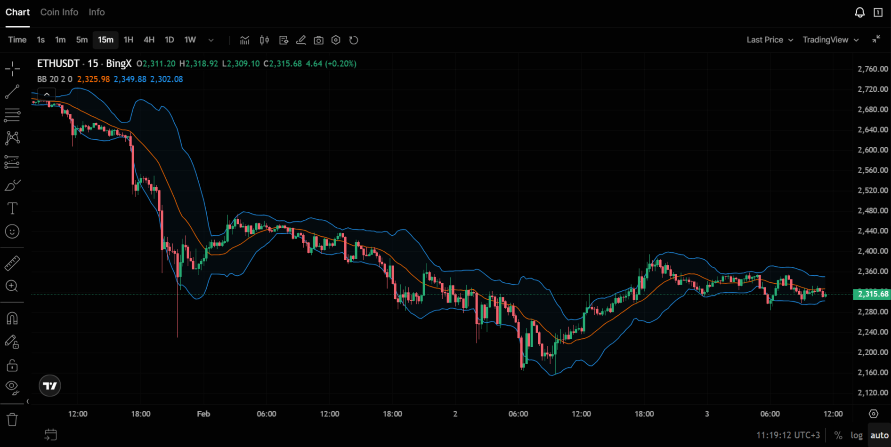

Полосы Боллинджера (Bollinger Bands) — индикатор волатильности: средняя линия (скользящая средняя) и две полосы выше и ниже, расстояние которых зависит от стандартного отклонения цены. Инструмент помогает оценивать «размах» движения и искать отскоки от границ канала. В статье — как рассчитываются полосы, как читать касания верхней и нижней границы и как комбинировать с [RSI](/ru/library/technical-analysis-rsi/) и [Williams %R](/ru/library/williams-percent-range-r/).

## Что такое полосы Боллинджера

**Полосы Боллинджера** — это индикатор, состоящий из трёх линий на графике цены. Средняя линия — это скользящая средняя (обычно простая, SMA) за выбранный период. Верхняя и нижняя полосы строятся на расстоянии от средней на величину, кратную стандартному отклонению цены за тот же период. Таким образом, полосы расширяются при росте волатильности и сужаются при её падении.

Индикатор разработан Джоном Боллинджером в 1980-х годах. Идея в том, что цена большую часть времени движется внутри полос, а выход за границы или касание границ часто предшествует развороту или коррекции. В статьях по теханализу и [торговым сигналам](/ru/library/what-are-trading-signals/) полосы Боллинджера относят к индикаторам волатильности наряду с [ATR](/ru/library/atr-and-atr-percent/).

## Как рассчитываются полосы Боллинджера

Расчёт основан на трёх величинах.

**Средняя линия (Middle Band):** простая скользящая средняя (SMA) цены закрытия за период N. Чаще всего N = 20.

**Стандартное отклонение:** считается по тем же N свечам от цены закрытия. Оно показывает, насколько сильно цена отклоняется от своей средней.

**Верхняя и нижняя полосы:** средняя линия плюс/минус (K × стандартное отклонение). Обычно K = 2. То есть верхняя полоса = SMA(20) + 2 × StdDev(20), нижняя = SMA(20) − 2 × StdDev(20).

Типичные настройки — 20 периодов и множитель 2. На младших [таймфреймах](/ru/library/timeframes-trading/) иногда используют меньший период (например, 15), чтобы индикатор быстрее реагировал.

## Интерпретация: зоны перекупленности и перепроданности

Касание или выход цены за **нижнюю полосу** часто трактуют как перепроданность: цена ушла вниз относительно своей недавней средней. Многие трейдеры рассматривают это как возможную зону для отскока вверх. Касание **верхней полосы** — перекупленность, возможна коррекция вниз.

Важно: в сильном тренде цена может «ходить по полосе» — долго держаться у верхней границы при росте или у нижней при падении. В таких условиях касание полосы не является самостоятельным сигналом разворота. Подтверждение лучше искать по [RSI](/ru/library/technical-analysis-rsi/) или [Williams %R](/ru/library/williams-percent-range-r/) и по уровням поддержки/сопротивления.

**Сжатие полос (squeeze):** когда полосы сильно сужаются, волатильность падает. Часто за сжатием следует резкое движение цены в одну из сторон. Сами полосы направления не показывают — только факт возможного всплеска. Направление входа определяют по тренду или другим индикаторам.

## Сигналы на покупку и продажу

Классический подход к сигналам:

- **Потенциальная покупка:** цена касается или пробивает нижнюю полосу, затем разворачивается и закрывается внутри полос. Подтверждением может служить отскок [RSI](/ru/library/technical-analysis-rsi/) из зоны перепроданности или выход [Williams %R](/ru/library/williams-percent-range-r/) из зоны ниже −80.
- **Потенциальная продажа:** цена касается или пробивает верхнюю полосу, затем разворачивается и закрывается внутри полос. Подтверждение — ослабление импульса по RSI или %R.

Один индикатор может давать ложные сигналы: например, цена у нижней полосы, но тренд продолжается вниз. Комбинация полос Боллинджера с осцилляторами и при необходимости со [стратегиями для бокового тренда](/ru/library/sideways-trend-strategies/) повышает фильтрацию.

## Комбинирование с другими индикаторами

- **Полосы Боллинджера + RSI:** RSI показывает перепроданность/перекупленность, полосы — экстремальное отклонение цены от средней. Совпадение сигналов (например, RSI &lt; 30 и касание нижней полосы) усиливает вероятность отскока.
- **Полосы Боллинджера + Williams %R:** как в статье про [Williams %R](/ru/library/williams-percent-range-r/), %R и полосы вместе помогают выявлять моменты, когда цена ушла от среднего на большое расстояние и осциллятор подтверждает экстремум.
- **Полосы Боллинджера + объём:** всплеск объёма при отскоке от нижней или верхней полосы может подтверждать силу разворота.

Не стоит перегружать график: 2–3 индикатора обычно достаточно. Подробнее о комбинациях — в материалах по [торговым сигналам](/ru/library/what-are-trading-signals/) и [бэктестам](/ru/library/what-are-backtests/).

## Применение в криптотрейдинге

Крипторынок отличается высокой волатильностью. Полосы на криптопарах часто сильно расширяются при резких движениях и сужаются в флэте. Стандартные 20 и 2 могут подходить; при скальпинге на [коротких таймфреймах](/ru/library/timeframes-trading/) иногда уменьшают период. Имеет смысл проверять настройки на истории через [бэктесты](/ru/library/what-are-backtests/) под выбранный актив и стиль торговли.

В боковом рынке отскоки от границ полос работают нагляднее. В тренде полезно смотреть на полосы как на зоны возможной коррекции, а направление сделки согласовывать с трендом.

## Кратко

- Полосы Боллинджера: средняя линия (SMA) и две полосы на расстоянии K × стандартное отклонение. Стандарт — период 20, множитель 2.
- Касание нижней полосы — возможная перепроданность; верхней — перекупленность. В тренде цена может долго идти вдоль полосы.
- Сжатие полос предвещает возможный всплеск волатильности; направление задают тренд или другие индикаторы.
- Комбинация с RSI, Williams %R и при необходимости с объёмом улучшает фильтрацию сигналов.

## Заключение

Полосы Боллинджера — мощный инструмент для оценки волатильности и поиска точек разворота. В сочетании с RSI и Williams %R они дают надёжные торговые сигналы.

Начать торговлю можно на проверенных биржах:
- **[Bybit](https://www.bybit.com/invite?ref=PWMD24)** — отличный выбор для работы с [торговыми ботами](/ru/library/bybit-trading-bot-setup/)
- **[Bitget](https://www.bitget.com/ru/referral/register?from=referral&clacCode=23EHR2VD)** — удобный интерфейс и бонусы
- **[BingX](https://bingxdao.com/invite/CUBDBG/)** — социальный трейдинг и копитрейдинг

---

## Связанные материалы
**Основы и стратегии:** изучите базовые индикаторы — [RSI](/ru/library/technical-analysis-rsi/) и [Williams %R](/ru/library/williams-percent-range-r/) — для комбинирования с полосами Боллинджера.
**Инструменты и автоматизация:** узнайте про [бэктесты](/ru/library/what-are-backtests/) для проверки сигналов на истории и настройки [торговых ботов на Bybit](/ru/library/bybit-trading-bot-setup/).
**Опыт и риски:** обязательно ознакомьтесь с [риск-менеджментом](/ru/library/risk-management-crypto-trading-bots/) и [диверсификацией](/ru/library/diversification-trading-system-part-1/), чтобы торговля была системной.

---

Если вам интересна эта тема и вы хотите следить за развитием нашего проекта, загляните на страницу [О проекте](/ru/about/) — там мы рассказываем о нашей миссии и о том, как можно поддержать стартап.
