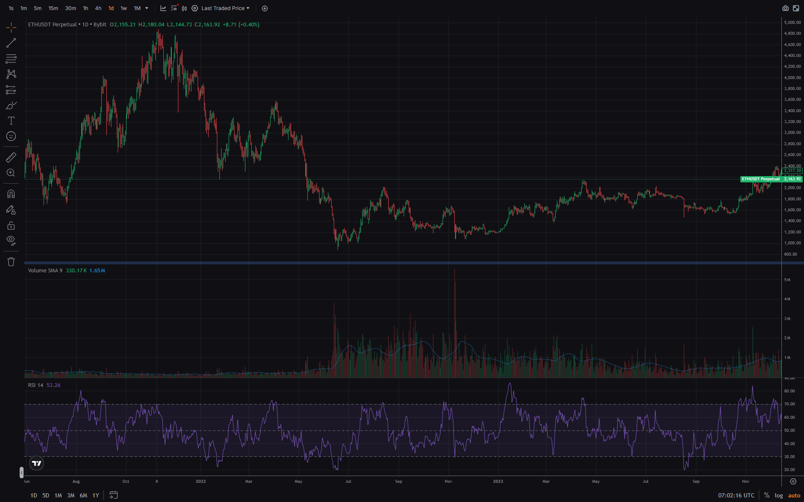
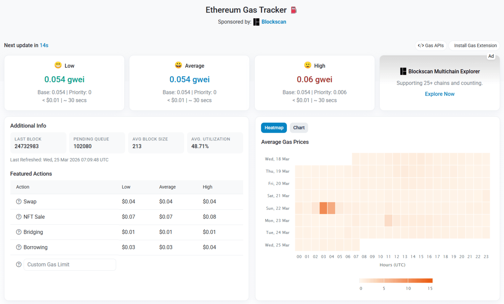
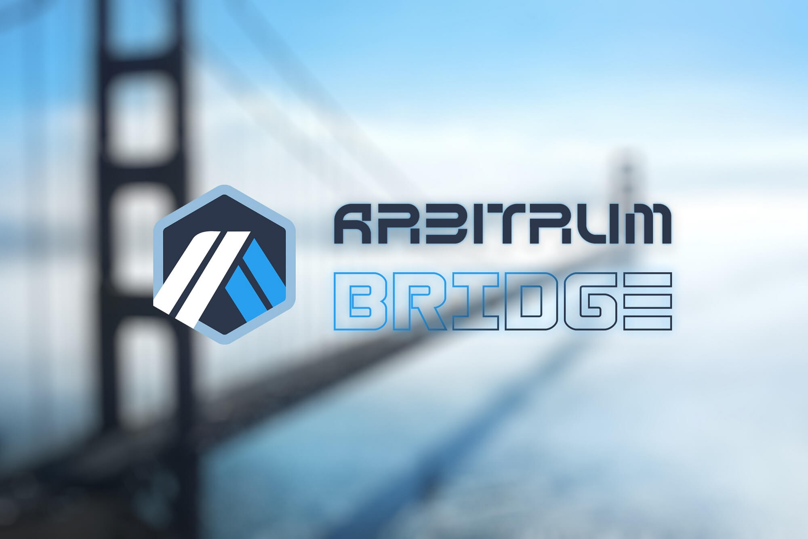

**Ethereum** — децентрализованная блокчейн-платформа для запуска смарт-контрактов и децентрализованных приложений (dApps). В отличие от Bitcoin, который создавался как цифровая валюта, Ethereum задумывался как «мировой компьютер» для программируемых финансовых операций.

**Почему это важно:**

Ethereum открыл возможность создавать не просто криптовалюты, а целые финансовые приложения без посредников: кредитование, стейкинг, обмен токенов, NFT и многое другое.

## Что такое Ethereum простыми словами

**Ethereum** — блокчейн с программируемой логикой. Если Bitcoin — это «цифровое золото» (хранение ценности), то Ethereum — «цифровая нефть» (топливо для приложений).

**Пример из жизни:**

Bitcoin — как калькулятор (одна функция: переводы). Ethereum — как смартфон (много функций: кредитование, обмен, игры, коллекционные токены).

**Ключевое отличие:**

- **Bitcoin:** Перевод BTC от А к Б
- **Ethereum:** Выполнение кода в блокчейне (смарт-контракты)

## История Ethereum: от идеи до ETH 2.0

### 2013-2014: Идея и запуск

**2013:** Виталик Бутерин (19 лет, программист из России) публикует Whitepaper Ethereum.

**Идея:** Bitcoin слишком ограничен. Нужен блокчейн с программируемой логикой.

**2014:** Краудфандинг Ethereum.

- Цена токена: $0.31
- Собрано: $18 млн в BTC
- Продано: 60 млн ETH

**2015:** Запуск основной сети (30 июля 2015).

### 2016-2020: Рост и проблемы

**2016:** The DAO — децентрализованный инвестиционный фонд.

- Собрал $150 млн
- Взлом из-за уязвимости в коде
- Спорное решение: откат транзакций (хардфорк)
- Результат: разделение на Ethereum (ETH) и Ethereum Classic (ETC)

**2017:** Бум ICO (Initial Coin Offering).

- 90% ICO запускались на Ethereum
- Цена ETH: $8 (начало года) → $1,400 (конец года)
- Проблема: перегрузка сети, высокие комиссии

**2020:** DeFi Summer (децентрализованные финансы).

- Запущены: Uniswap, Aave, Compound, MakerDAO
- TVL (Total Value Locked): $1 млрд → $15 млрд
- Проблема: комиссии до $50-100 за транзакцию



### 2022: The Merge — переход на Proof-of-Stake

**15 сентября 2022:** Ethereum перешёл с Proof-of-Work на Proof-of-Stake.

**Что изменилось:**
- Энергопотребление: -99.95%
- Майнинг на видеокартах: прекращён
- Стейкинг ETH: стал доступен для всех
- Инфляция ETH: стала дефляционной (сжигание комиссий)

**Что не изменилось:**
- Комиссии: остались высокими (решение — Layer 2)
- Скорость: ~15 транзакций в секунду (решение — шардинг в будущем)

---

## Как работает Ethereum

### Блокчейн и транзакции

**Блокчейн Ethereum** — распределённый реестр, где хранятся:
- Балансы адресов (ETH)
- Код смарт-контрактов
- Данные контрактов (состояние)

**Транзакция** — действие в сети:
- Перевод ETH
- Вызов смарт-контракта
- Развёртывание контракта

**Время блока:** ~12 секунд
**Пропускная способность:** ~15 TPS (транзакций в секунду)

### Смарт-контракты

**Смарт-контракт** — программа в блокчейне, которая выполняется автоматически при выполнении условий.

**Пример:**

Децентрализованный обмен (DEX):
1. Пользователь А хочет обменять 1 ETH на USDC
2. Пользователь Б хочет обменять 2000 USDC на ETH
3. Смарт-контракт автоматически исполняет обмен
4. Никакого посредника, никаких KYC

**Преимущества:**
- Автоматическое исполнение (не нужно доверять человеку)
- Прозрачность (код открыт)
- Безостановочность (никто не может закрыть)

**Недостатки:**
- Баги в коде = потеря средств (необратимо)
- Комиссии за каждое действие
- Сложность обновления (контракт нельзя изменить)

### Газ (Gas) — комиссия сети

**Газ** — единица измерения вычислительной работы в Ethereum.

**Почему нужен газ:**
- Защита от спама (каждая операция стоит денег)
- Оплата майнерам/валидаторам
- Ограничение сложности вычислений

**Как рассчитывается комиссия:**

```
Комиссия = Gas Used × Gas Price
```

**Пример:**
- Перевод ETH: 21,000 gas
- Сложный контракт: 100,000-500,000 gas
- Gas Price: 20 gwei (0.00000002 ETH)
- Комиссия: 21,000 × 20 gwei = 0.00042 ETH (~$1-5 в спокойное время, $50-100 в пик)

**Gwei** — единица измерения цены газа (1 gwei = 0.000000001 ETH).



---

## ETH — токен Ethereum

### Токеномика ETH

**Тип токена:** Utility (полезность) + Governance (управление)

**Функции ETH:**
1. **Оплата газа** — все транзакции оплачиваются в ETH
2. **Стейкинг** — залог для валидаторов (32 ETH для своей ноды)
3. **Залог в DeFi** — обеспечение для кредитов, ликвидность в пулах
4. **Средство сбережения** — «цифровая нефть» + дефляционная модель

**Эмиссия:**
- **До The Merge:** ~4.5% годовых (майнинг + стейкинг)
- **После The Merge:** ~0.5% годовых (только стейкинг)
- **Сжигание:** Базовая комиссия сжигается (EIP-1559)
- **Чистая инфляция:** Может быть отрицательной (дефляция) при высокой активности

**Распределение:**
- ~83 млн ETH в обращении (март 2026)
- ~28 млн ETH застейкано (33% от supply)
- Нет жёсткого лимита (в отличие от BTC 21 млн)

### Сравнение: ETH vs BTC

| Параметр | Bitcoin (BTC) | Ethereum (ETH) |
|----------|---------------|----------------|
| **Цель** | Цифровое золото | Мировой компьютер |
| **Эмиссия** | 21 млн (жёсткий лимит) | Неограниченно (дефляционная модель) |
| **Блок** | 10 минут | 12 секунд |
| **TPS** | ~7 | ~15 |
| **Консенсус** | Proof-of-Work | Proof-of-Stake |
| **Стейкинг** | Нет | Да (3-5% годовых) |
| **Сжигание** | Нет | Да (EIP-1559) |

## Стейкинг Ethereum

### Что такое стейкинг

**Стейкинг** — блокировка ETH для поддержки работы сети и получение вознаграждения.

**Как работает:**
1. Валидатор блокирует 32 ETH (или меньше через пулы)
2. Валидатор проверяет транзакции и создаёт блоки
3. Валидатор получает награду (~3-5% годовых)
4. При нарушении (простой, злонамеренность) — штраф (слэшинг)

### Способы стейкинга

| Способ | Мин. сумма | Гибкость | Риск | Доходность |
|--------|------------|----------|------|------------|
| **Своя нода** | 32 ETH | 28 дней на вывод | Низкий | 3-5% |
| **Пулы (Lido, Rocket Pool)** | 0.01 ETH | Гибко (stETH, rETH) | Средний | 3-4% |
| **Биржи (Bybit, Binance)** | 0.0001 ETH | Зависит от биржи | Средний | 2-4% |

**Популярные решения:**
- **Lido (stETH):** Крупнейший пул, ликвидный токен
- **Rocket Pool (rETH):** Децентрализованный, меньшая комиссия
- **Bybit/Binance:** Просто, но кастодиальный риск

---

## Экосистема Ethereum

### DeFi (децентрализованные финансы)

**DeFi** — финансовые приложения без посредников.

**Категории:**
- **DEX (децентрализованные биржи):** Uniswap, SushiSwap, Curve
- **Кредитование:** Aave, Compound, MakerDAO
- **Стейкинг:** Lido, Rocket Pool, Ankr
- **Деривативы:** dYdX, GMX, Synthetix

**TVL (Total Value Locked):** $50-100 млрд (колеблется)

### NFT (невзаимозаменяемые токены)

**NFT** — уникальные токены для цифрового искусства, коллекций, игровых предметов.

**Популярные стандарты:**
- **ERC-721:** Уникальные токены (CryptoPunks, Bored Apes)
- **ERC-1155:** Полузаменяемые токены (игры, коллекции)

**Маркетплейсы:** OpenSea, Blur, LooksRare

### Layer 2 (решения второго уровня)

**Layer 2** — надстройки над Ethereum для снижения комиссий и увеличения скорости.

**Почему нужны Layer 2:**
- Ethereum: ~15 TPS, комиссии $1-50
- Layer 2: ~100-4,000 TPS, комиссии $0.01-0.10

**Типы Layer 2:**

**Optimistic Rollups:**
- **Arbitrum:** Крупнейший по TVL ($3-5 млрд)
- **Optimism:** Поддержка от Coinbase (Base built on OP)
- **Base:** Биржа Coinbase, быстрый рост
- **Механика:** Транзакции выполняются вне Ethereum, результаты публикуются в mainnet

**ZK-Rollups:**
- **zkSync Era:** ZK-доказательства, быстро
- **Starknet:** Cairo язык, высокая производительность
- **Polygon zkEVM:** Совместимость с Ethereum
- **Механика:** ZK-доказательства корректности транзакций

### Сравнение Layer 2 решений

| Решение | Тип | TVL (млрд $) | Комиссии | Вывод в mainnet |
|---------|-----|--------------|----------|-----------------|
| **Arbitrum** | Optimistic | 3-5 | $0.01-0.10 | 7 дней |
| **Optimism** | Optimistic | 1-2 | $0.01-0.10 | 7 дней |
| **Base** | Optimistic | 1-2 | $0.01-0.10 | 7 дней |
| **zkSync Era** | ZK | 0.5-1 | $0.01-0.05 | Мгновенно |
| **Starknet** | ZK | 0.3-0.5 | $0.01-0.05 | Мгновенно |
| **Polygon zkEVM** | ZK | 0.1-0.3 | $0.01-0.05 | Мгновенно |

**Как начать использовать Layer 2:**
1. Купить ETH на бирже
2. Вывести на L2 через мост (Arbitrum Bridge, Optimism Gateway)
3. Использовать в DeFi (Uniswap, Aave на L2)
4. Комиссии: $0.01-0.10 за своп

**Преимущества:**
- Низкие комиссии ($0.01-0.10 vs $1-50)
- Высокая скорость (~100-4,000 TPS)
- Совместимость с Ethereum (те же адреса, ключи)

**Недостатки:**
- Нужно использовать мост (дополнительный шаг)
- Некоторые протоколы ещё не портированы
- Вывод в mainnet может занимать 7 дней (Optimistic)

**Рекомендация:** Для небольших сумм (< $1,000) использовать Layer 2. Для крупных — mainnet Ethereum.



---

## Риски Ethereum

### 1. Конкуренция

**Проблема:** Solana, Cardano, Avalanche предлагают более высокую скорость и низкие комиссии.

**Ответ Ethereum:** Layer 2, шардинг, постоянные обновления.

### 2. Регуляторные риски

**Проблема:** SEC может классифицировать ETH как ценную бумагу.

**Статус:** Пока ETH считается товаром (как BTC), но вопрос остаётся открытым.

### 3. Технические риски

**Проблема:** Баги в смарт-контрактах, уязвимости мостов.

**Примеры:**
- The DAO (2016): $60 млн украдено
- Wormhole (2022): $320 млн украдено из моста Solana-Ethereum

**Как защититься:**
- Использовать аудированные контракты
- Не хранить всё в одном протоколе
- Диверсифицировать риски

---

## Как купить и хранить ETH

### Покупка ETH

**Способы:**
1. **Криптобиржи:** Bybit, Binance, Coinbase (просто, но кастодиально)
2. **DEX:** Uniswap, 1inch (децентрализованно, но нужны ETH для газа)
3. **P2P:** LocalCryptos, Bisq (напрямую от человека)
4. **Криптобанкоматы:** BitAccess, General Bytes (наличные → ETH)

**Рекомендация:** Для начала — биржа (Bybit, Binance). Для больших сумм — P2P или DEX.

### Хранение ETH

| Тип | Примеры | Безопасность | Удобство | Комиссии |
|-----|---------|--------------|----------|----------|
| **Аппаратный кошелёк** | Ledger, Trezor | ⭐⭐⭐⭐⭐ | ⭐⭐⭐ | $50-150 (единоразово) |
| **Программный** | MetaMask, Trust Wallet | ⭐⭐⭐⭐ | ⭐⭐⭐⭐ | Бесплатно |
| **Биржа** | Bybit, Binance | ⭐⭐ | ⭐⭐⭐⭐⭐ | Бесплатно (но комиссии на вывод) |
| **Бумажный** | Распечатка seed-фразы | ⭐⭐⭐ | ⭐ | Бесплатно |

**Рекомендация:**
- До $1,000: биржа (просто)
- $1,000-10,000: программный кошелёк (MetaMask)
- От $10,000: аппаратный кошелёк (Ledger Nano X)

### Безопасность: чек-лист

- Seed-фраза: записать на бумаге, хранить в сейфе
- 2FA: Google Authenticator (не SMS!)
- Проверка адресов: первые и последние 4 символа
- Тестовая транзакция: перед крупной суммой
- Не хранить на бирже больше 10% капитала
- Не переходить по ссылкам из писем (фишинг)
- Не давать доступ к кошельку третьим лицам

---

## Прогнозы на 2026-2030: возможные сценарии

### Развитие экосистемы

**Ожидаемые тенденции:**
- Layer 2 станут основными для пользователей
- Шардинг увеличит пропускную способность
- Институциональное принятие (ETF на ETH уже одобрены)

### Влияние на цену: сценарии

**Бычий сценарий (оптимистичный):**
- Массовое принятие DeFi и NFT
- Дефляционная модель (сжигание > эмиссии)
- Цена ETH: $10,000-20,000

**Медвежий сценарий (пессимистичный):**
- Конкуренция Solana, Cardano
- Регуляторные проблемы
- Цена ETH: $1,000-2,000

**Важно:** Это прогнозы аналитиков, не финансовые рекомендации. Прошлые результаты не гарантируют будущую доходность.

---

## Итог

**Ethereum** — платформа для смарт-контрактов и dApps. ETH используется для оплаты газа, стейкинга и как средство сбережения.

**Главные правила:**
1. Понимать разницу между ETH и ERC-20 токенами
2. Использовать Layer 2 для низких комиссий
3. Хранить ETH в надёжном кошельке (не на бирже)
4. Стейкать ETH для пассивного дохода (3-5% годовых)

**Для кого Ethereum:**
- Разработчики dApps
- Пользователи DeFi и NFT
- Долгосрочные инвесторы
- Стейкеры

**Для кого НЕ подходит:**
- Только для платежей (BTC лучше)
- Не доверяют смарт-контрактам
- Хотят 100% анонимности

---

## FAQ

**Сколько ETH в обращении?**

~83 млн ETH (март 2026). Нет жёсткого лимита, но эмиссия низкая (~0.5% годовых).

**Можно ли майнить Ethereum?**

Нет. После The Merge (сентябрь 2022) Ethereum перешёл на Proof-of-Stake. Майнинг невозможен.

**Что такое stETH?**

stETH — ликвидный токен стейкинга от Lido. Вы получаете stETH за заблокированные ETH и можете использовать его в DeFi.

**Безопасно ли стейкать ETH на бирже?**

Зависит от биржи. Bybit, Binance — надёжные, но кастодиальный риск остаётся. Для больших сумм — своя нода или децентрализованные пулы (Lido, Rocket Pool).

**Почему комиссии такие высокие?**

Ethereum перегружен (много пользователей). Решение — Layer 2 (Arbitrum, Optimism, Base), где комиссии $0.01-0.10.

**Что такое EIP-1559?**

Обновление Ethereum (август 2021). Базовая комиссия сжигается, что делает ETH дефляционным при высокой активности.
