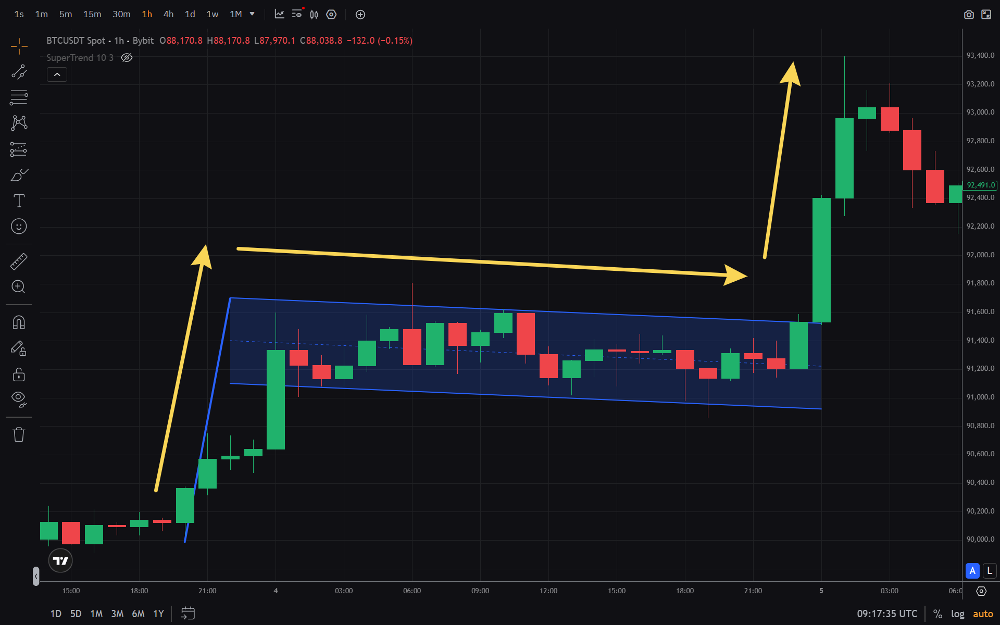

Паттерны флаг и вымпел — это графические фигуры технического анализа, которые сигнализируют о продолжении текущего тренда после кратковременной паузы. Эти паттерны часто встречаются на графиках криптовалют и помогают трейдерам определить момент входа в позицию.

В статье разбираются виды флагов и вымпелов, правила их идентификации, как торговать по этим паттернам и какие ошибки следует избегать.

## Что такое паттерн флаг

**Паттерн флаг (Flag Pattern)** — это фигура продолжения тренда, которая формируется после сильного импульсного движения цены. Визуально флаг выглядит как небольшой прямоугольник или параллельный канал, наклоненный против направления основного тренда.

### Структура паттерна флаг

Паттерн состоит из двух частей:

1. **Древко (Flagpole)** — сильное импульсное движение цены в одном направлении
2. **Флаг (Flag)** — кратковременная консолидация в виде параллельного канала, наклоненного против тренда

### Бычий флаг

Бычий флаг формируется после восходящего движения. Древко направлено вверх, а сам флаг наклонен вниз. Несмотря на визуальное направление флага вниз, паттерн сигнализирует о продолжении роста после пробоя верхней границы.

### Медвежий флаг

Медвежий флаг формируется после нисходящего движения. Древко направлено вниз, а сам флаг наклонен вверх. Паттерн сигнализирует о продолжении падения после пробоя нижней границы.

## Что такое паттерн вымпел

**Паттерн вымпел (Pennant Pattern)** — это разновидность флага, которая отличается формой консолидации. Вместо параллельного канала вымпел формируется в виде сходящегося треугольника.

Практический смысл вымпела — показать “паузу” после импульса, когда диапазон сужается, а участники рынка временно балансируют спрос и предложение. В классическом сценарии пробой происходит в сторону основного импульса, а повышение объёма на пробое усиливает сигнал.

### Отличия вымпела от флага

- **Флаг:** параллельные линии поддержки и сопротивления
- **Вымпел:** сходящиеся линии, образующие треугольник

Оба паттерна имеют одинаковую логику и сигнализируют о продолжении тренда.

## Как идентифицировать паттерны флаг и вымпел

### Критерии идентификации

1. **Сильное импульсное движение** — древко должно быть выраженным и направленным
2. **Консолидация** — флаг или вымпел формируется в течение 1-4 недель (на дневных графиках)
3. **Объемы** — при формировании паттерна объемы снижаются, при пробое — увеличиваются
4. **Пробой** — цена должна пробить границу паттерна в направлении тренда

### На каких таймфреймах работают

Паттерны флаг и вымпел работают на всех таймфреймах, но наиболее надежными считаются сигналы на:
- **H4 (4 часа)** и выше
- **D1 (дневной)** — самые сильные сигналы
- **W1 (недельный)** — для долгосрочных позиций

На меньших таймфреймах (M1-M15) паттерны встречаются чаще, но дают больше ложных сигналов.

## Как торговать по паттернам флаг и вымпел

### Правила входа

1. **Дождаться пробоя** — цена должна закрыться за границей паттерна
2. **Подтверждение объемом** — при пробое объем должен увеличиться
3. **Вход после пробоя** — открывать позицию после закрытия свечи за границей

### Установка стоп-лосса

Стоп-лосс устанавливается:
- **Для бычьего флага:** ниже нижней границы паттерна
- **Для медвежьего флага:** выше верхней границы паттерна

### Расчет тейк-профита

Классический метод расчета тейк-профита:
- **Высота древка** = расстояние от начала до конца импульсного движения
- **Тейк-профит** = высота древка от точки пробоя

Например, если древко было 100 пунктов, то тейк-профит устанавливается на 100 пунктов от точки пробоя.

## Комбинация с индикаторами

Паттерны флаг и вымпел работают лучше в комбинации с другими инструментами технического анализа:

- **[RSI](/ru/library/technical-analysis-rsi)** — для подтверждения зон перекупленности/перепроданности
- **[MFI](/ru/library/money-flow-index)** — для анализа объемов и подтверждения пробоя
- **[Свечные паттерны](/ru/library/what-are-doji-candles)** — для дополнительного подтверждения сигнала

## Типичные ошибки

### 1. Вход до пробоя

Не следует открывать позицию до того, как цена пробила границу паттерна. Ранний вход может привести к убыткам, если пробой окажется ложным.

### 2. Игнорирование объемов

Пробой без увеличения объемов часто оказывается ложным. Обязательно проверяйте объемы при пробое.

### 3. Торговля против тренда

Флаг и вымпел — это паттерны продолжения, а не разворота. Не следует торговать против основного тренда.

### 4. Использование на малых таймфреймах

На таймфреймах M1-M15 паттерны дают много ложных сигналов. Лучше использовать на H4 и выше.

## Использование в алгоритмической торговле

Паттерны флаг и вымпел можно использовать в торговых ботах. Бот может автоматически:
- Идентифицировать паттерн на графике
- Ждать пробоя границы
- Открывать позицию при подтверждении объемом
- Устанавливать стоп-лосс и тейк-профит

Перед использованием в реальной торговле рекомендуется протестировать стратегию на исторических данных через [бэктестинг](/ru/library/what-are-backtests).

## FAQ

**Чем отличается флаг от вымпела?**

Флаг формируется параллельными линиями, вымпел — сходящимися (треугольник). Логика работы одинаковая.

**Всегда ли флаг означает продолжение тренда?**

Нет, возможны ложные пробои. Важно дождаться подтверждения объемом и закрытия свечи за границей паттерна.

**На каком таймфрейме лучше торговать флаги?**

Наиболее надежные сигналы на H4 и D1. На меньших таймфреймах больше ложных сигналов.

**Можно ли использовать флаги для скальпинга?**

Технически можно, но на малых таймфреймах паттерны менее надежны. Рекомендуется использовать на H4 и выше.

**Как отличить истинный пробой от ложного?**

Истинный пробой сопровождается увеличением объемов и закрытием свечи за границей паттерна. Ложный пробой часто откатывается обратно в паттерн.

**Итог:** Паттерны флаг и вымпел — эффективные инструменты для определения точек входа в продолжение тренда. Важно дождаться пробоя, подтверждения объемом и использовать стоп-лоссы. Для повышения надежности рекомендуется комбинировать паттерны с индикаторами и тестировать стратегии через [бэктестинг](/ru/library/what-are-backtests).
