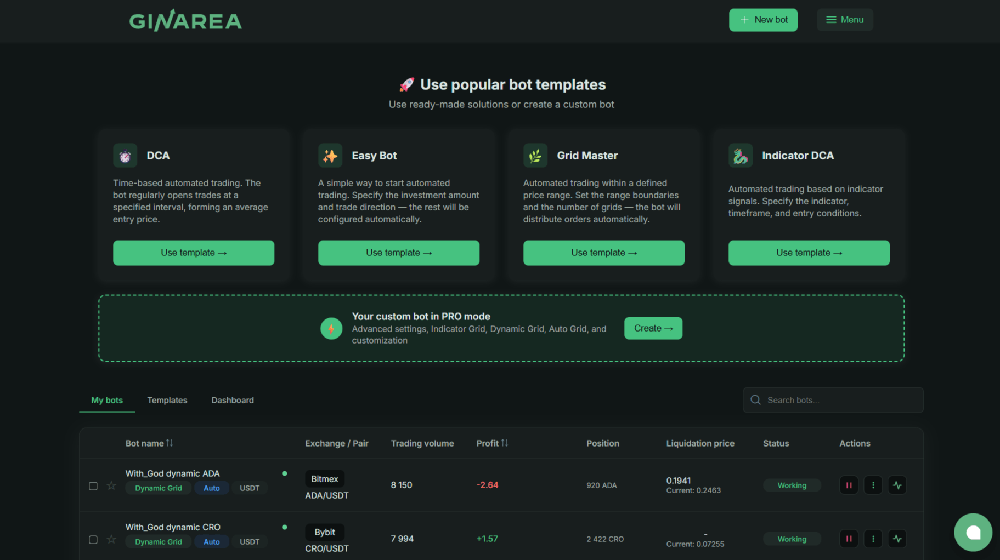

**Ginarea** — платформа для создания торговых ботов с помощью визуального конструктора. Позволяет автоматизировать торговлю без программирования, используя готовые типы ботов и индикаторы.

**Для кого:** Трейдеры, которые хотят автоматизировать торговлю, но не умеют программировать.

---

## Что такое Ginarea

**Ginarea (Grow Investments Area)** — это платформа бесплатных ботов для автоматизированной торговли на централизованных биржах. В отличие от готовых ботов (как Veles), здесь вы выбираете тип бота и настраиваете параметры под свою стратегию.

**Основная идея:** Предоставить простые и эффективные инструменты для автоматизации без сложного программирования.

### Ключевые возможности

1. **Визуальный конструктор** — настройка ботов через понятный интерфейс
2. **Типы ботов** — Default, Auto Grid, Dynamic, Indicator Grid, DCA
3. **Аналитика** — статистика торговли, анализ результатов
4. **Мультибиржа** — OKX, Bybit, BitMEX
5. **Автосетка (Auto Grid)** — автоматическая перестройка сетки при движении цены
6. **Бесплатно** — платформа с бесплатным тарифом (партнёрская программа для развития)

### Поддерживаемые биржи

| Биржа | Тип | Статус |
|-------|-----|--------|
| **OKX** | Крипто (спот + фьючерсы) | ✅ Полная поддержка |
| **Bybit** | Крипто (спот + фьючерсы) | ✅ Полная поддержка |
| **BitMEX** | Крипто (фьючерсы) | ✅ Полная поддержка |

**Важно:** Ginarea специализируется на фьючерсах (крипто), спот торговля ограничена. Требуется единый торговый аккаунт (Bybit) или торговый счет (OKX).

### Минимальные требования

- **Спот:** От 200 USDT для запуска бота
- **Фьючерсы:** От 200 USDT на едином торговом аккаунте
- **Инверсные контракты:** От 200 USDT

---

## Как работает Ginarea

### Процесс работы

1. **Регистрация:** Создаёте аккаунт на Ginarea
2. **Подключение биржи:** Добавляете API-ключи (только торговля, без вывода!)
3. **Выбор типа бота:** Default, Auto Grid, Dynamic, Indicator Grid, DCA
4. **Настройка:** Заполняете параметры бота (биржа, пара, настройки)
5. **Запуск:** Бот начинает торговать 24/7
6. **Мониторинг:** Следите через веб-интерфейс

### Визуальный конструктор

**Ginarea использует визуальный интерфейс для настройки ботов:**

1. **Выбор типа бота:** Default, Auto Grid, Dynamic, Indicator Grid, DCA
2. **Заполнение полей:** Биржа, стратегия, торговая пара, тип, направление, имя бота
3. **Настройка индикаторов:** EMA, RSI, MA, SMMA, ATR, ATR%, Supertrend
4. **Управление рисками:** Стоп-лосс, тейк-профит, размер позиции

**Пример настройки Indicator Grid:**
- Выбираете индикаторы (например, RSI + EMA)
- Настраиваете параметры (период RSI, период EMA)
- Указываете условия входа (RSI < 30 + цена > EMA)
- Задаёте управление рисками

### Типы ботов Ginarea

**Ginarea поддерживает несколько типов ботов:**

#### 1. Default (стандартная)

**Принцип:** Однонаправленная стратегия (только лонг или только шорт).

**Настройки:**
- Направление: Long или Short
- Индикаторы для входа
- Стоп-лосс / тейк-профит

**Для кого:** Начинающие, простая торговля по тренду.

#### 2. Auto Grid (автосетка)

**Принцип:** Открывает лонг и шорт позиции одновременно в заданном диапазоне.

**Настройки:**
- Диапазон цены (мин/макс)
- Количество сеток
- Размер позиции на сетку

**Особенность:** Доступно только для USDT Futures.

**Для кого:** Боковой рынок (флэт), высокая волатильность.

#### 3. Dynamic (динамическая)

**Принцип:** Использует плавающие границы, которые подстраиваются за ценой.

**Настройки:**
- Базовый диапазон
- Коэффициент подстройки
- Направление: Long, Short, Auto

**Для кого:** Трендовый рынок с коррекциями.

#### 4. Indicator Grid (индикаторная сетка)

**Принцип:** Сетка ордеров с фильтрами на основе индикаторов.

**Индикаторы:**
- EMA (Exponential Moving Average)
- RSI (Relative Strength Index)
- MA (Moving Average)
- SMMA (Smoothed Moving Average)
- ATR (Average True Range)
- ATR% (ATR в процентах)
- Supertrend

**Для кого:** Опытные трейдеры, которые хотят комбинировать сетку с индикаторами.

#### 5. DCA

**Принцип:** Усреднение позиции при движении цены против.

**Настройки:**
- Базовая сумма покупки
- Шаг усреднения (% или фиксированный)
- Множитель (увеличение покупки)
- Take-profit

**Для кого:** Долгосрочные инвестиции, накопление позиции.

---

## Стоимость

**Ginarea полностью бесплатна.** Платформа зарабатывает на возврате части комиссий от бирж — это стандартная практика (IB rebate).

**Расходы:**
1. **Комиссии биржи:** 0.02-0.1% за сделку (зависит от биржи и объёма)
2. **Проскальзывание:** Разница между ожидаемой и реальной ценой исполнения

---

## Безопасность

### API-ключи

**Ginarea запрашивает только:**
- ✅ Торговля (фьючерсы)
- ✅ Чтение баланса

**Ginarea НЕ запрашивает:**
- ❌ Вывод средств
- ❌ Доступ к email
- ❌ Изменение пароля

**Рекомендация:** Всегда создавайте API-ключи с ограниченным доступом.

### Двухфакторная аутентификация (2FA)

**Поддержка:** Google Authenticator  
**Рекомендация:** Включить обязательно!

### История и аудит

**Ginarea предоставляет:**
- Полную историю ордеров
- Логи изменений стратегий
- Экспорт в CSV для учёта

---

## Плюсы и минусы Ginarea

### Плюсы

| Преимущество | Описание |
|--------------|----------|
| **Визуальный конструктор** | Создание стратегий без кода, наглядно |
| **Гибкость** | Можно реализовать сложные идеи (условия, фильтры) |
| **Аналитика** | Статистика торговли, анализ результатов |
| **Мультибиржа** | OKX, Bybit, BitMEX в одной платформе |
| **Сообщество** | Публикация стратегий, обучение |

### Минусы

| Недостаток | Описание |
|------------|----------|
| **Сложность** | Новичкам нужно время на освоение конструктора |
| **Ограниченные индикаторы** | Нет кастомных индикаторов (только встроенные) |
| **Нет мобильного приложения** | Только веб-интерфейс |
| **Нет бэктестов** | Нельзя протестировать стратегию на исторических данных |
| **Нет paper trading** | Нет возможности тестирования на демо-счёте |

---

## Для кого Ginarea

### ✅ Подходит, если:

- Хотите создавать собственные стратегии (не готовые боты)
- Умеете читать графики, понимать индикаторы
- Депозит: $500-5,000
- Торгуете на фьючерсах (крипто или форекс)
- Готовы учиться (конструктор требует времени на освоение)

### ❌ Не подходит, если:

- Нужны готовые решения (лучше Veles, Gainium)
- Не понимаете технические индикаторы
- Депозит < $200 (комиссии съедят прибыль)
- Хотите торговать на споте (крипто без плеча)

---

## Альтернативы Ginarea

| Платформа | Плюсы | Минусы | Для кого |
|-----------|-------|--------|----------|
| **Veles** | Готовые боты, проще | Нет конструктора, меньше гибкости | Новички |
| **Gainium** | Бесплатно до 2 ботов | Простые стратегии, нет бэктестов | Тест |
| **3Commas** | Много функций, мобильное приложение | Дорого, сложные бэктесты | Опытные |
| **TradingView + Pine Script** | Мощный язык, бэктесты | Нужен код (Pine Script) | Разработчики |
| **Python + Backtrader** | Полная свобода | Нужен код, настройка | Программисты |

---

## FAQ

**Сложно ли освоить Ginarea?**

Базовые стратегии — 1-2 часа (интуитивно понятно).  
Сложные стратегии — 1-2 недели (нужно понимать индикаторы и логику).

**Можно ли использовать готовые стратегии?**

Да, в маркетплейсе Ginarea есть сотни готовых стратегий (платно и бесплатно).

**Безопасно ли доверять API-ключи Ginarea?**

Да, если выдать ключи только на торговлю (без вывода). Ginarea не может вывести средства.

**Сколько нужно денег для старта?**

Минимум: $200-500 (для фьючерсов с плечом 3-5x).  
Оптимально: $1,000-3,000 для комфортной торговли.

**Работает ли Ginarea в России?**

Да, Ginarea доступен в РФ. Биржи (Bybit, Binance) работают с ограничениями.

**Нужно ли платить налоги?**

Да, прибыль от торговли облагается налогом (13% для резидентов РФ). Ginarea предоставляет экспорт для учёта.

---

## Попробовать Ginarea

**[Зарегистрироваться на Ginarea](https://ginarea.com)** и начать автоматизировать торговлю.

*Платформа полностью бесплатная — сервис зарабатывает на возврате части комиссий от бирж.*
