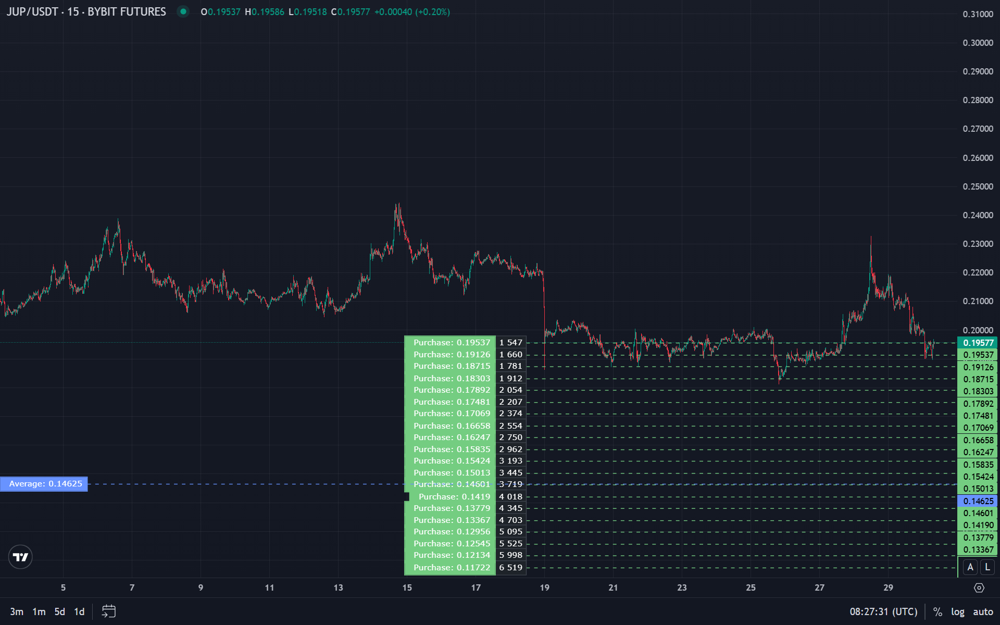

Сеточная торговля (grid trading) — это стратегия, при которой ордера на покупку и продажу выставляются сеткой в заданном ценовом диапазоне. Бот покупает у нижних уровней и продаёт у верхних, зарабатывая на колебаниях цены внутри диапазона.

В статье — как устроена grid-стратегия, когда она работает лучше всего, риски и связь с боковым трендом и другими материалами блога.

## Что такое grid-торговля (сетка)

**Grid-торговля (сеточная торговля)** — это подход, при котором в выбранном ценовом диапазоне размещают ряд ордеров на покупку и продажу с равным шагом. Нижние уровни — ордера на покупку, верхние — на продажу. Цена, двигаясь вверх и вниз внутри диапазона, поочерёдно исполняет покупки и продажи; прибыль фиксируется на разнице между ценой покупки и ценой продажи на каждом «ярусе» сетки.

### Основные параметры сетки

- **Диапазон цен** — нижняя и верхняя граница, между которыми строится сетка. Обычно задаётся вручную по уровням поддержки и сопротивления или по процентам от текущей цены.
- **Шаг сетки (grid step)** — расстояние между соседними ордерами в процентах или в абсолютной величине. Чем меньше шаг, тем больше ордеров и потенциальных сделок, но выше комиссии и риск «забивания» одной стороны при сильном движении.
- **Количество уровней** — сколько ордеров на покупку и продажу выставляется. Зависит от шага и ширины диапазона.
- **Размер позиции на уровень** — объём или сумма на каждый ордер. Может быть одинаковым на всех уровнях или меняться (например, больше у центра диапазона).

Grid не требует прогноза направления тренда: стратегия рассчитана на то, что цена будет колебаться внутри выбранного коридора. Подробнее о торговле в диапазоне — в статье [стратегии для бокового тренда](/ru/library/sideways-trend-strategies/).

## Как работает сетка на практике

Пример: диапазон по BTC/USDT от $60 000 до $66 000, шаг 1%, по 0.001 BTC на уровень. Уровни покупки: $60 000, $60 600, $61 200, … Уровни продажи — те же, но ордера на продажу стоят выше текущей цены.

Цена падает с $63 000 до $61 200 — срабатывают два ордера на покупку, накапливается позиция. Цена разворачивается и растёт: при $61 200 и $61 800 срабатывают ордера на продажу — часть позиции закрывается с прибылью. Дальше цена снова падает — снова исполняются покупки, затем рост — продажи. Каждый цикл «покупка → продажа» на уровне даёт разницу в цене минус комиссии.

Чем чаще цена ходит внутри диапазона и не выходит за его границы надолго, тем больше таких циклов и тем эффективнее grid. Если цена уходит выше верхней границы или ниже нижней и не возвращается, сетка остаётся с накопленной позицией в одну сторону (все покупки исполнены, продажи не сработали — или наоборот), и дальнейшая судьба зависит от настроек (стоп, перенос сетки и т.п.).

Перед запуском на реальном счёте параметры сетки полезно проверять [бэктестированием](/ru/library/what-are-backtests/) на исторических данных: подбирать диапазон, шаг и размер позиции под волатильность актива и комиссии биржи.

## Когда grid эффективен

Grid даёт лучший результат в условиях **бокового тренда (флета)** — когда цена долго движется в горизонтальном диапазоне без выраженного выхода за его границы. В такой ситуации многократные отскоки от уровней сетки генерируют много сделок и потенциальную прибыль.

**Условия, благоприятные для grid:**

- Чётко выраженный диапазон с видимой поддержкой и сопротивлением.
- Достаточная волатильность внутри диапазона — цена регулярно доходит до уровней сетки, а не «залипает» в узкой полосе.
- Относительная стабильность границ — диапазон не смещается резко и не пробивается часто.

В сильном тренде в одну сторону grid рискован: цена уходит из диапазона, все ордера одной стороны исполняются, вторая сторона не участвует — получается большая односторонняя позиция без хеджирования сеткой. Поэтому grid относят к стратегиям для бокового тренда и диапазонного рынка, а не для трендовой торговли.

## Риски grid-стратегии

**Выход цены из диапазона** — самая серьёзная угроза. Если цена надолго уходит выше верхней границы или ниже нижней, сетка накапливает позицию в одну сторону (только покупки или только продажи исполнены). Доходность и просадка тогда зависят уже от дальнейшего движения цены и от того, есть ли стоп-лосс или ограничение по позиции.

**Накопление позиции в одну сторону** — даже внутри диапазона при длительном движении в одном направлении одна сторона сетки может исполняться чаще. Нужен контроль суммарной позиции и риска (размер на уровень, лимиты по депозиту). Здесь пригодятся принципы [риск-менеджмента](/ru/library/risk-management-crypto-trading-bots/).

**Комиссии** — при частых срабатываниях ордеров комиссии съедают часть прибыли. На высокочастотных сетках с мелкими шагами это особенно заметно; в бэктесте обязательно учитывать комиссии и проскальзывание.

**Неверный выбор диапазона** — если границы заданы слишком узко, цена быстро выходит из сетки; если слишком широко — большая часть ордеров может не срабатывать. Подбор параметров лучше делать на истории и тестировать на демо перед живым запуском.

## Grid и другие стратегии

**Grid и DCA** — разные задачи. [DCA](/ru/library/dca-strategy-crypto/) — регулярные покупки на фиксированную сумму по времени для накопления и усреднения цены входа. Grid — заработок на колебаниях внутри ценового диапазона за счёт множества пар «покупка–продажа». DCA не предполагает обязательных продаж; grid как раз строится на циклах покупка/продажа.

**Grid и боковой тренд** — grid является одной из формализованных стратегий торговли в диапазоне. Общий контекст: как определять боковик, какие ещё есть подходы (range trading, осцилляторы) — в материале про [стратегии для бокового тренда](/ru/library/sideways-trend-strategies/).

**Grid и бэктесты** — перед запуском сетки на реальном счёте логично проверить диапазон, шаг и размер позиции на исторических данных и учесть комиссии; основы бэктестирования описаны в отдельной статье блога.

## Итог

Сеточная торговля (grid) — это размещение ордеров на покупку и продажу с заданным шагом в ценовом диапазоне. Стратегия эффективна в боковом тренде, когда цена многократно проходит уровни сетки; при сильном тренде и выходе цены из диапазона возникает риск накопления односторонней позиции. Важно учитывать комиссии, корректно задавать диапазон и размер позиции и проверять параметры бэктестом и риск-менеджментом; для сравнения подходов полезны материалы по стратегиям для бокового тренда и DCA.

## FAQ

**Что такое grid-торговля простыми словами?**

Grid — это сетка ордеров на покупку и продажу в заданном ценовом диапазоне. Цена, двигаясь вверх-вниз внутри диапазона, поочерёдно исполняет покупки и продажи; прибыль получают на разнице цен каждого цикла минус комиссии.

**Когда grid-стратегия эффективна?**

Grid лучше всего работает в боковом тренде (флете), когда цена долго колеблется внутри диапазона и не уходит далеко за его границы.

**Чем grid отличается от DCA?**

DCA — регулярные покупки на фиксированную сумму по времени (накопление, усреднение входа). Grid — множество ордеров в ценовом диапазоне для заработка на колебаниях; обязательны и покупки, и продажи. О DCA — в материале [DCA-стратегия в крипто](/ru/library/dca-strategy-crypto/).

**Какие риски у grid?**

Главный риск — выход цены из диапазона: тогда накапливается большая позиция в одну сторону. Также важны комиссии при частых сделках и правильный выбор диапазона и шага. Снижать риски помогает управление рисками и проверка параметров бэктестом.

**Нужно ли бэктестировать grid?**

Да. На истории проверяют, как часто цена остаётся в диапазоне, сколько сделок даёт сетка и как комиссии влияют на результат. Это помогает подобрать диапазон, шаг и размер позиции перед запуском на реальном счёте. Основы бэктестирования описаны в отдельной статье блога.

**Можно ли совмещать grid с другими стратегиями?**

Grid — отдельная стратегия по смыслу (торговля в диапазоне). Один и тот же счёт можно распределять между разными подходами (например, часть — grid, часть — DCA), но важно не превышать общий риск-менеджмент и учитывать, что grid требует мониторинга диапазона и позиции.
