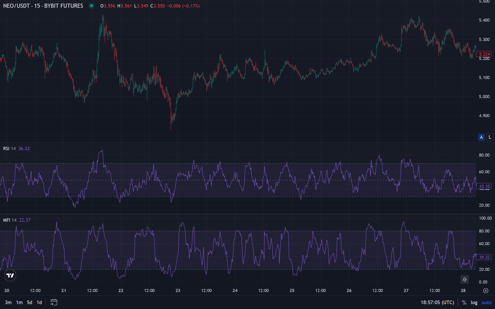

В трейдинге существует множество проверенных индикаторов. Однако лишь малая часть из них анализирует информацию, опираясь не только на цену актива, но и на другие метрики, например объемы. Индекс денежного потока является именно таким индикатором.

## Что такое индекс денежного потока (MFI)

**Индекс денежного потока (Money Flow Index, MFI)** — это технический индикатор, который показывает интенсивность, с которой деньги вкладываются в актив или выводятся из него. Он оценивает приток и отток капитала, учитывая как цену, так и объем торгов.

Этот индикатор был разработан **Дженом Вайлдером**, пионером в области технического анализа, который также создал такие популярные инструменты, как Relative Strength Index (RSI) и Average True Range (ATR). Впервые MFI был представлен в его книге «Новые концепции в технических торговых системах» ("New Concepts in Technical Trading Systems"), опубликованной в 1978 году.

**Money Flow Index** часто называют "улучшенной версией RSI", так как в отличие от RSI, который анализирует только движение цены, **индекс денежного потока MFI** включает в расчет еще и объемы торгов. MFI является инструментом измерения скорости движения цены и аналогичен RSI по интерпретации, но имеет другую формулу расчета, которая помимо прочего учитывает объем торгов. Для этого сравниваются так называемые **положительные денежные потоки** и **отрицательные денежные потоки**.

**Положительные денежные потоки** — это потоки средств покупателей, вкладываемые в торговый инструмент и заставляющие его цену расти. **Отрицательные денежные потоки**, напротив, формируются продавцами, которые создают объем предложения на рынке, и при его избытке могут способствовать падению цены.

В результате оценки этих потоков получается показатель, который при сравнении с ценой дает возможность определить силу и предположительное направление тренда. Изображается индикатор MFI в виде осциллятора, принимающего значения от 0 до 100.

Важно отметить, что MFI не просто индикатор объема — он совмещает как ценовые, так и объемные данные, чтобы предоставить более полную картину того, что происходит в активе. Благодаря этому он считается одним из **лучших индикаторов для крипты**, где активность и ликвидность имеют равное значение.

**Money Flow Index** помогает трейдерам понять, куда движется капитал: входит ли он в рынок (покупки) или выходит из него (продажи). Индикатор показывает скрытые настроения участников рынка и может сигнализировать о скорых разворотах цены.

## Как рассчитывается индекс денежного потока

Формула MFI строится на нескольких этапах:

- Сначала вычисляется типичная цена актива по формуле (High + Low + Close) / 3.
- Затем она умножается на объем торгов — получается денежный поток.
- После этого он делится на положительный (при росте цены) и отрицательный (при падении).
- На основе соотношения между ними рассчитывается итоговое значение **индикатора Money flow index**, которое всегда находится в диапазоне от 0 до 100. MFI объединяет данные цены и объема из-за чего является ценным инструментом среди других **индикаторов торговли криптой**.

## Как интерпретировать значения MFI

Когда MFI находится в нижних зонах (обычно ниже 20), это говорит о том, что капитал активно уходит с рынка, а актив находится в состоянии перепроданности. В таких ситуациях многие трейдеры начинают искать точки входа на покупку, ожидая технический отскок или начало нового восходящего импульса. Однако важно учитывать общий рыночный контекст. Например, сильный нисходящий тренд может продолжаться даже при низком MFI, поэтому подтверждение другими индикаторами в таком случае будет обязательным.

Если же MFI поднимается выше 80, то рынок входит в состояние **перекупленности**. В этом случае в актив влилось слишком много средств за короткое время, и существует риск коррекции. Часто именно в таких точках фиксируют прибыль те, кто покупал раньше. Такая ситуация приводит к замедлению роста или вовсе развороту.

Особое внимание уделяется **дивергенциям**. Например, цена обновляет новый максимум, но MFI при этом показывает более низкие значения — это сигнал ослабления тренда. Такая ситуация указывает на то, что деньги в рынок поступают с меньшей интенсивностью, и вероятность разворота возрастает. Аналогичная логика работает и в обратную сторону. Если цена обновляет минимумы, а MFI растет, то можно ожидать отскока.

Важно также учитывать **средние значения индекса денежного потока**. Диапазон между 40 и 60 обычно считается зоной равновесия, когда на рынке нет выраженного давления ни со стороны покупателей, ни со стороны продавцов. В такие периоды актив чаще всего движется в боковом тренде, и поэтому сигналы MFI будут менее значимыми.

Рынок криптовалют отличается высокой волатильностью, поэтому ложные пробои, перекупленности или перепроданности случаются довольно часто. Поэтому опытные трейдеры используют MFI не как единственный источник сигналов, а как фильтр для подтверждения силы тренда. В частности, если значение индикатора выходит из зоны перепроданности и закрепляется выше 30, то это может быть сигналом к началу восходящего движения. А если после перекупленности MFI опускается ниже 70, то это указывает, что рынок постепенно остывает. Исходя из разобранных выше ситуаций, **интерпретация индекса денежного потока MFI** сводится не только к простым уровням 20 и 80, но и к анализу динамики.

## Индикатор MFI в криптотрейдинге

Криптовалютный рынок отличается высокой волатильностью, нестабильностью ликвидности и большим влиянием крупных игроков, поэтому использование классических инструментов технического анализа здесь требует адаптации. В этом контексте **индекс денежного потока MFI** стал одним из наиболее востребованных индикаторов среди крипто-трейдеров. Его ценность здесь заключается в том, что он учитывает не только динамику цены, но и объемы торгов, а на рынке криптовалют именно объемы часто сигнализируют о скрытых движениях капитала.

Особенность MFI в крипто трейдинге состоит в том, что он позволяет выявлять фазы накопления и распределения. Например, когда цена на графике может казаться «спокойной» или двигаться в боковике, **Money Flow Index** способен показать рост, сигнализируя о том, что крупные инвесторы незаметно входят в рынок. Такая ситуация часто предшествует сильному бычьему импульсу. Обратный процесс происходит при распределении. Например, индикатор начинает снижаться, хотя цена еще остается на пиках. Такое поведение означает, что «киты» постепенно фиксируют прибыль, а розничные трейдеры продолжают покупать на максимумах.

Еще одна важная особенность применения **Money flow index** индикатора в криптовалютной торговле — это анализ зон перекупленности и перепроданности в условиях резкой волатильности. В отличие от традиционных рынков, где нахождение индекса в крайних зонах (ниже 20 или выше 80) чаще сигнализирует о скором развороте, в крипте актив может находиться там гораздо дольше. Однако именно скорость выхода из этих зон зачастую становится основным сигналом. Например, если после долгого нахождения ниже 20 MFI резко поднимается выше 30, то это может означать, что медвежья фаза завершена и рынок готов к росту.

Крипто трейдеры также используют MFI для подтверждения сигналов других индикаторов. Если RSI показывает перекупленность, а MFI нейтрален, то сигнал считается слабым. Если же оба инструмента совпадают, вероятность разворота становится значительно выше.

Еще одно важное применение индекса — работа с паттернами технического анализа. Когда на графике формируется фигура бычьего или медвежьего флага, индекс денежного потока помогает понять, подтверждается ли этот паттерн наличием ликвидности. Если при пробое флага вверх MFI также растет, то сигнал на покупку становится надежнее. Если же индикатор не поддерживает движение, то есть риск ложного пробоя.

Для долгосрочных инвесторов **значения Money Flow Index в трейдинге** также имеют свое место при анализе. На дневных и недельных графиках MFI помогает отследить глобальные циклы рынка: периоды накопления перед бычьими циклами и распределения перед медвежьими фазами. В совокупности с фундаментальными факторами и анализом настроений рынка он позволяет принимать более взвешенные инвестиционные решения.

## Как использовать MFI в торговых стратегиях

**Индекс денежного потока (MFI)** можно применять в разных сценариях, начиная от поиска моментов входа и выхода и заканчивая подтверждением силы тренда. Одним из самых распространенных способов является анализ зон перекупленности и перепроданности. Когда значение Money Flow Index опускается ниже 20, то это говорит о перепроданности актива и возможном скором росте, тогда как значения выше 80 указывают на перекупленность и риск коррекции. Однако в крипто рынке такие сигналы нужно трактовать осторожно, так как высокая волатильность способна удерживать актив в экстремальных зонах довольно долго. Именно поэтому многие трейдеры дожидаются подтверждения в виде свечных паттернов или пробоев уровней поддержки и сопротивления.

Другой способ использования индекса денежного потока связан с дивергенциями (расхождение динамики цены и тех. индикаторов). Если цена обновляет максимум, а MFI при этом показывает снижение, то это указывает на ослабление покупательской силы и вероятность разворота. Аналогичная ситуация возникает, когда цена падает, но MFI формирует растущую динамику — это уже сигнал к возможному отскоку. Такой подход наиболее полезен в крипто трейдинге, где на рынке присутствуют крупные игроки, и их активность можно заметить именно через анализ соотношения цены и объема.

Важным элементом применения индекса денежного потока становится фильтрация сигналов RSI. Поскольку MFI учитывает объемы, его сигналы часто считаются более качественными. Например, если RSI показывает перекупленность, но MFI остается в нейтральной зоне, то многие трейдеры игнорируют этот сигнал, понимая, что реального притока капитала в рынок нет. При этом нельзя сказать однозначно, что MFI лучше RSI, но именно за счет учета объема он считается более информативным и нередко выступает надежным фильтром.

Также MFI используется для оценки силы трендовых движений. Когда цена пробивает важный уровень сопротивления и индикатор показывает рост, то это подтверждает истинность пробоя и активность покупателей. Если же пробой не сопровождается повышением MFI, велика вероятность ложного сигнала. Более того, анализ динамики индекса денежного потока позволяет выявлять фазы накопления и распределения. Если индикатор стабильно растет из зоны низких значений, то это может означать, что крупные инвесторы постепенно скупают актив, готовя почву для сильного движения.

Наконец, важно учитывать работу MFI на разных таймфреймах. В краткосрочном трейдинге он помогает находить быстрые точки входа и выхода даже во время волативных движений. На дневных и недельных графиках индикатор позволяет определить глобальные зоны перекупленности и перепроданности. Подобные зоны ценны для инвесторов, которые ориентируются на долгосрок и смотрят на рыночную картину более глобально.

**Комфортный для торговли таймфрейм подбирается индивидуально**, но в основном MFI используется на графиках от часовых и выше. При работе с MFI можно использовать те же классические сигналы, которые характерны для большинства осцилляторов: уровни перекупленности/перепроданности для алгоритмической торговли, дивергенция и переход через медианную линию, отслеживание формирования графических фигур на индикаторе — для ручной торговли.

Если подытожить, то **Money Flow Index** универсален и может применяться как для скальпинга, так и для позиционных стратегий.

## Преимущества и недостатки индекса денежного потока

**Преимущества:**

- Учет объемов в расчетах
- Высокая точность сигналов
- Универсальность на разных таймфреймах

**Недостатки:**

- Возможные ложные сигналы при низкой ликвидности
- Необходимость комбинировать с другими индикаторами

## FAQ

**Какое значение MFI является хорошим?**

Оптимальным значением считается диапазон 40–60, когда рынок находится в равновесии.

**MFI лучше RSI?**

Не всегда лучше, но информативнее. RSI анализирует только цену, а MFI добавляет объемы, что делает его более точным.

**В чем разница между высоким и низким MFI?**

Высокий MFI (выше 80) говорит о сильном притоке капитала и вероятной перекупленности, низкий (ниже 20) — об оттоке средств и перепроданности.

**Можно ли использовать Money Flow Index отдельно?**

Технически да, но на практике он надежнее в связке с другими индикаторами торговли криптой.

**Подходит ли MFI для долгосрочных стратегий?**

Да, но в долгосроке он менее чувствителен. Чаще всего Money Flow Index применяется в краткосрочном и среднесрочном трейдинге.

**Где узнать больше о MFI?**

Более подробную информацию о построении индикатора, формулах его расчёта, разновидностях и модификациях MFI, а также сравнении с другими индикаторами объемов можно найти в специализированных источниках по техническому анализу. 