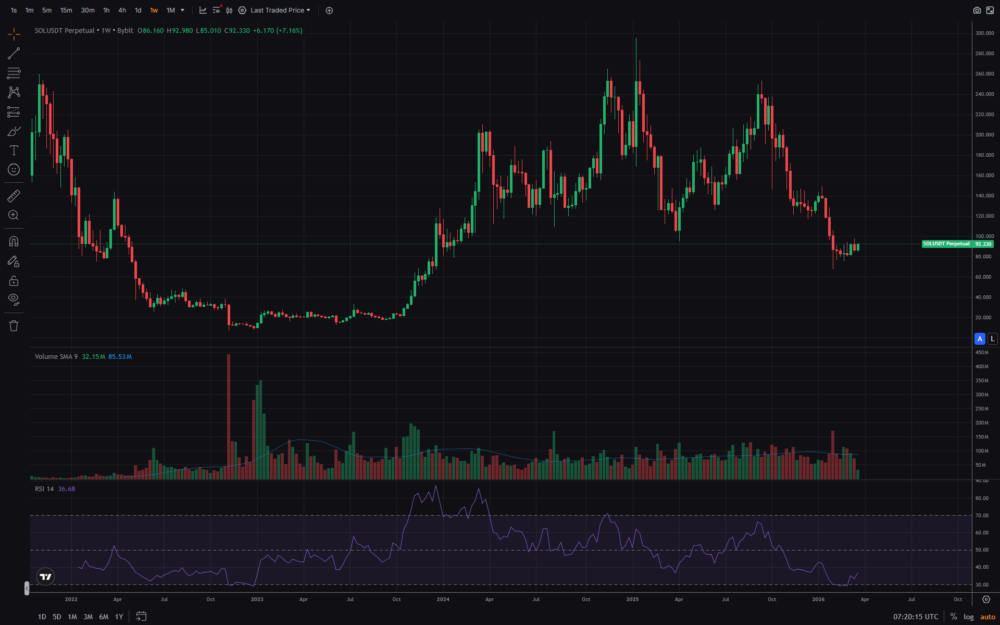
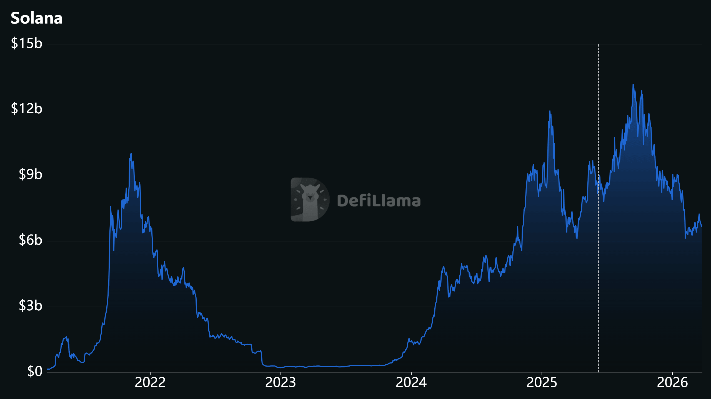
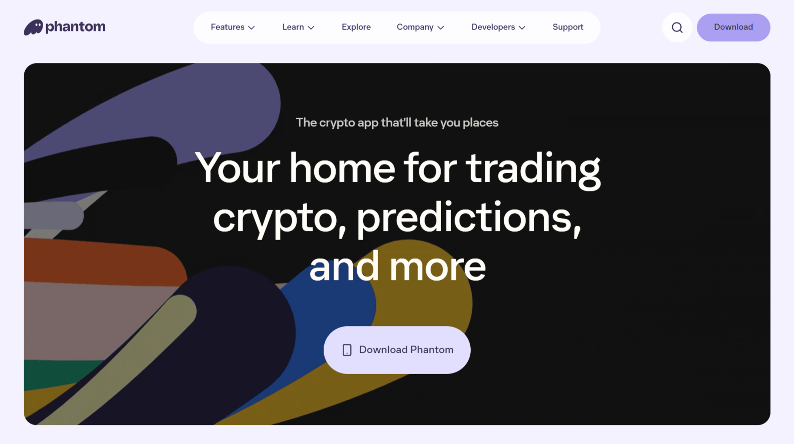

**Solana** — высокопроизводительный блокчейн для децентрализованных приложений (dApps) с пропускной способностью до 65,000 транзакций в секунду и комиссиями ~$0.00025. В отличие от Ethereum, Solana использует уникальный механизм консенсуса Proof-of-History (PoH) для достижения высокой скорости.

**Почему это важно:**

Solana решает проблему масштабируемости без Layer 2: один блокчейн, высокая скорость, низкие комиссии. Это привлекает разработчиков DeFi, NFT, игр и социальных приложений.

## Что такое Solana простыми словами

**Solana** — блокчейн пятого поколения, созданный для массового принятия криптовалют.

**Пример из жизни:**

- **Bitcoin:** 7 TPS (как пешеход)
- **Ethereum:** 15 TPS (как велосипед)
- **Solana:** 65,000 TPS (как скоростной поезд)

**Ключевое отличие:**

Solana использует Proof-of-History (PoH) + Proof-of-Stake (PoS). PoH создаёт «временные метки» для транзакций, что позволяет обрабатывать тысячи операций параллельно.

## История Solana: от идеи до восстановления

### 2017-2020: Создание

**2017:** Анатолий Яковенко (инженер из России, работал в Qualcomm, Dropbox) публикует Whitepaper Solana.

**Идея:** Блокчейны медленные из-за синхронизации времени. Нужен механизм «встроенных часов».

**2018:** Основана Solana Labs.

**2020:** Запуск основной сети (март 2020).

- Первая транзакция
- Начальная цена SOL: ~$0.22

### 2021: Бум и ATH

**2021:** Год роста Solana.

- Цена SOL: $1.50 (январь) → $260 (ноябрь)
- Запущены: Serum (DEX), Magic Eden (NFT), Marinade (стейкинг)
- TVL: $0 → $10 млрд

**Проблемы:**
- Перегрев сети (высокий спрос)
- Первые остановки (ноябрь 2021)

### 2022: FTX и крах

**Ноябрь 2022:** Крах FTX/Alameda.

**Почему это ударило по Solana:**
- SBF (Сэм Бэнкман-Фрид) был крупным инвестором Solana
- FTX/Alameda держали ~$3-5 млрд в SOL
- Паника на рынке, массовая продажа

**Результат:**
- Цена SOL: $140 → $8 (минус 94%)
- TVL: $10 млрд → $200 млн
- Восстановление заняло 12+ месяцев

### 2023-2024: Восстановление

**2023:** Постепенное восстановление.

- Цена SOL: $8 → $120
- Запущены новые проекты: Jupiter (агрегатор), Tensor (NFT)
- Разработчики вернулись (низкие комиссии, высокая скорость)

**2024:** Новый рост.

- Цена SOL: $120 → $200+
- Запущены: Solana Pay (платежи), Saga (смартфон)
- Институциональный интерес (Visa принимает USDC на Solana)

---

## Как работает Solana

### Proof-of-History (PoH)

**PoH** — механизм синхронизации времени в блокчейне.

**Проблема обычных блокчейнов:**

В Bitcoin/Ethereum валидаторы должны «договориться» о времени транзакции. Это медленно (10 минут в BTC, 12 секунд в ETH).

**Решение Solana:**

PoH создаёт криптографические «часы», которые автоматически метят каждую транзакцию временем. Валидаторам не нужно договариваться — время уже встроено в данные.

**Аналогия:**

- **Bitcoin/Ethereum:** Каждый участник сверяет часы с другими (медленно)
- **Solana:** У всех есть доступ к атомным часам (быстро)

### Proof-of-Stake (PoS)

**PoS** — механизм консенсуса, где валидаторы блокируют SOL для участия в сети.

**Как работает:**
1. Валидатор блокирует SOL (залог)
2. Валидатор проверяет транзакции и создаёт блоки
3. Валидатор получает награду (~7% годовых)
4. При нарушении (простой, злонамеренность) — штраф (слэшинг)

**Требования:**
- Минимум SOL для своей ноды: не требуется (но нужно набрать голоса)
- Делегирование: от 0.01 SOL через пулы

### Параллельная обработка (Sealevel)

**Sealevel** — технология параллельного выполнения смарт-контрактов.

**Проблема Ethereum:**

Контракты выполняются последовательно (один за другим). Если один контракт медленный, все ждут.

**Решение Solana:**

Контракты, которые не конфликтуют, выполняются параллельно. Это увеличивает пропускную способность в сотни раз.

**Результат:**
- Теоретический лимит: 65,000 TPS
- Реальный: 2,000-4,000 TPS (всё равно в 100-200 раз быстрее Ethereum)

---

## SOL — токен Solana

### Токеномика SOL

**Тип токена:** Utility + Governance

**Функции SOL:**
1. **Оплата комиссий** — все транзакции оплачиваются в SOL
2. **Стейкинг** — залог для валидаторов
3. **Голосование** — участие в управлении (SOL = голоса)
4. **Залог в DeFi** — обеспечение для кредитов, ликвидность

**Эмиссия:**
- Начальная эмиссия: ~489 млн SOL (2020)
- Инфляция: 8% (первый год), -15% ежегодно, пока не достигнет 1.5%
- Текущая инфляция: ~5% годовых
- Сжигание: 50% комиссий сжигается

**Распределение (на запуске):**
- 16% — Seed sale (ранние инвесторы)
- 13% — Founding sale (основатели)
- 38% — Валидаторы (награды)
- 13% — Команда
- 10% — Foundation
- 10% — Community & Ecosystem

**В обращении:**
- ~430 млн SOL (март 2026)
- ~260-280 млн SOL застейкано (~60-65% от circulating supply)

### Сравнение: SOL vs ETH

| Параметр | Ethereum (ETH) | Solana (SOL) |
|----------|----------------|--------------|
| **TPS** | ~15 | ~2,000-4,000 (реально), до 65,000 (теоретически) |
| **Комиссии** | $1-50 | $0.00025 |
| **Время блока** | 12 секунд | 400 миллисекунд |
| **Консенсус** | PoS | PoH + PoS |
| **Стейкинг** | 3-5% годовых | 6-8% годовых |
| **Инфляция** | ~0.5% (дефляция возможна) | ~5% (снижается до 1.5%) |
| **Сжигание** | 100% базовой комиссии | 50% комиссий |

---

## Стейкинг Solana

### Что такое стейкинг

**Стейкинг** — делегирование SOL валидатору для поддержки сети и получение вознаграждения.

**Как работает:**
1. Выбираете валидатора (или пул)
2. Делегируете SOL (любое количество)
3. Получаете награду (~7% годовых)
4. Вывод: 2-4 дня (эпоха)

### Способы стейкинга

| Способ | Мин. сумма | Гибкость | Риск | Доходность |
|--------|------------|----------|------|------------|
| **Своя нода** | Не требуется (но нужны голоса) | 2-4 дня | Низкий | 7-8% |
| **Пулы (Marinade, Jito)** | 0.01 SOL | Гибко (mSOL, jitoSOL) | Средний | 6-7% |
| **Биржи (Bybit, Binance)** | 0.0001 SOL | Зависит от биржи | Средний | 5-7% |

**Популярные решения:**
- **Marinade Finance (mSOL):** Крупнейший пул, ликвидный токен
- **Jito (jitoSOL):** MEV-вознаграждения дополнительно
- **Bybit/Binance:** Просто, но кастодиальный риск

### MEV в Solana

**MEV (Maximal Extractable Value)** — дополнительная прибыль валидаторов от оптимизации порядка транзакций.

**Jito** — первый протокол, который делится MEV с стейкерами.

**Доходность:**
- Базовая: ~6-7%
- С MEV: ~7-9%

---

## Экосистема Solana

### DeFi (децентрализованные финансы)

**DeFi в Solana** — быстро, дёшево, удобно.

**Категории:**
- **DEX (децентрализованные биржи):** Jupiter (агрегатор), Raydium, Orca
- **Кредитование:** Solend, MarginFi, Kamino
- **Стейкинг:** Marinade, Jito, Lido (закрыт)
- **Перпетуальные фьючерсы:** Drift, Zeta, Jupiter Perps

### Сравнение DEX на Solana

| DEX | Тип | Объём (24ч) | Комиссии | Особенности |
|-----|-----|-------------|----------|-------------|
| **Jupiter** | Агрегатор | $1-3 млрд | 0% | Лучший маршрут, лимитные ордера |
| **Raydium** | AMM | $200-500 млн | 0.25% | Предоставление ликвидности |
| **Orca** | AMM | $100-300 млн | 0.30% | Концентрированная ликвидность |
| **Drift** | Перпетуалы | $50-100 млн | 0.05-0.10% | Фьючерсы с плечом |

**TVL (Total Value Locked):** $5-10 млрд (колеблется)

**Преимущества:**
- Комиссии: $0.00025 за своп
- Скорость: ~400 мс на транзакцию
- UX: как веб-приложение (не нужно ждать подтверждения)

### NFT (невзаимозаменяемые токены)

**NFT в Solana** — альтернатива Ethereum с низкими комиссиями.

**Популярные стандарты:**
- **Metaplex:** Основной стандарт для NFT
- **Token Extensions:** Расширенные функции (роялти, замораживание)

**Маркетплейсы:**
- **Magic Eden:** Крупнейший (мультичейн)
- **Tensor:** Трейдинг NFT (как биржа)
- **Hyperspace:** Агрегатор

**Известные коллекции:**
- Mad Lads, Okay Bears, DeGods (перешли на Ethereum), Solana Monkey Business

### Игры и социальные приложения

**Игры:**
- Star Atlas (космическая стратегия)
- Aurory (RPG)
- Genopets (move-to-earn)

**Социальные:**
- Dialect (мессенджер)
- Farcaster (децентрализованная соцсеть, мост с Solana)

### Платежи

**Solana Pay** — протокол для платежей в SOL и стейблкоинах.

**Партнёры:**
- Visa (принимает USDC на Solana)
- Shopify (интеграция для магазинов)
- Helium (телеком на Solana)

---

## Риски Solana

### 1. История остановок

**Проблема:** Solana неоднократно останавливалась (2021-2023).

**Причины:**
- Перегрузка сети (спам-транзакции)
- Баги в клиенте валидатора
- Атаки на сеть

**Последние остановки:**
- Сентябрь 2021: 17 часов
- Сентябрь 2022: 7 часов
- Февраль 2023: 18 часов
- Декабрь 2023: 5 часов

**Решение:**
- Улучшение клиента валидатора
- Rate limiting (ограничение спама)
- Быстрое развёртывание патчей

**Статус:** С января 2024 остановок не было.

### 2. Конкуренция

**Проблема:** Ethereum Layer 2, Aptos, Sui предлагают похожие преимущества.

**Ответ Solana:**
- Firedancer (новый клиент валидатора от Jump Crypto)
- Увеличение пропускной способности до 1 млн TPS
- Партнёрства (Visa, Shopify, Google Cloud)

### 3. Регуляторные риски

**Проблема:** SEC может классифицировать SOL как ценную бумагу.

**Статус:**
- В иске SEC против Binance/Coinbase SOL упомянут как ценная бумага
- Solana Foundation отрицает, утверждает, что SOL — утилита
- Вопрос остаётся открытым

### 4. Зависимость от ключевых игроков

**Проблема:** Solana Labs, Alameda Research были крупными держателями SOL.

**После краха FTX:**
- Alameda продала/заморозила большую часть SOL
- Foundation продолжает финансировать экосистему
- Децентрализация растёт (меньше зависимости от одного игрока)

---

## Как купить и хранить SOL

### Покупка SOL

**Способы:**
1. **Криптобиржи:** Bybit, Binance, Coinbase (просто, но кастодиально)
2. **DEX:** Jupiter, Raydium (децентрализованно, но нужны SOL для газа)
3. **P2P:** LocalCryptos, Bisq (напрямую от человека)
4. **Криптобанкоматы:** BitAccess, CoinFlip (наличные → SOL)

**Рекомендация:** Для начала — биржа (Bybit, Binance). Для больших сумм — P2P или DEX.

### Хранение SOL

| Тип | Примеры | Безопасность | Удобство | Комиссии |
|-----|---------|--------------|----------|----------|
| **Аппаратный кошелёк** | Ledger, Trezor | ⭐⭐⭐⭐⭐ | ⭐⭐⭐ | $50-150 (единоразово) |
| **Программный** | Phantom, Solflare | ⭐⭐⭐⭐ | ⭐⭐⭐⭐ | Бесплатно |
| **Биржа** | Bybit, Binance | ⭐⭐ | ⭐⭐⭐⭐⭐ | Бесплатно (но комиссии на вывод) |
| **Бумажный** | Распечатка seed-фразы | ⭐⭐⭐ | ⭐ | Бесплатно |

**Рекомендация:**
- До $1,000: биржа (просто)
- $1,000-10,000: программный кошелёк (Phantom, Solflare)
- От $10,000: аппаратный кошелёк (Ledger Nano X)

### Безопасность: чек-лист

- Seed-фраза: записать на бумаге, хранить в сейфе
- 2FA: Google Authenticator (не SMS!)
- Проверка адресов: первые и последние 4 символа
- Тестовая транзакция: перед крупной суммой
- Не хранить на бирже больше 10% капитала
- Не переходить по ссылкам из писем (фишинг)
- Не давать доступ к кошельку третьим лицам
- Не подключать кошелёк к подозрительным dApps

---

## Прогнозы на 2026-2030: возможные сценарии

### Развитие экосистемы

**Ожидаемые тенденции:**
- Firedancer увеличит надёжность сети
- Платежи (Solana Pay) станут массовыми
- Институциональное принятие (Visa, Shopify)

### Влияние на цену: сценарии

**Бычий сценарий (оптимистичный):**
- TVL достигает $50-100 млрд
- Массовое принятие платежей
- Цена SOL: $500-1,000

**Медвежий сценарий (пессимистичный):**
- Новые остановки сети
- Конкуренция Ethereum L2, Aptos
- Цена SOL: $50-100

**Важно:** Это прогнозы аналитиков, не финансовые рекомендации. Прошлые результаты не гарантируют будущую доходность.

---

## Итог

**Solana** — высокопроизводительный блокчейн для dApps с низкими комиссиями и высокой скоростью. SOL используется для оплаты газа, стейкинга и управления.

**Главные правила:**
1. Использовать ликвидные токены стейкинга (mSOL, jitoSOL) для DeFi
2. Хранить SOL в надёжном кошельке (не на бирже)
3. Следить за новостями (Firedancer, регуляция)
4. Диверсифицировать риски (не всё в SOL)

**Для кого Solana:**
- Разработчики высоконагруженных dApps
- Пользователи DeFi и NFT (низкие комиссии)
- Трейдеры (высокая скорость)
- Стейкеры (6-8% годовых)

**Для кого НЕ подходит:**
- Максимальная децентрализация (BTC, ETH лучше)
- Не доверяют PoH (новый механизм)
- Хотят 100% анонимности

---

## FAQ

**Сколько SOL в обращении?**

~430 млн SOL (март 2026). Инфляция ~5% годовых, снижается до 1.5%.

**Можно ли майнить Solana?**

Нет. Solana использует Proof-of-Stake. Майнинг невозможен.

**Что такое mSOL?**

mSOL — ликвидный токен стейкинга от Marinade Finance. Вы получаете mSOL за заблокированные SOL и можете использовать его в DeFi.

**Безопасно ли стейкать SOL на бирже?**

Зависит от биржи. Bybit, Binance — надёжные, но кастодиальный риск остаётся. Для больших сумм — своя нода или децентрализованные пулы (Marinade, Jito).

**Почему Solana останавливалась?**

Перегрузка сети, баги в клиенте валидатора, атаки. С января 2024 остановок не было. Firedancer (новый клиент) должен решить проблему.

**Что такое Firedancer?**

Новый клиент валидатора от Jump Crypto. Увеличит пропускную способность до 1 млн TPS и улучшит надёжность. Запуск ожидается в 2026.

**Как купить SOL в США/Европе/РФ?**

В США/Европе: Coinbase, Binance, Kraken. В РФ: Bybit, BingX (через P2P). Хранить лучше на аппаратном кошельке (Ledger) или программном (Phantom, Solflare).
