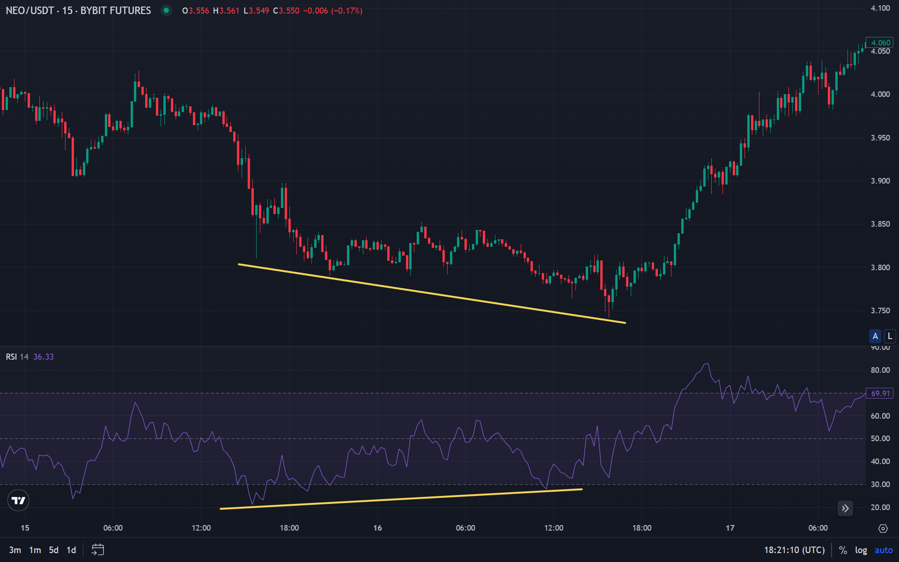
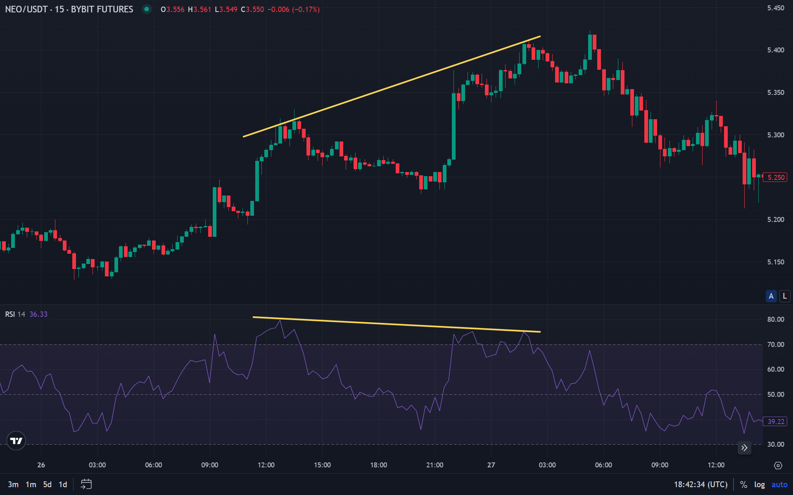
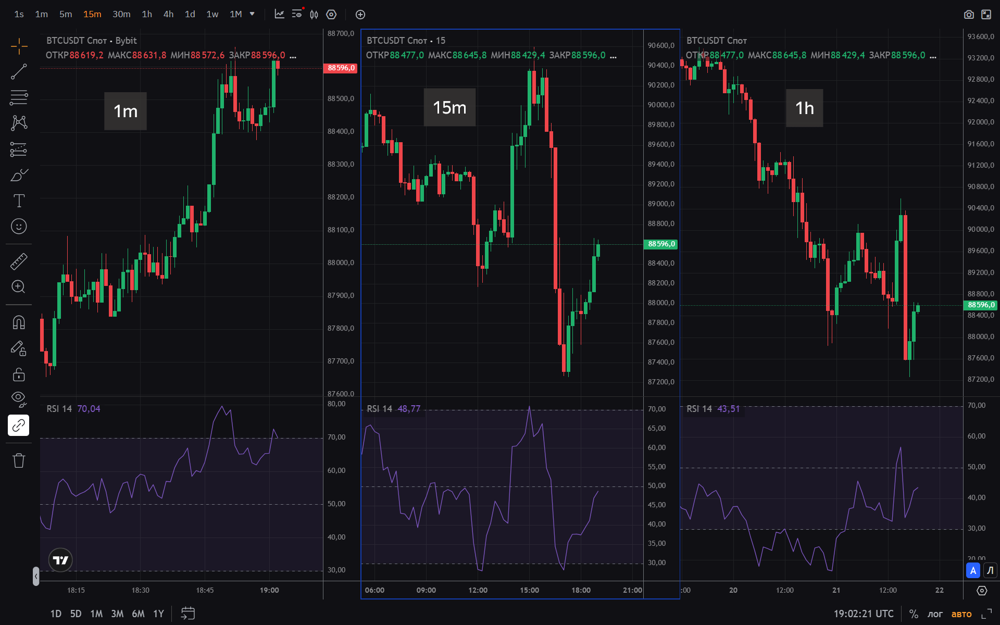

Индикатор RSI (Relative Strength Index) — это один из самых популярных осцилляторов в техническом анализе. Он измеряет скорость и изменение ценовых движений, помогая трейдерам определять моменты для входа и выхода с рынка.

Индикатор колеблется в диапазоне от 0 до 100 и традиционно используется для определения состояний перекупленности или перепроданности актива. RSI считается классическим инструментом технического анализа, который применяется на различных рынках, включая криптовалюты.

## Что такое RSI (Relative Strength Index)

**RSI (Relative Strength Index)** — это технический осциллятор, разработанный Уэллсом Уайлдером в 1978 году. Индикатор измеряет относительную силу восходящих и нисходящих движений цены за определенный период времени.

Основная идея RSI заключается в сравнении среднего роста цены со средним падением цены за выбранный период. Результат выражается в виде числа от 0 до 100, что позволяет легко интерпретировать состояние рынка.

RSI относится к категории импульсных индикаторов. Он показывает силу и скорость ценовых движений, помогая определить, когда актив может быть перекуплен или перепродан. Это делает его особенно полезным для поиска точек разворота тренда.

### История создания

Индикатор RSI был представлен Уэллсом Уайлдером в его книге "Новые концепции в технических торговых системах" ("New Concepts in Technical Trading Systems"), опубликованной в 1978 году. Уайлдер разработал несколько известных технических индикаторов, включая Average True Range (ATR) и Average Directional Index (ADX).

Изначально RSI был предназначен для анализа товарных рынков, но со временем стал применяться на всех типах финансовых рынков. Благодаря простоте интерпретации и эффективности, индикатор завоевал популярность среди трейдеров по всему миру.

Сегодня RSI входит в стандартный набор инструментов большинства торговых платформ и широко используется как новичками, так и профессиональными трейдерами.

### Ключевые характеристики

RSI обладает несколькими важными свойствами, которые делают его универсальным инструментом:

**Диапазон значений:** Индикатор всегда находится в диапазоне от 0 до 100, что упрощает интерпретацию результатов.

**Стандартные уровни:** Традиционно уровни 70 и 30 считаются зонами перекупленности и перепроданности соответственно. Однако эти значения могут варьироваться в зависимости от волатильности рынка.

**Период расчета:** По умолчанию используется период 14 свечей, но трейдеры могут изменять этот параметр для адаптации под различные таймфреймы.

**Момент индикатор:** RSI реагирует на изменение импульса цены, что позволяет выявлять потенциальные развороты раньше, чем это становится очевидным на ценовом графике.

## Как рассчитывается RSI

Расчет RSI основан на сравнении средних значений роста и падения цены за выбранный период. Формула включает несколько этапов:

**Шаг 1:** Вычисляется среднее значение роста цены (Average Gain) за период.

**Шаг 2:** Вычисляется среднее значение падения цены (Average Loss) за период.

**Шаг 3:** Рассчитывается относительная сила (RS) как отношение среднего роста к среднему падению.

**Шаг 4:** RSI вычисляется по формуле: RSI = 100 - (100 / (1 + RS)).

Стандартный период расчета составляет 14 свечей, но трейдеры могут использовать другие значения. Короткие периоды (например, 9) делают индикатор более чувствительным, а длинные (например, 21) — более сглаженным.

Важно понимать, что RSI рассчитывается только на основе цены закрытия свечей. Объемы торгов не учитываются, в отличие от [индекса денежного потока (MFI)](/ru/library/money-flow-index/), который включает объемы в свои расчеты.

## Как интерпретировать значения RSI

Интерпретация RSI основана на анализе числовых значений индикатора и их динамики. Основные зоны и сигналы:

**Зона перекупленности (70-100):** Значения выше 70 традиционно указывают на то, что актив может быть перекуплен. Это означает, что рост цены был слишком быстрым и возможна коррекция вниз.

Однако на сильных восходящих трендах RSI может оставаться выше 70 длительное время. В таких случаях пересечение уровня 70 сверху вниз может быть более надежным сигналом, чем само нахождение в зоне перекупленности.

**Зона перепроданности (0-30):** Значения ниже 30 указывают на перепроданность актива. Падение цены было слишком интенсивным, и возможен отскок вверх.

Аналогично зоне перекупленности, на сильных нисходящих трендах RSI может оставаться ниже 30 продолжительное время. Выход из зоны перепроданности (пересечение уровня 30 снизу вверх) часто служит более надежным сигналом.

**Нейтральная зона (30-70):** Значения между 30 и 70 считаются нормальными. Нахождение RSI в этой зоне не дает четких сигналов о состоянии рынка.

Центральная линия (50) играет особую роль. Пересечение RSI уровня 50 снизу вверх может указывать на усиление бычьего импульса, а сверху вниз — на усиление медвежьего импульса.

## Дивергенции RSI

Дивергенция — это один из самых сильных сигналов RSI. Она возникает, когда направление движения цены не совпадает с направлением движения индикатора.

**Бычья дивергенция:** Цена формирует новый минимум, а RSI показывает более высокий минимум. Это указывает на ослабление медвежьего импульса и возможный разворот вверх.

Бычья дивергенция считается сигналом к покупке, особенно если она формируется в зоне перепроданности. Чем больше временной интервал между минимумами цены, тем сильнее сигнал.

**Медвежья дивергенция:** Цена формирует новый максимум, а RSI показывает более низкий максимум. Это указывает на ослабление бычьего импульса и возможный разворот вниз.

Медвежья дивергенция считается сигналом к продаже, особенно если она формируется в зоне перекупленности. Как и бычья дивергенция, медвежья дивергенция становится сильнее с увеличением временного интервала между максимумами.

Дивергенции RSI особенно эффективны на криптовалютном рынке, где волатильность позволяет четко видеть такие паттерны. Однако важно подтверждать сигналы дивергенции другими индикаторами, уровнями поддержки/сопротивления или [свечными паттернами](/ru/library/what-are-doji-candles/), такими как доджи или поглощения.

## Использование RSI в криптотрейдинге

Криптовалютный рынок отличается высокой волатильностью и специфическими характеристиками, что требует адаптации классических индикаторов. RSI успешно применяется на рынке криптовалют, но с некоторыми особенностями.

**Волатильность криптовалют:** Высокая волатильность может приводить к частым ложным сигналам RSI. В криптотрейдинге нередко используется более чувствительный период (9 вместо 14) или изменяются уровни перекупленности/перепроданности (например, 80/20 вместо 70/30).

**Разные таймфреймы:** На коротких таймфреймах (минуты, часы) RSI может давать множество сигналов, но их надежность ниже. На дневных и недельных графиках сигналы RSI более значимы, но встречаются реже.

**Трендовые и боковые рынки:** В боковых трендах RSI эффективно показывает перекупленность и перепроданность. В сильных трендах индикатор может оставаться в экстремальных зонах длительное время, что требует дополнительной фильтрации сигналов.

**Подтверждение сигналов:** На криптовалютном рынке особенно важно подтверждать сигналы RSI другими индикаторами. Например, комбинация RSI с [индексом денежного потока (MFI)](/ru/library/money-flow-index/) может повысить надежность торговых сигналов, так как MFI учитывает объемы торгов.

## Как использовать RSI в торговых стратегиях

RSI может применяться в различных торговых стратегиях, от скальпинга до долгосрочных инвестиций. Перед применением стратегии с RSI рекомендуется провести [бэктестирование](/ru/library/what-are-backtests/) для оценки эффективности на исторических данных. Основные подходы:

**Стратегия отскока от уровней:** Вход в позицию при достижении RSI экстремальных зон (ниже 30 или выше 70) с ожиданием возврата к средним значениям. Стоп-лосс устанавливается за противоположным экстремумом.

Эта стратегия хорошо работает в боковых трендах, но может быть опасной в сильных трендовых движениях. Важно учитывать общее направление рынка перед использованием данной стратегии.

**Стратегия дивергенций:** Вход в позицию при формировании дивергенции между ценой и RSI. Бычья дивергенция — сигнал к покупке, медвежья — к продаже.

Стратегия дивергенций требует навыков визуального анализа графиков и подтверждения других инструментами технического анализа. Не все дивергенции приводят к развороту, поэтому важно использовать фильтры.

**Стратегия пересечения уровня 50:** Вход в позицию при пересечении RSI уровня 50 в направлении тренда. Пересечение снизу вверх на растущем рынке — сигнал к покупке, пересечение сверху вниз на падающем рынке — к продаже.

Данная стратегия особенно эффективна для подтверждения силы тренда. В сочетании с трендовыми индикаторами она может давать качественные сигналы.

**Стратегия с несколькими таймфреймами:** Использование RSI на разных таймфреймах для подтверждения сигналов. Например, если RSI на дневном графике показывает перепроданность, а на часовом — формируется бычья дивергенция, это усиливает сигнал на покупку.

Мультитаймфреймовый анализ повышает надежность торговых решений и помогает избежать ложных сигналов, характерных для коротких таймфреймов.

## Преимущества и недостатки RSI

Как и любой технический индикатор, RSI имеет свои сильные и слабые стороны.

### Преимущества

**Простота интерпретации:** Диапазон значений от 0 до 100 и четкие уровни перекупленности/перепроданности делают RSI понятным даже для начинающих трейдеров.

**Универсальность:** RSI работает на всех типах рынков и таймфреймов, от криптовалют до традиционных финансовых инструментов.

**Раннее выявление разворотов:** Дивергенции RSI часто появляются раньше, чем становится очевидным разворот на ценовом графике.

**Широкая доступность:** Индикатор присутствует во всех популярных торговых платформах и не требует дополнительных настроек.

Аналогичным индикатором является [Williams Percent Range](/ru/library/williams-percent-range-r/), который также измеряет импульс цены и может использоваться в комбинации с RSI для повышения надежности сигналов.

### Недостатки

**Ложные сигналы:** В трендовых рынках RSI может оставаться в экстремальных зонах длительное время, генерируя ложные сигналы на разворот.

**Отсутствие учета объемов:** RSI рассчитывается только на основе цены и не учитывает объемы торгов, в отличие от [индекса денежного потока (MFI)](/ru/library/money-flow-index/).

**Запаздывание:** Как и большинство осцилляторов, RSI может запаздывать с сигналами в быстро меняющихся рынках.

**Необходимость фильтрации:** Для повышения надежности требуется комбинирование RSI с другими индикаторами или методами анализа.

## FAQ

**Что такое RSI простыми словами?**

RSI — это индикатор, который показывает, насколько быстро и сильно движется цена актива. Значения выше 70 указывают на возможную перекупленность, а ниже 30 — на перепроданность.

**Какое значение RSI считается оптимальным?**

Оптимальных значений не существует. RSI интерпретируется в зависимости от рыночных условий. В боковых трендах зоны 30 и 70 могут служить точками входа, в трендовых рынках важнее динамика изменения RSI.

**RSI лучше MFI?**

Не лучше и не хуже — это разные инструменты. RSI анализирует только цену, а [MFI учитывает объемы торгов](/ru/library/money-flow-index/). Оба индикатора могут дополнять друг друга в комплексном анализе. Аналогичным осциллятором является также [Williams Percent Range](/ru/library/williams-percent-range-r/), который работает в инвертированном диапазоне.

**Как часто RSI дает ложные сигналы?**

Частота ложных сигналов зависит от рыночных условий и настроек индикатора. В боковых трендах RSI более надежен, в сильных трендах может давать множество ложных сигналов. Комбинирование с другими индикаторами снижает количество ложных срабатываний.

**На каком таймфрейме лучше использовать RSI?**

RSI работает на всех таймфреймах. Для краткосрочной торговли используют короткие периоды (9), для долгосрочной — стандартный (14) или более длинный (21). Важно учитывать, что на коротких таймфреймах сигналов больше, но их надежность ниже.

**Что такое дивергенция RSI?**

Дивергенция — это расхождение между направлением движения цены и RSI. Бычья дивергенция (цена падает, RSI растет) может указывать на разворот вверх, медвежья дивергенция (цена растет, RSI падает) — на разворот вниз.

**Можно ли использовать RSI отдельно?**

Технически да, но на практике RSI надежнее в комбинации с другими инструментами технического анализа. Подтверждение сигналов уровнями поддержки/сопротивления или другими индикаторами повышает вероятность успешных сделок.
