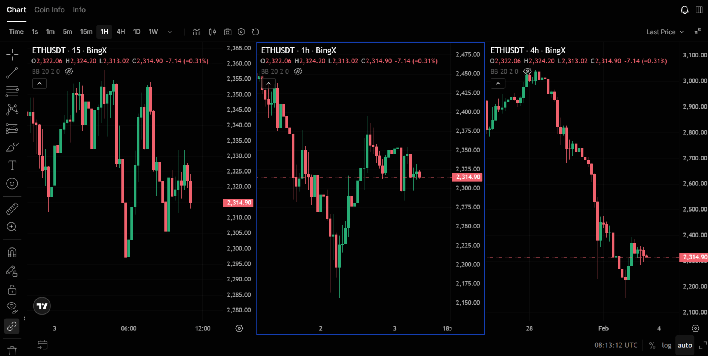

Таймфрейм — это временной интервал, который задаёт одну свечу (или бар) на графике. От выбора таймфрейма зависят настройки индикаторов, количество сигналов и тип стратегии: скальпинг, внутридневная торговля или свинг. В статье — что такое таймфреймы, как они обозначаются, как выбирать под свой стиль и как увязывать с [RSI](/ru/library/technical-analysis-rsi/), [бэктестами](/ru/library/what-are-backtests/) и стратегиями.

## Что такое таймфрейм

**Таймфрейм** — это период времени, который представляет одна свеча на графике. Одна свеча на M1 — это движение цены за одну минуту, на H4 — за четыре часа, на D1 — за один торговый день. Чем меньше таймфрейм, тем больше деталей и «шума»; чем больше — тем сглаженнее картина и значимее уровни.

Выбор таймфрейма определяет, как часто вы получаете сигналы и на какой срок открываете позиции. На минутных графиках сделок много, удержание позиции — минуты или часы. На дневных и недельных — сделок меньше, позиции могут держаться днями или неделями.

## Основные таймфреймы

Обозначения приняты международные: латинская буква и число.

**Минутные:** M1 (1 минута), M5 (5 минут), M15 (15 минут), M30 (30 минут). Используются для скальпинга и внутридневной торговли. Много сигналов, но выше доля ложных; нужна дисциплина и чёткие правила выхода.

**Часовые:** H1 (1 час), H4 (4 часа). Подходят для среднесрочной торговли внутри дня и на несколько дней. Баланс между количеством возможностей и «шумом». H4 часто используют для определения тренда и ключевых уровней.

**Дневные и выше:** D1 (день), W1 (неделя), MN (месяц). Применяются для свинг-трейдинга и позиционной торговли. Сигналы редкие, но уровни и паттерны считаются более значимыми. На [ложные пробои](/ru/library/false-breakouts-trading/) обращают внимание чаще на H4 и D1, чем на M1–M15.

## Как выбирать таймфрейм под стиль торговли

**Скальпинг:** цель — много небольших сделок за день. Обычно используют M1, M5, реже M15. Важны быстрая реакция, минимальные комиссии и спреды. Индикаторы настраивают на короткие периоды; [RSI](/ru/library/technical-analysis-rsi/) на M1 даёт много сигналов, часть из них лучше фильтровать старшим таймфреймом.

**Внутридневная торговля (дей-трейдинг):** позиции открывают и закрывают в течение одного дня. Типичные таймфреймы — M15, M30, H1. Тренд и зоны перекупленности/перепроданности часто смотрят на H1 или H4, вход уточняют на младшем.

**Свинг:** позиции держат от нескольких дней до недель. Используют H4, D1, иногда W1. Количество сделок меньше, зато меньше и «шума». Подходит тем, кто не может следить за графиком постоянно. Стратегии для [бокового тренда](/ru/library/sideways-trend-strategies/) и разворота часто тестируют на H4 и D1.

**Долгосрочное инвестирование и позиции:** D1, W1, MN. Таймфрейм для оценки глобального тренда и крупных уровней; индикаторы настраивают на длинные периоды.

## Таймфрейм и индикаторы

Период индикатора (например, RSI 14 или скользящая средняя 20) считается в **свечах** выбранного таймфрейма. RSI 14 на M5 — это 14 пятиминутных свечей (70 минут); на D1 — 14 дней. Один и тот же период на разных таймфреймах даёт разную чувствительность: на M1 индикатор реагирует быстрее, на D1 — медленнее и сглаженнее.

Частая ошибка — ставить слишком короткий период на старшем таймфрейме или слишком длинный на младшем. Тогда индикатор либо почти не двигается, либо даёт много ложных срабатываний. Имеет смысл тестировать настройки в [бэктестах](/ru/library/what-are-backtests/) под выбранный таймфрейм и стиль торговли.

## Мультитаймфреймовый анализ

Подход, при котором тренд и зоны определяют на старшем таймфрейме, а вход — на младшем. Пример: на H4 определяют восходящий тренд и зону поддержки; на H1 или M15 ждут отскок и подтверждение (например, разворотная свеча или сигнал от [Williams %R](/ru/library/williams-percent-range-r/)) и только тогда входят. Так снижают число входов против тренда и в «шум».

## Таймфреймы и крипторынок

Криптовалюты торгуются круглосуточно, объём и волатильность могут сильно меняться в течение суток. На малых таймфреймах (M1–M15) это даёт много движений, но и много ложных пробоев. На [как начать с малой суммы](/ru/library/how-to-start-trading-small-deposit/) часто советуют не зацикливаться на M1, а начинать с M15–H1, чтобы сочетать возможность частых сделок с более читаемыми уровнями.

## Кратко

- Таймфрейм — интервал одной свечи (M1, H4, D1 и т.д.). От него зависят «шум», количество сигналов и тип стратегии.
- Младшие (M1–M15) — для скальпинга и быстрых входов; старшие (H4, D1) — для тренда и свинга.
- Период индикаторов задаётся в свечах выбранного таймфрейма; настройки лучше проверять в [бэктестах](/ru/library/what-are-backtests/).
- Мультитаймфреймовый анализ: тренд на старшем, вход на младшем — помогает фильтровать ложные сигналы.
