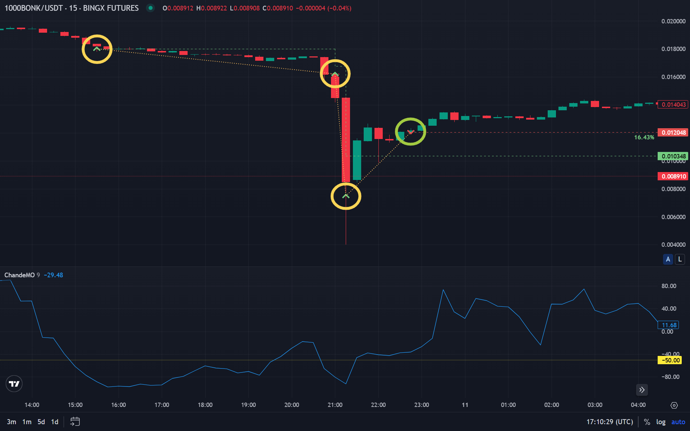

# Что такое торговые сигналы в криптовалюте

Трейдинг и спекуляции являются самыми популярными видами деятельности в криптовалютной среде. Многие из участников рынка хотят обладать полезной практической информацией для торговли, вследствие чего спрос, как и всегда, породил предложение и привёл к появлению и распространению в массы торговых сигналов.

## Зачем трейдерам нужны торговые сигналы

В условиях стремительно развивающегося крипторынка умение быстро реагировать на изменения может стать ключевым фактором успеха. Именно здесь на помощь трейдерам приходят торговые сигналы — это заранее подготовленные рекомендации, указывающие на потенциально выгодные точки входа и выхода из сделки. Эти сигналы помогают оперативно ориентироваться в информационном потоке, повышая шансы на успешный трейдинг криптой.

## Кто использует сигналы

Торговыми сигналами пользуются как новички, желающие получить поддержку в принятии решений, так и опытные трейдеры, стремящиеся оптимизировать стратегии. Кроме того, криптовалютные биржи и инвестиционные фонды всё чаще интегрируют криптосигналы в свои алгоритмы, улучшая эффективность алготрейдинга криптовалют и расширяя возможности инвесторов.

## Виды торговых сигналов

Существует два основных типа сигналов: ручные и автоматические.

### Ручные сигналы

Ручные сигналы — это результат анализа профессионального трейдера. Такой подход опирается на опыт, интуицию и знание рынка, включая скальпинг в трейдинге или среднесрочные прогнозы. Эти сигналы криптовалют обычно публикуются в Telegram-каналах, форумах или платных сообществах.

### Автоматические сигналы

Автоматические сигналы — результат анализа, проводимого алгоритмами. Они формируются с использованием технических индикаторов в трейдинге и часто поступают от торговых ботов или специализированных платформ. Например, благодаря наличию индикаторов можно грамотно усреднять позицию по их сигналам, что позволяет снижать риски и накапливать необходимый объём позиции.

В эпоху, когда алготрейдинг становится понятным даже начинающим, автоматизированные сигналы завоёвывают всё большую популярность. Они минимизируют человеческий фактор и работают 24/7, особенно в рамках автоматической торговли криптовалютой.

## Что включают в себя сигналы

Структура у всех сигналов схожая и состоит из множества технических и фундаментальных аспектов.

### Точка входа, стоп-лосс, цели по прибыли

Любой качественный сигнал начинается с обозначения точки входа — цены, при достижении которой трейдеру рекомендуется открыть позицию. Эта точка рассчитывается на основе анализа текущего состояния рынка, включая технические и фундаментальные данные. В сигналах она указывается либо как конкретное значение, либо как ценовой диапазон, в котором безопасно войти в сделку.

Следующим обязательным элементом является стоп-лосс — уровень цены, при достижении которого сделка автоматически закрывается, чтобы минимизировать убытки. Это один из ключевых инструментов управления рисками, особенно в трейдинге криптой сигналы, где волатильность может быть крайне высокой. Правильный стоп-лосс позволяет защитить депозит и торговать с более высокой уверенностью.

Завершающим компонентом служат цели по прибыли — уровни, на которых трейдеру рекомендуется зафиксировать прибыль. Обычно сигнал содержит одну или несколько целей, давая возможность гибкой фиксации прибыли поэтапно. Это помогает трейдеру не упустить потенциал роста, особенно в случае, если сигнал подан на фоне сильного тренда или позитивных новостей в секторе.

### Индикаторы и основания сигнала

Основой для формирования сигналов криптовалют служат технические и фундаментальные факторы. В техническом плане используются такие технические индикаторы в трейдинге, как [RSI](/ru/library/technical-analysis-rsi/), MACD, скользящие средние, уровни поддержки и сопротивления. Эти инструменты помогают анализировать поведение цены, выявлять тренды, перекупленность или перепроданность актива и давать рекомендации по входу и выходу из позиции.

Фундаментальный анализ, в свою очередь, включает в себя новости, события, обновления проектов, партнёрства и запуск новых функций. Например, положительное заявление крупного инвестора или листинг на топовых криптовалютных биржах может стать поводом для сигнала на покупку. Также важную роль играют объёмы торгов, которые подтверждают силу тренда и помогают выявить точки входа.

В алгоритмических системах, особенно когда речь идёт об алготрейдинге криптовалют, используются автоматизированные методы анализа, включая машинное обучение и статистические модели. Такие криптосигналы формируются на основе массивов данных, часто быстрее и точнее, чем ручной анализ. Для проверки эффективности сигналов важно проводить [бэктестинг стратегий](/ru/library/what-are-backtests/).

## Где искать торговые сигналы

Сигналы по криптовалютам можно найти в профессиональных аналитических сообществах, Telegram-каналах, платформах с торговыми ботами, а также на сайтах аналитики. При выборе источника важно учитывать его репутацию, статистику успешных прогнозов и открытость к проверке истории сигналов. Многие предлагают бесплатные сигналы криптовалют с возможностью перейти на платный тариф при необходимости.

## Преимущества и риски

Торговые сигналы в криптовалюте предоставляют трейдерам возможность принимать обоснованные решения, опираясь на аналитику и опыт профессионалов или алгоритмов.

Одним из главных преимуществ таких сигналов является экономия времени. Трейдерам не нужно самостоятельно проводить глубокий технический анализ или следить за новостями 24/7 — за них это делают специалисты или автоматизированные системы. Это особенно актуально для начинающих участников рынка, которые ещё не полностью освоили технические индикаторы в трейдинге и механизмы алготрейдинга криптовалют.

Ещё одним плюсом является повышение точности входов в рынок. Грамотно составленные сигналы криптовалют могут существенно повысить эффективность сделок, особенно если они основаны на комплексной аналитике. Это может быть полезно как на спотовом рынке, так и при использовании, например, стратегии скальпинга в трейдинге, где важна каждая секунда.

Однако, несмотря на очевидные преимущества, сигналы не лишены рисков.

Во-первых, даже лучшие сигналы не дают стопроцентной гарантии результата. Рынок криптовалют нестабилен и подвержен сильному влиянию внешних факторов — от политических событий до твитов известных личностей. Это означает, что даже при наличии сигнала сделка может оказаться убыточной. Особенно важно понимать риски в автоматической торговле, когда сигналы обрабатываются без участия человека.

Ещё один важный момент — источник сигнала. На рынке присутствует множество мошеннических схем, где под видом лучших сигналов криптовалют пользователям навязываются заведомо ложные или бесполезные рекомендации. Поэтому важно проверять репутацию автора сигналов и не полагаться исключительно на один источник. Кроме того, даже при использовании надёжных криптосигналов, необходимо соблюдать правила управления рисками и не вкладывать все средства в одну сделку.

Также стоит учитывать, что некоторые сигналы могут запаздывать. Особенно это касается каналов в мессенджерах или социальных сетях, где скорость публикации критична. В таких случаях даже точный анализ может оказаться бесполезным, если трейдер не успел среагировать на время.

## Как использовать сигналы грамотно

Грамотное использование криптосигналов требует не только технических знаний, но и дисциплины, понимания рыночной логики и умения управлять рисками. Сигналы — это не волшебная кнопка «заработать», а один из инструментов в арсенале трейдера, который необходимо применять осознанно и системно.

В первую очередь важно определить источник сигналов. Надёжные сигналы криптовалют предоставляют проверенные аналитики, трейдинг-команды или алгоритмические платформы. Новичкам стоит начать с каналов, где есть прозрачная история сигналов, статистика успеха, а также пояснения к каждому входу. Избегать следует малоизвестных телеграмм-каналов, предлагающих «гарантированную прибыль», так как часто это ловушка. Даже бесплатные сигналы криптовалют могут быть полезны, если они сопровождаются анализом и логикой входа.

После выбора сигнального источника важно понимать, как применять сам сигнал. Каждый сигнал содержит основные элементы: точку входа, стоп-лосс, таргеты по прибыли и часто — обоснование на основе технических индикаторов в трейдинге или новостного фона. Необходимо строго соблюдать предложенные уровни и не пытаться «улучшить» сигнал вручную, особенно без опыта. Отклонение от рекомендаций снижает шансы на успех.

Особое внимание нужно уделять управлению капиталом. Даже лучшие сигналы криптовалют могут быть убыточными. Не стоит входить на весь депозит в одну сделку. Разделение капитала и установка стоп-лосса защищают трейдера от непредвиденных убытков. Эффективная стратегия — это не только прибыльные сделки, но и умение контролировать потери.

Сигналы можно использовать как вручную, так и через торговые боты или другие автоматические системы криптовалютной торговли. В последнем случае важно правильно настроить бота, особенно если речь идёт об алготрейдинге криптовалют. Важно протестировать работу алгоритма, чтобы убедиться, что сигналы обрабатываются корректно и в нужное время. Автоматизация может быть удобна, но несёт определённые риски в автоматической торговле, особенно при высокой волатильности рынка.

Для повышения эффективности важно следить за общей рыночной ситуацией. Например, в условиях сильного бычьего тренда можно сместить акцент на сигналы для роста криптовалюты, а при боковом движении — сосредоточиться на краткосрочных сделках или скальпинге. Понимание текущей фазы рынка позволяет использовать сигналы более гибко и адаптивно.

Также не стоит слепо следовать каждому сигналу. Полезно формировать собственное мнение, анализировать входы и со временем учиться распознавать сильные и слабые сигналы. Это поможет не только в улучшении результатов, но и в профессиональном росте как трейдера.

---

## Связанные материалы

- [Что такое бэктесты в трейдинге](/ru/library/what-are-backtests/) — проверка стратегий на истории
- [RSI: индикатор технического анализа](/ru/library/technical-analysis-rsi/) — один из источников сигналов
- [Индекс денежного потока (MFI)](/ru/library/money-flow-index/) — объёмы и точки входа
