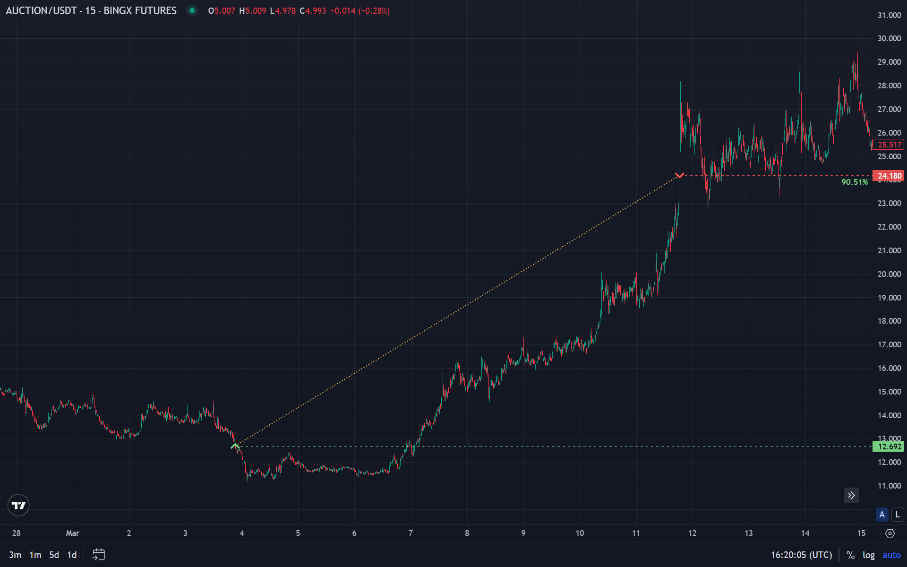

# Что такое трейлинг-стоп и как его использовать

Многие трейдеры теряют прибыль не из-за неправильного входа в сделку, а потому что не выставили стоп-лосс или тейк-профит. Что, если бы существовал способ зафиксировать прибыль, но не ограничивать её рост? Такой инструмент есть, и он называется трейлинг-стоп.

## Трейлинг-стоп в криптовалюте

На высокой волатильности рынка криптовалют умение правильно выйти из позиции может быть важнее, чем грамотный вход. Один из самых эффективных инструментов для защиты прибыли в криптовалюте — это трейлинг-стоп (trailing stop loss).

В отличие от обычного стоп-лосса, который выставляется на фиксированном уровне, трейлинг-стоп двигается вместе с ценой. Когда цена актива растёт, стоп двигается за ней. Соответственно, если цена разворачивается, то стоп фиксируется и срабатывает, закрывая сделку на пике или близко к нему.

## Как работает трейлинг-стоп

Чтобы разобраться, как работает трейлинг-стоп, нужно понимать его главное отличие от обычного стоп-лосса. Если обычный стоп выставляется на фиксированное значение и остаётся на месте, независимо от движения цены, то трейлинг-стоп динамически двигается вслед за ценой, фиксируя отступ, но не ограничивая потенциал роста прибыли. Это и делает его удобным инструментом в управлении рисками и защите прибыли в криптовалюте.

Предположим: куплена криптовалюта по цене $100 и сразу решено установить трейлинг-стоп с шагом $10. Пока цена растёт, скажем, до $105, $110, $115, стоп-лосс будет перемещаться за ценой, оставаясь на расстоянии $10 ниже пикового значения. Когда цена достигнет $115, стоп окажется на $105. Но если цена развернётся и упадёт до $105, сработает ордер на продажу. В этом и есть суть трейлинг-стопа: он не ограничивает рост, но «запирает» прибыль на определённом уровне, не давая ей исчезнуть при откате.

Что происходит внутри механизма: как только выставляется трейлинг-стоп, система запоминает цену входа и начинает отслеживать максимум, которого достигает цена после входа. Как только цена начинает снижаться на установленную величину от этого максимума, активируется команда на продажу — чаще всего трейлинг-стоп маркет, который срабатывает мгновенно по рыночной цене. Это важно понимать, особенно когда речь идёт о низколиквидных активах, где проскальзывание может быть ощутимым.

На большинстве бирж указывается либо процентное значение отступа, либо фиксированное число пунктов. После этого система берёт на себя всё: отслеживает цену, двигает стоп и в нужный момент активирует автоматический стоп-лосс. При этом можно оставить позицию открытой и не следить за графиком — ордер сработает автоматически, если произойдёт разворот.

Стоит отметить, что как работает ордер трейлинг-стоп зависит от платформы. Некоторые биржи поддерживают встроенный механизм, где трейлинг реализуется на уровне биржевого движка. Другие предлагают только обычные стопы, и в этом случае используется торговый бот с трейлинг-стопом, где вся логика реализуется в коде или через подключённый сервис.

Также трейдеры часто задаются вопросом: какой трейлинг-стоп лучше? Ответ зависит от стратегии. Если нужно зафиксировать прибыль на каждом этапе роста, лучше использовать короткий отступ. Если рынок нестабилен и не хочется, чтобы случайная тень свечи закрыла позицию, отступ должен быть шире. Здесь нет универсального рецепта, и именно поэтому важно тестировать разные подходы.

## Особенности трейлинг-стопа

Главная особенность трейлинг-стопа заключается в том, что он активируется не по статичной цене, а по условию изменения текущего максимума или минимума. Если актив растёт, стоп автоматически смещается вверх, но если начинается коррекция — он остаётся на месте и ждёт, пока цена не достигнет триггера. Это делает трейлинг-стоп отличным инструментом для сопровождения тренда и фиксации прибыли на локальных вершинах.

Важно также понимать, что как работает трейлинг-стоп зависит от условий, которые задаются при установке. Размер отступа в пунктах или процентах сильно влияет на поведение ордера. Узкий шаг может слишком рано закрыть сделку при незначительных колебаниях цены, в то время как широкий шаг даёт больше потенциальной прибыли, но может потерять её часть при развороте.

Ещё одна важная особенность трейлинг-стопа — он может работать как в виде трейлинг-стоп маркет, так и быть реализован через внешний алгоритм или торговый бот с трейлинг-стопом. В первом случае — ордер исполняется по рыночной цене, что позволяет быстро закрыть позицию. Но это также может привести к проскальзыванию. Во втором случае бот даёт большую гибкость, позволяя вручную настраивать реакцию на сигналы и выполнять более сложные условия.

Когда трейдер определяет, как выставлять трейлинг-стоп, он должен учитывать не только технические параметры, но и свою торговую стратегию. Трейлинг особенно хорош в условиях трендового рынка, где важно «высидеть» максимум прибыли, не закрываясь преждевременно. В этом смысле использование данного вида стопа — вопрос не столько о кнопке на бирже, сколько о грамотной интеграции в свою торговую систему.

Ещё одна особенность трейлинг-стопа — это его невидимость до момента активации. В отличие от лимитного ордера, ордер трейлинг-стоп не отображается в книге заявок до тех пор, пока не сработает условие. Это делает его менее уязвимым к манипуляциям или попыткам «вынести» стопы других участников рынка.

Грамотное использование трейлинг-стопа помогает не просто выйти в прибыль, а сохранить её при любой волатильности и рынке. Если торгуется криптой, то обязательно стоит протестировать его в связке с ботами. Это простое действие способно радикально изменить подход к торговле и её результативность. Для проверки эффективности стратегий со стопами полезно использовать [бэктестинг](/ru/library/what-are-backtests/), а для анализа точек выхода — [индикатор RSI](/ru/library/technical-analysis-rsi/).

---

## Связанные материалы

- [RSI: индикатор технического анализа](/ru/library/technical-analysis-rsi/) — теханализ и точки выхода
- [Что такое бэктесты в трейдинге](/ru/library/what-are-backtests/) — тестирование стратегий со стопами
- [Williams %R](/ru/library/williams-percent-range-r/) — осциллятор и зоны разворота
