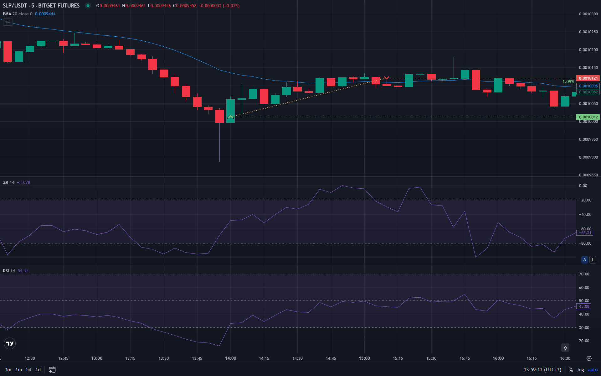

Многие трейдеры не используют потенциал такого инструмента, как Процентный диапазон Вильямса. Этот осциллятор позволяет эффективно определять моменты затухания тренда и находить точки входа на разворотах.

## Что такое индикатор %R Вильямса

**Процентный диапазон Вильямса** — это классический осциллятор, используемый для анализа движения цен на финансовых рынках. Он помогает определять зоны перекупленности и перепроданности, указывая на возможные точки разворота. В торговле криптовалютами этот инструмент приобрёл популярность благодаря своей чувствительности к быстрым изменениям цены.

## Основные принципы работы

Процентный диапазон Вильямса основан на сравнении текущей цены закрытия с диапазоном цен за определенный период времени. Его задача — определить, насколько текущая цена близка к максимальному или минимальному уровню за выбранный промежуток.

Работа индикатора строится на предположении, что в растущем тренде цена стремится к верхней границе диапазона, а в падающем — к нижней. Значение %R варьируется в диапазоне от 0 до -100:
- Значение около **0** свидетельствует о перекупленности.
- Значение около **-100** говорит о перепроданности.

Индикатор относится к опережающим инструментам технического анализа. Он реагирует на изменения цены быстрее многих других осцилляторов, что дает возможность заранее подготовиться к возможным разворотам тренда в условиях высокой волатильности.

## Как рассчитывается %R Вильямса

Формула индикатора выглядит следующим образом:
`%R = (Наибольшая цена за период - Цена закрытия) / (Наибольшая цена за период - Наименьшая цена за период) × (-100)`

Эта математическая модель позволяет выявить потенциальные разворотные точки, анализируя положение цены относительно её недавнего максимума.

## Как интерпретировать значения

Традиционно используются два ключевых уровня:
- **Выше -20:** рынок считается перекупленным. Цена находится в верхней части диапазона, и риск коррекции возрастает.
- **Ниже -80:** рынок считается перепроданным. Актив торгуется в нижней части диапазона, что часто предшествует отскоку вверх.

Важно отметить, что нахождение индикатора в экстремальных зонах не является автоматическим сигналом к сделке. Опытные трейдеры дожидаются выхода линии индикатора из этих зон для подтверждения смены рыночной динамики.

## Сигналы на покупку и продажу

Индикатор %R Вильямса генерирует сигналы на основе выхода из зон экстремумов:

- **Сигнал на покупку:** возникает, когда индикатор пересекает уровень -80 снизу вверх. Это означает, что актив начинает восстанавливаться после периода сильных продаж.
- **Сигнал на продажу:** появляется, когда индикатор выходит из зоны выше -20 сверху вниз. Такая динамика указывает на ослабление покупательской активности.

## Комбинирование %R Вильямса с другими индикаторами

Поскольку %R является опережающим индикатором, он может давать ложные сигналы на сильных трендовых рынках. Для повышения точности его комбинируют с другими инструментами:

- **%R Вильямса + RSI:** позволяет фильтровать ложные сигналы, сравнивая данные двух разных осцилляторов.
- **%R Вильямса + EMA 50/200:** подтверждает сигналы индикатора в направлении основного долгосрочного тренда.
- **%R Вильямса + Индикаторы объема:** всплески активности при выходе из зон перекупленности/перепроданности усиливают надежность сигнала.
- **%R Вильямса + Bollinger Bands:** помогает выявлять моменты, когда цена отклоняется от среднего значения на экстремальные расстояния.

## Кому подходит индикатор %R

Этот инструмент идеально подходит для трейдеров, работающих на краткосрочных и среднесрочных таймфреймах (скальпинг, внутридневная торговля). Он эффективно показывает себя в боковых трендах и при поиске локальных коррекций.

Для начинающих %R полезен простотой интерпретации, однако требует дисциплины при работе в условиях сильного направленного движения рынка.
